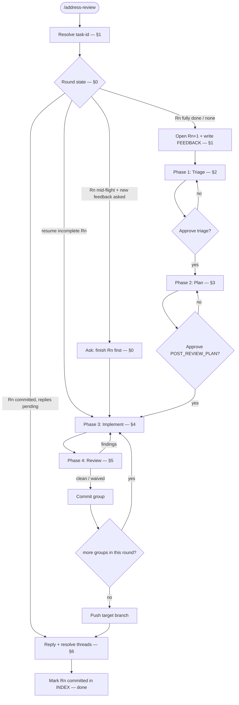

# Address Review

## Purpose

Address code-review feedback for an existing `.ai/task/<task-id>/` in bounded rounds. You are the orchestrator. You run in the main thread. That thread is the only place that can spawn subagents.

You own the human gates, the state files, every commit, and every review-thread reply. You never write triage/plan markdown or application code yourself. You do rewrite `STATUS.md` (phase `address-review`) per `ai-dir`.

## Activation

### Use when

Use this skill when:

- an existing `.ai/task/<task-id>/` has PR or code-review comments to address
- the user asks to fix PR comments, address review feedback, or handle code review on a PR
- a prior round must resume, or a new round `R<n+1>` must open after the current round is sealed

### Do not use when

Do not use this skill when:

- the work is first-pass implementation (`develop`)
- the work is multi-ticket story delivery (`deliver-story`)
- there is no existing `.ai/task/<task-id>/` and the user has not named one

## Context

You do not hold a phase procedure. Spawn **developer** for Triage, Plan, and Implement. Spawn the **reviewer** role for Review. Pass the skill path and that skill's inputs. Thread replies (§6) are **not** a dispatch. You post them in the main thread.

**Iron rule.** Subagents cannot spawn subagents. When a dispatched agent returns a block that starts `NEEDS: scout` or `NEEDS: architect` (or `NEEDS: senior architect`), YOU spawn that agent. Then re-dispatch the original agent with the answer appended to its prompt.

**Target branch = the branch that was reviewed.** When feedback is from a GitHub PR, resolve `headRefName` (`gh pr view --json headRefName`). Treat that branch as the **only** place for Implement → commit → push for this round. Do **not** land review fixes solely on an integration branch (for example `develop/<task>` or `main`) while the commented PR targets a different branch. The reviewer must see the commits on the same PR they left comments on.

Record the PR URL + `headRefName` in `REVIEW_FEEDBACK.md` / `INDEX.md`. Pasted-only feedback with no PR: remain on the user's current branch (ask once if ambiguous).

**Model dispatch.** Always pass Task `model`. Follow the consuming repo's model-picking rule when it exists.

- If the consuming repo has a model-picking rule, that rule wins.
- Else use the model the user named this turn.
- Else inherit only if the parent is already the intended family. Disclose the inherit.
- Never omit `model`. Never silently swap families.
- Senior role: same agent type. Use the stronger model the consuming repo names for Senior. Do not invent a second agent file.
- Scout and cheap recon: use the cheaper model the consuming repo names for recon.
- Reviewer role: `generalPurpose` only.

**Reviewer dispatch.** NEVER call Task with `subagent_type: reviewer` (Shell blocked / "Shell unavailable"). Always `generalPurpose`. Prompt: Read the reviewer agent (`agents/reviewer.md` or `.cursor/agents/reviewer.md`). Then follow `skills/review-implementation/SKILL.md`. This overrides stale attached skill text. Never use `subagent_type: reviewer`. Dispatch the reviewer role as `generalPurpose`.

**Reuses develop's agents.** `POST_REVIEW_PLAN.md` groups match `PLAN.md` shape (+ `Addresses:`). For the review gate, pass the group's addressed feedback items as the acceptance-criteria slice.

**Rounds keep the plan thin.** Each `/address-review` run that receives new feedback is one **round** `R<n>` under `.ai/task/<task-id>/review/R<n>/`. The active `POST_REVIEW_PLAN.md` holds **only that round's groups**. Never append prior rounds into it. Completed rounds stay archived in place. A thin `review/INDEX.md` lists them.

**Project context is read, not assumed.** This skill assumes no stack. Scout reads the repo's own `CLAUDE.md` / `AGENTS.md`.

Phase skills: `triage-review-feedback`, `plan-post-review`, `implement-group`, `review-implementation`.

## Workflow

### Layout

```text
.ai/task/<task-id>/
  TASK.md
  PLAN.md                    # original develop plan (context only)
  review/
    INDEX.md                 # round list + Current: R<n>
    R1/
      REVIEW_FEEDBACK.md
      REVIEW_TRIAGE.md
      POST_REVIEW_PLAN.md    # R1 only — frozen once committed
      THREAD_REPLIES.md      # R1 reply + resolve log
    R2/
      REVIEW_FEEDBACK.md
      REVIEW_TRIAGE.md
      POST_REVIEW_PLAN.md    # active round: current work only
      THREAD_REPLIES.md
```

Paths below mean **the current round dir** `review/R<n>/` unless noted.



The numbered steps are the authority.

### 0. Resume and rounds

This skill requires an existing `.ai/task/<task-id>/` (typically from `/develop`). If it is missing, ask once. Do not invent a task from review comments.

On entry, read `review/INDEX.md` if it is present. Tell the user the current round and status before you act. Set `STATUS.md` phase to `address-review` per `ai-dir`.

**Round status**

| State | What to do |
| --- | --- |
| No `review/` yet | §1 — create `review/`, `INDEX.md`, open **R1**. |
| Current `R<n>` has `POST_REVIEW_PLAN.md` with any group not `[x] committed` | **Resume** that round (§2–§5 from the right phase). Do **not** open a new round. Do **not** rewrite FEEDBACK/TRIAGE/PLAN. |
| Current `R<n>` groups are committed (or the plan has only Declined and no groups), and `THREAD_REPLIES.md` is missing or incomplete | **Resume §6**. Do not open `R<n+1>`. |
| Current `R<n>` fully done (groups committed, thread replies posted or n/a) | **New round** — §1 opens `R<n+1>` with a fresh FEEDBACK/TRIAGE/PLAN. Prior `R<n>/` stays untouched. |
| User gives new feedback while `R<n>` is mid-flight | Ask via `AskUserQuestion`: finish current round first (default). Do not merge new comments into an in-progress plan. |

**Anti-bloat rules (orchestrator-enforced)**

- Never append groups from an old round into a new `POST_REVIEW_PLAN.md`.
- Never copy prior-round group history into the active plan.
- `INDEX.md` stays a short table (round, status, PR url, Threads column, one-line summary). It is not a second plan.
- Feedback ids (`F1`, `F2`, …) are **per-round**. Do not keep numbering across rounds.

Mid-round resume checkpoints (scoped to `review/R<n>/`):

- no `REVIEW_FEEDBACK.md` → §1 for this round.
- `REVIEW_TRIAGE.md` present, no `POST_REVIEW_PLAN.md` → Phase 1 gate.
- `POST_REVIEW_PLAN.md` present, no group started → Phase 2 gate.
- groups in progress → implement/review loop by `**Status:**` (implemented → Phase 4. reviewed → commit. all committed → push → §6).
- groups committed (or no groups), `THREAD_REPLIES.md` incomplete → §6.

### 1. Resolve task-id, open round, fetch feedback

#### Task-id

1. Explicit `.ai/task/<task-id>/` or bare id under `.ai/task/` → use it.
2. Else tracker-key matching an existing dir → use it.
3. Else ask once via `AskUserQuestion`.

#### Open round

When §0 says start a new round:

1. Create `review/` if needed.
2. Next id = max existing `R*` + 1, or `R1`.
3. Create `review/R<n>/`.
4. Update `INDEX.md`: set `Current: R<n>`, status `in progress`, Threads `pending`. Leave prior rounds as `committed` (or `abandoned` only if the user explicitly abandoned). Use `assets/index-template.md`.

#### Feedback source (prefer gh) — **this round only**

Write **only** `review/R<n>/REVIEW_FEEDBACK.md` (never a task-root copy). Follow `assets/feedback-template.md`. Every remote item **must** record **Platform**, **Kind**, **Comment id**, and **Thread id**. §6 cannot reply without those ids.

1. **GitHub PR** — resolve with `gh pr view --json …,headRefName,url`. Fetch review + inline comments as structured JSON. Prefer GraphQL `reviewThreads` so each item has REST `databaseId` (Comment id) and thread node id (Thread id). Header must include `PR: <url>` and `Branch: <headRefName>`. That branch is this round's implement/commit/push target. Set **Platform:** `github`. Set **Kind:** `inline` for review threads. Set **Kind:** `top-level` for conversation comments that are not a review thread.
2. **Origin PR** — same fields. **Platform:** `origin`. Comment id is `cmt_…`. Thread id is `cth_…` when present.
3. **Linear diff** — when the source is a Linear review URL, or when gh returns no inline comments and Linear MCP is available. Discover Linear tools first. Then call `get_diff_threads` with the review URL or GitHub PR URL. **Platform:** `linear`. Comment id and Thread id are Linear UUIDs. The top-level comment UUID is the reply parent and the resolve id.
4. **Pasted feedback** — if no PR / gh fails. Header `Source: pasted`. **Platform:** `pasted`. Comment id and Thread id are `n/a`.
5. **Both** — gh first. Then append pasted items not already present. Do not fetch the same comment from GitHub and Linear. Pick one platform per item. Prefer GitHub when the review landed on GitHub.

`gh` is **read-only**. Use it to fetch. Do not use `gh` to post replies or resolve threads.

**Dedup against prior rounds.** Before writing FEEDBACK, collect comment ids (and for paste, normalized body hashes) already listed in any `review/R*/REVIEW_TRIAGE.md` or `REVIEW_FEEDBACK.md`. Omit those from the new file. Already triaged work must not enter the active plan again. If every fetched comment is a duplicate, tell the user and stop (no empty round).

Also read task-root `TASK.md` / `PLAN.md` as context. Optionally skim prior rounds' INDEX one-liners for continuity. Do not load old plan groups into the new plan.

### 2. Phase 1 — Triage (→ `review/R<n>/REVIEW_TRIAGE.md`)

1. **Recon on demand.** Scout / architect as needed.
2. **Dispatch.** Developer (pass Task `model`; consuming-repo picker wins) + `skills/triage-review-feedback/SKILL.md` with: this round's `REVIEW_FEEDBACK.md`, target `REVIEW_TRIAGE.md`, template `skills/triage-review-feedback/assets/triage-template.md`, `TASK.md`/`PLAN.md`, scout map, and **round id `R<n>`**.
3. **Escalations.** Iron rule. Re-dispatch until triage path returned.
4. **Gate.** Present accept / decline / partial. Declines need explicit confirm. No Phase 2 without approval.

**Decline policy.** Decline feedback that is incorrect, out of scope, or style without a repo convention. Give a rationale. Do not implement. Do not post thread replies during triage. Post them in §6.

### 3. Phase 2 — Plan (→ `review/R<n>/POST_REVIEW_PLAN.md`)

1. **Dispatch.** Developer (pass Task `model`; consuming-repo picker wins) + `skills/plan-post-review/SKILL.md` with: approved triage path, target **this round's** `POST_REVIEW_PLAN.md`, template, scout map, round id. Only accept and partial items become groups. Put declines under `## Declined`.
2. **Escalations.** Same as §2.3.
3. **Gate.** Present graph, titles, commits, `Addresses:`. The approved file is this round's execution state. It holds **current groups only**.

A plan with only Declined and no groups still runs §6 after this gate. Skip implement and review.

### 4. Phase 3 — Implement

**Checkout the target branch first** (the PR `headRefName` from §1). All implement/review/commit work for this round happens on that branch. The commented PR then updates. If the working tree has unrelated WIP, stash the changes or ask before you switch branches.

Commit gate via `AskUserQuestion`: (a) auto-commit or (b) review-each. Review (§5) before every commit. You own commits **and the push to the target branch**.

Parallelism and model are the same as develop. review-each ⇒ no parallel. auto-commit ⇒ parallel only if no dependency edge + disjoint `Files:`. Pass Task `model`. Follow the consuming repo's picker when it exists.

**Loop** (paths under `review/R<n>/POST_REVIEW_PLAN.md`):

1. Next runnable group(s).
2. Developer + `implement-group` + group block + task-id + scout map (+ findings on re-dispatch). Scout/implement against the **target branch** tree, not a different integration branch.
3. Handle `NEEDS:`.
4. DONE → `[x] implemented` → §5. BLOCKED → show the reason. Stop that lane.
5. Review pass/waive → `[x] reviewed` → commit on the target branch → `[x] committed`.
6. When **every** group in **this round** is committed (or there were no groups): **push** the target branch to `origin` (`git push -u origin HEAD`). Confirm the PR head advanced. Then run §6. Do not mark INDEX `committed` until §6 finishes.

### 5. Phase 4 — Review

1. Reviewer role via Task `generalPurpose` (not `subagent_type: reviewer`) + pass Task `model`; consuming-repo picker wins. Prompt: Read the reviewer agent (`agents/reviewer.md` or `.cursor/agents/reviewer.md`). Then follow `review-implementation` with group diff, this round's group block, addressed feedback asks as AC slice, scout map / `CLAUDE.md`.
2. Findings → re-dispatch implement-group → review again until clean or waived.
3. Optional whole-**round** sweep after all groups committed. This sweep is outside the commit path.

### 6. Reply to comments and resolve threads

The reviewer must see what this round took and what it declined. Code commits are not enough. Reply on the original thread. Then resolve the thread when this round completed the actionable ask.

You post replies. You resolve threads. Do not dispatch a subagent for this. Do not use `gh` to write.

Write `review/R<n>/THREAD_REPLIES.md` from `assets/thread-replies-template.md`. One row per feedback id in this round's triage.

#### When

Run §6 after the round push (or after the plan gate when there are no groups). Skip remote writes when every item is **Platform:** `pasted`. Still write `THREAD_REPLIES.md` with Reply `n/a` and Resolved `n/a`. Set INDEX Threads to `n/a`.

#### Tools

Discover the tool schema before you call it.

| Platform | Reply | Resolve |
| --- | --- | --- |
| github or origin | `ManagePullRequest` `post_comment` with `in_reply_to` = Comment id | `ManagePullRequest` `resolve_comment` with `comment_id` = Comment id |
| linear | Linear MCP `save_diff_comment` with `parentId` = top-level Comment id | Linear MCP `resolve_diff_thread` with `threadId` = Thread id (or the top-level Comment id) |
| pasted | none | none |

GitHub `in_reply_to` and `comment_id` are the numeric review-comment id (REST `id` / GraphQL `databaseId`). Origin uses `cmt_…` (comment) or `cth_…` (thread). Linear uses the top-level diff comment UUID for both reply parent and resolve. Linear `save_diff_comment` body is plain text. Do not use Markdown there.

For **Kind:** `top-level` with no review thread, post a PR comment that names the feedback id. Do not call resolve.

If a reply or resolve call fails, retry once. Then record `failed` in `THREAD_REPLIES.md`. Tell the user which ids failed. Do not open `R<n+1>` until every remote item is `posted` or `failed` after retry.

#### Reply every item

Reply to **every** item that has a Comment id. Include accept, partial, and decline. A silent skip hides whether this round fixed the ask or declined it.

Write each reply in **English ASD-STE100 Strict**. Do not mix languages. Technical register only. See `rules/asd-ste100.md` and the `asd-ste100` skill.

Reply rules:

- Active voice. Name the change.
- One idea per sentence. Cap a sentence at 25 words.
- Name files, symbols, and the short commit SHA when a fix landed.
- No thanks. No emoji. No marketing words.
- Do not paste large diffs. Point to the commit and the path.

| Verdict | Reply must state | Then resolve? |
| --- | --- | --- |
| accept | What changed. Which files. Short SHA. | Yes, after the reply succeeds. Kind `inline` only. |
| partial | What this round took. What it dropped, and why. Short SHA for the taken part. | Yes, after the reply succeeds. Kind `inline` only. The dropped part is not a remaining ask. |
| decline | Why this round declined (incorrect, out of scope, or no convention). | No. Leave the thread open. |

Skip resolve when the thread is already resolved. Still reply if this round has not replied.

Never resolve a declined thread. Never resolve before the reply succeeds. Never resolve a thread this round did not reply to.

#### Examples

Accept:

```text
Fixed in abc1234.

Guard `UpdateUserDisplayName` now rejects a blank name in `packages/core/src/identity/application/update-user-display-name.ts`.
```

Partial:

```text
Took the null-check in abc1234 (`packages/core/src/identity/identity-service.ts`).

Dropped the extra DTO field. That change is out of scope for this task.
```

Decline:

```text
Declined.

The comment cites `UserStore` in core. The port already belongs to Identity. No code change.
```

#### Seal

When every row in `THREAD_REPLIES.md` is filled:

1. Set INDEX status `committed`.
2. Set INDEX Threads to `posted` (or `n/a` for pasted-only).
3. Note one-line summary + PR URL.
4. Later `/address-review` may open `R<n+1>` for new feedback.

## Decision Rules

- If `.ai/task/<task-id>/` is missing → ask once. Do not invent a task from comments.
- If current `R<n>` has uncommitted groups → resume that round. Do not open `R<n+1>`.
- If groups are committed and `THREAD_REPLIES.md` is incomplete → resume §6. Do not open `R<n+1>`.
- If `R<n>` is fully done → open `R<n+1>` with fresh FEEDBACK/TRIAGE/PLAN. Leave prior `R<n>/` untouched.
- If the user gives new feedback while `R<n>` is mid-flight → ask to finish `R<n>` first. Do not merge into the in-progress plan.
- If every fetched comment is a duplicate of a prior round → tell the user. Stop. Write no empty round.
- If feedback is from a GitHub PR → target branch = `headRefName`. Checkout that branch before Implement.
- If feedback is pasted-only with no PR → stay on the current branch. Ask once if ambiguous.
- If the plan has only Declined and no groups → skip Implement and Review. Run §6 after the plan gate.
- If commit mode is review-each → no parallel.
- If commit mode is auto-commit, no dependency edge, and disjoint `Files:` → parallel is allowed.
- If a dispatched agent returns `NEEDS: scout` or `NEEDS: architect` → you spawn that agent. Then re-dispatch.
- If Platform is `pasted` for every item → skip remote writes. Still write `THREAD_REPLIES.md` with `n/a`.
- If Kind is `top-level` → post a PR comment. Do not resolve.
- If verdict is decline → reply. Do not resolve.
- If a reply or resolve fails → retry once. Record `failed`. Do not open `R<n+1>` until every remote item is `posted` or `failed`.

## Constraints

- MUST run in the main thread.
- MUST pass Task `model` on every spawn. MUST follow the consuming repo's model-picking rule when it exists.
- MUST dispatch the reviewer role as `generalPurpose`. MUST NOT use `subagent_type: reviewer`.
- MUST handle every `NEEDS:` escalation yourself.
- MUST implement, commit, and push on the reviewed PR `headRefName`.
- MUST write round state under `.ai/task/<task-id>/review/R<n>/`.
- MUST NOT write triage, plan, or application code yourself. Dispatch instead.
- MUST NOT append or merge a prior round into the active `POST_REVIEW_PLAN.md`.
- MUST NOT open `R<n+1>` while `R<n>` still has uncommitted groups (unless the user explicitly abandons `R<n>`. Then mark INDEX `abandoned` and leave that dir frozen).
- MUST NOT open `R<n+1>` while `THREAD_REPLIES.md` is missing or incomplete.
- MUST NOT implement declined feedback.
- MUST NOT invent PR comments gh/paste did not provide.
- MUST NOT commit before the per-group review gate passes (unless waived).
- MUST NOT rewrite the original develop `PLAN.md` for review follow-ups.
- MUST NOT land review commits only on an integration branch when the feedback PR's `headRefName` is different. The commented PR must receive the push.
- MUST NOT seal a round as committed without pushing the target branch when the round is from a GitHub PR.
- MUST NOT seal a remote-feedback round without a reply to each item that has a Comment id.
- MUST NOT resolve a declined thread.
- MUST NOT resolve a thread before a reply to that thread succeeds.
- MUST NOT use `gh` to post a comment or resolve a thread.
- MUST write each thread reply in English ASD-STE100 Strict. MUST NOT mix languages.
- MUST NOT dispatch a subagent to post or resolve review threads.
- NEVER silently swap model families.
- NEVER omit Task `model`.

## Quality Checks

Before you finish:

- [ ] An existing `.ai/task/<task-id>/` was used. No task was invented from comments.
- [ ] Round state followed §0. No new round opened over an incomplete `R<n>`.
- [ ] Target branch equals the reviewed PR `headRefName` (or current branch for pasted-only).
- [ ] FEEDBACK recorded Platform, Kind, Comment id, and Thread id for every remote item.
- [ ] Prior-round comment ids were deduped. No empty duplicate round.
- [ ] Triage and plan were dispatched. Active `POST_REVIEW_PLAN.md` holds this round only.
- [ ] Each group was reviewed (or waived) before commit on the target branch.
- [ ] Target branch was pushed. PR head advanced (GitHub PR rounds).
- [ ] Every item with a Comment id has a reply. Declines were not resolved.
- [ ] Reviewer ran as `generalPurpose`. Model was passed.
- [ ] INDEX was sealed only after `THREAD_REPLIES.md` was complete.
- [ ] Thread replies are English STE Strict. No mixed language.

## Examples

### New round on a PR

Input: `/address-review TICKET-123` with PR comments and no `review/` yet.

Expected: open `R1`. Fetch via `gh`. Write `REVIEW_FEEDBACK.md` with `Branch: <headRefName>`. Triage. Plan. Checkout that branch. Implement, review, commit, push. Reply and resolve accepts. Seal INDEX.

### Resume uncommitted round

Input: `/address-review TICKET-123` and `R1` has `[x] implemented` without `[x] reviewed`.

Expected: resume Phase 4 for that group. Do not open `R2`. Do not rewrite FEEDBACK.

### Duplicate comments

Input: `/address-review` after `R1` is sealed. `gh` returns only comments already in `R1`.

Expected: tell the user every fetched comment is a duplicate. Stop. Do not create empty `R2`.

### Decline-only plan

Input: triage is all decline. User confirms.

Expected: `POST_REVIEW_PLAN.md` has `## Declined` and no groups. Skip Implement and Review. Still run §6. Reply. Do not resolve declined threads.

### Wrong skill

Input: "implement TICKET-123 from scratch".

Expected: refuse this skill. Point to `develop`.

## Failure Modes

- `.ai/task/<task-id>/` missing → ask once. Do not invent a task from comments.
- `gh` fails and no paste is given → say so. Ask for a PR URL or pasted feedback.
- Every fetched comment is a duplicate → stop. No empty round.
- Unrelated WIP on the working tree → stash or ask before you switch to `headRefName`.
- Reply or resolve call fails → retry once. Record `failed`. Do not open `R<n+1>`.
- Reviewer dispatched as `subagent_type: reviewer` → "Shell unavailable". Re-dispatch as `generalPurpose`.
- User asks to merge new comments into a mid-flight round → refuse. Finish `R<n>` first.
- Temptation to land fixes on an integration branch → stop. Push the reviewed `headRefName`.

## References

- `rules/asd-ste100.md` — English STE on thread replies. Read before §6.
- `skills/asd-ste100/SKILL.md` — Strict rewrite rules for replies. Read before §6.
- `skills/triage-review-feedback/SKILL.md` — Phase 1. Pass this path to developer.
- `skills/plan-post-review/SKILL.md` — Phase 2. Pass this path to developer.
- `skills/implement-group/SKILL.md` — Phase 3. Pass this path to developer.
- `skills/review-implementation/SKILL.md` — Phase 4. Pass this path to the reviewer role.
- `skills/develop/SKILL.md` — implement/review/commit loop and parallelism. Restate. Do not invoke it.
- `agents/reviewer.md` — reviewer role. Read from `.cursor/agents/reviewer.md` when that copy is the runtime file.
- `assets/index-template.md` — `review/INDEX.md` shape. Use when opening a round.
- `assets/feedback-template.md` — `REVIEW_FEEDBACK.md` shape. Use when fetching this round.
- `assets/thread-replies-template.md` — `THREAD_REPLIES.md` shape. Use in §6.
