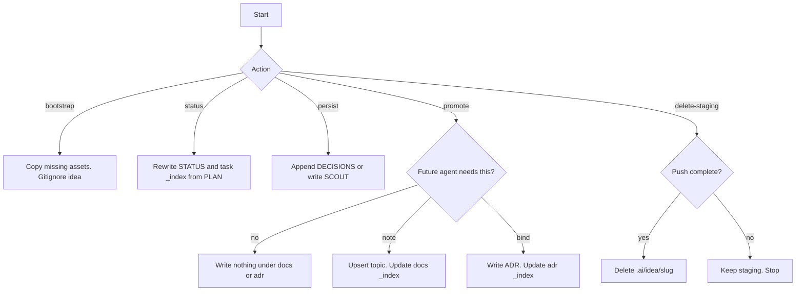

# AI dir

## Purpose

Keep the consuming repository's `.ai/` tree in one shape. Bootstrap missing catalogs. Write derived progress. Persist task-local scout and decisions. Promote lasting notes only when needed. Delete staging after a successful tracker push.

## Activation

### Use when

Use this skill when:

- a parent is about to write under `.ai/` and the tree may be missing
- an orchestrator must update `STATUS.md` or `.ai/task/_index.md`
- an orchestrator must persist a Scout map or a Decision block
- a task close-out may promote a note or an ADR
- `push-issues` succeeded and the idea slug must be deleted
- `.ai/idea/` is not in `.gitignore`

### Do not use when

Do not use this skill when:

- the task is to draft a PRD or ticket body
- the task is to implement application code
- the task is to run a board vote
- the task is to invent a tracker key

## Context

Kit assets live in this skill's `assets/`. Copy them into the consuming repo. Do not invent a parallel shape.

Durable buckets: `task/`, `docs/`, `adr/`, `board-voting/`.

Staging: `.ai/idea/<slug>/`. Gitignore it. Delete it after a successful push.

Catalog names: `_index.md` for `docs/`, `task/`, and `adr/`. `board-voting/` keeps `INDEX.md`. In-task `review/INDEX.md` stays the round list.

Write English STE on files you create. See `skills/asd-ste100` and `rules/asd-ste100.md`.

## Workflow

The numbered steps are the authority.

### 1. Bootstrap

If `.ai/AGENTS.md` is missing, copy from this skill:

- `assets/AGENTS.md` → `.ai/AGENTS.md`
- `assets/docs/_index.md`, `AGENTS.md`, `TEMPLATE.md` → `.ai/docs/`
- `assets/task/_index.md` → `.ai/task/_index.md`
- `assets/adr/AGENTS.md`, `_index.md`, `TEMPLATE.md` → `.ai/adr/`

Do not overwrite a file that already exists.

If `.ai/board-voting/` is missing, leave it. The board-voting skill copies its own assets on first vote.

Ensure `.gitignore` contains a `.ai/idea/` line. If `.gitignore` is missing, create it with that line. If the line is missing, append it. Do not rewrite unrelated ignore rules.

### 2. New task dir

When an orchestrator creates `.ai/task/<task-id>/`:

1. Write `TICKET.md` as that orchestrator already specifies.
2. Copy `assets/task/STATUS.md` to `STATUS.md`. Fill `task-id`, source, phase `refine`, progress `0/n`, blocked `none`, today's date.
3. Copy `assets/task/DECISIONS.md` to `DECISIONS.md`. Fill `task-id`.
4. Append or update the row in `.ai/task/_index.md`.

`<task-id>` is the tracker key when the work has an issue. Use a kebab id only for raw-intent work that has no issue yet.

### 3. Update progress (derived)

After every `PLAN.md` status write, and after a phase change:

1. Read `PLAN.md`. Count groups. Count `[x] committed`. Read the first group that is not fully committed.
2. Set `STATUS.md` fields. Phase rules:
   - no `TASK.md` → `refine`
   - `TASK.md` and no approved `PLAN.md` work started → `split` if PLAN exists as draft, else `refine`
   - any group in implement/review/commit → `implement`
   - `review/` current round in progress → `address-review`
   - all groups `[x] committed` (or legacy `[x] done`) → `done`
   - a group is BLOCKED → `blocked`
3. Rewrite the matching row in `.ai/task/_index.md`.
4. If STATUS and PLAN disagree, PLAN wins. Rewrite STATUS.

Do not attach `STATUS.md` to the tracker. The tracker mirror remains `PLAN.md` per develop.

### 4. Persist scout and decisions

The scout and architect agents are read-only. The orchestrator writes:

- After a scout returns a map → write `.ai/task/<id>/SCOUT.md` with that map. Overwrite if a later recon replaces it.
- After an architect Decision block → append it to `.ai/task/<id>/DECISIONS.md`. Do not rewrite earlier blocks.

`refine-task` still folds the latest decisions into `TASK.md` Approach. `DECISIONS.md` is the canonical log.

### 5. Promote at close-out

After a task is `done`, ask whether any Decision must outlive the task folder. Default is no.

- Ticket-local → leave it in `DECISIONS.md` only.
- Future agents need the fact, not a MUST → upsert `.ai/docs/<topic>.md`. If that topic is already a directory, write a sibling file. Update `docs/_index.md` in the same change. Use `assets/docs/TEMPLATE.md`.
- Implementers MUST follow it repo-wide → write the next `NNNN` under `.ai/adr/`. Update `adr/_index.md`. Use `assets/adr/TEMPLATE.md`. Offer a Cursor rule when it binds day-to-day code.

Do not name a docs file after a tracker key. Split a flat topic into a directory when a second document appears, not when the first file gets long.

### 6. Delete staging after push

Run only after `push-issues` reports every key, every required PRD attach, and every dependency link succeeded.

Delete `.ai/idea/<slug>/`. Do not keep a copy in git.

If push is partial, do not delete. Staging is the resume checkpoint for the next push.

## Decision Rules

- If `.ai/AGENTS.md` is missing → bootstrap. Do not invent a layout.
- If `.ai/idea/` is not gitignored → append the ignore line.
- If PLAN and STATUS disagree → PLAN wins. Rewrite STATUS and task `_index.md`.
- If close-out has no lasting fact → write nothing under `docs/` or `adr/`.
- If a topic already has two real documents as one file → split into a directory. Update the root `_index.md` row.
- If push is incomplete → keep staging. Do not delete.
- If no tracker MCP is connected → do not call delete-staging. The parent must stop. Staging is not the handoff.
- If the work has a tracker key → that key is `task-id`. Do not keep a parallel kebab dir.

## Constraints

- MUST copy kit assets instead of inventing a parallel shape.
- MUST NOT overwrite an existing `.ai` catalog file on bootstrap.
- MUST NOT commit `.ai/idea/`.
- MUST NOT delete staging until push is complete.
- MUST NOT write a docs file per ticket.
- MUST NOT treat a living note as an ADR.
- MUST NOT treat a board vote as an ADR.
- MUST NOT attach `STATUS.md` to the tracker as the progress mirror.
- NEVER invent a tracker key.

## Quality Checks

Before you finish:

- [ ] `.ai/AGENTS.md` exists or was copied.
- [ ] `.gitignore` contains `.ai/idea/`.
- [ ] Task dirs that this run owns have `STATUS.md` aligned with `PLAN.md`.
- [ ] `.ai/task/_index.md` has a row for each of those dirs.
- [ ] Scout maps and Decision blocks from this run were persisted when they existed.
- [ ] Close-out either skipped docs/ADR or updated the matching `_index.md`.
- [ ] Staging was deleted only after a complete push.

## Examples

### First write

Input: develop is about to create `.ai/task/ENG-45/` and `.ai/` is missing.

Expected: copy root AGENTS, docs catalogs, task `_index`, adr catalogs. Gitignore `.ai/idea/`. Then create the task dir with STATUS and DECISIONS.

### Close-out skip

Input: the only Decision is a file pick local to ENG-45.

Expected: leave `DECISIONS.md`. Write nothing under `docs/` or `adr/`.

### Delete staging

Input: `push-issues` created every child, attached both PRDs, linked deps.

Expected: delete `.ai/idea/catalog-import/`.

## Failure Modes

- Asset path unreadable → stop. Name the path. Do not invent templates.
- PLAN unreadable while updating STATUS → stop. Do not guess progress.
- Push partial → keep staging. Report what is left.
- Human asks to keep `idea/` in git after a successful push → refuse. Linear is the source of truth.

## References

- `assets/AGENTS.md` — consuming-repo map
- `assets/docs/` — living notes
- `assets/task/` — STATUS, DECISIONS, `_index`
- `assets/adr/` — binding ADRs
- `rules/ai-dir.md` — policy
- `board-voting` — copies its own `INDEX.md` assets
