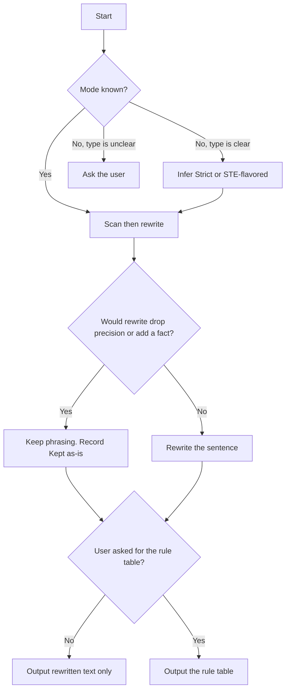

# Simplified Technical English (ASD-STE100)

## Purpose

Rewrite English so a downstream agent can parse it without a human. Remove words with more than one meaning. Remove sentences with more than one structure. This skill fixes form. It does not fix empty content.

Do not reproduce ASD's official dictionary. Do not claim certified STE compliance. See `references/writing-rules.md` for history, Issue 9, and redistribution limits.

## Activation

### Use when

- The text is a tool description, error message, inter-agent instruction, system prompt, or status report.
- A wrong reading has a real cost.
- The text is dense, hedged, or easy to misparse.
- The user asks for a before/after rule table. The default output is still the rewritten text only, unless they asked for that table.

### Do not use when

- The text is creative, marketing, or persuasive copy.
- The task is translation.
- The task is grammar-only proofreading with no ambiguity cost.
- The user needs certified aerospace STE. Direct them to the official standard.
- The work is code, API names, product names, or quoted user content. Keep those strings.
- The user wants better substance, not clearer form.

## Context

This skill applies ASD-STE100 Issue 9 rule categories. It does not ship the ~900-word dictionary.

**Structural rules** describe sentence shape. Apply them.

**Lexical rules** need the official dictionary. Treat them as a preference for plain, stable words. Do not claim dictionary compliance.

Read `references/writing-rules.md` when the user wants rule citations or section numbers.

Read `examples/before-after.md` when the case is modality, added content, or STE-flavored README prose.

## Workflow



The numbered steps are the authority.

1. Select Strict or STE-flavored from the decision rules. Do not announce the mode unless the user asked for the rule table.
2. Read the input once for meaning. Do not rewrite until you know what the text must still say.
3. Walk the text sentence by sentence. Flag each Core Rewrite Rules hit and each Scan Checklist hit. In STE-flavored mode, flag lexical rules. Do not enforce them.
4. Rewrite each flagged sentence. Keep the original meaning. If a rewrite would drop a safety condition, a scope qualifier, or a number, keep the longer phrasing and flag it.
5. Check modality before you keep a rewrite. Hedges (`may`, `could`, `sometimes`, `is likely to`) are content. Do not upgrade a hedge to a fact.
6. Do not add a cause, a frequency, or a mechanism that the source did not state.
7. Output per Output format. Keep analysis internal unless the user asked for the rule table.
8. If the input already complies, say so. Do not force changes.

## Decision Rules

- If the user named a mode → use that mode.
- If the text is a procedure, error, tool description, function description, inter-agent instruction, or safety text → Strict.
- If the text is a README, PR description, changelog, or explanatory prose → STE-flavored.
- If the document mixes procedure and prose → Strict on procedures. STE-flavored on the surrounding prose.
- If the text type cannot be inferred → ask the user. Do not guess.
- If tense and modality conflict → keep the hedge. Modality wins.
- If the text is an instruction and uses "should" → rewrite to an imperative. Do not do this in descriptive text.
- If the input already complies → report that. Stop.
- If a rewrite would add a fact → do not add it. Flag it as in Example C.
- If the user asked for the rule table, a diff, or before/after → output the rule table. Otherwise output rewritten text only.
- If code, API names, product names, or quoted user content appear → keep those strings.

## Two modes

**Strict** — procedures, errors, tool and function descriptions, inter-agent instructions, safety text. Apply every structural rule, including length caps. Apply lexical discipline as far as this skill can without the dictionary.

**STE-flavored** — READMEs, PR descriptions, changelogs, explanatory prose. Apply every structural rule. Treat lexical rules as advisory. Prose may keep some range of words.

## Core Rewrite Rules

### Structural rules — apply these

| Rule | Do | Don't |
| --- | --- | --- |
| Active voice | "The agent deletes the file." | "The file is deleted (by the agent)." unless the actor is unknown or irrelevant |
| No phrasal verbs (Rule 9.3) | "Remove the panel." / "Start the job." | "Take off the panel." / "Spin up the job." |
| One instruction per sentence | "Open the file. Read line 3." | "Open the file and read line 3, then check if it matches." |
| Sentence length | ≤20 words for instructions. ≤25 words for descriptions | Long compound sentences |
| No semicolons (Rule 8.1) | Split into separate sentences | Any semicolon |
| Noun clusters | ≤3 words stacked as a noun phrase | 4+ word noun stacks |
| No ellipsis | Keep the subject, verb, and article | Drop words to save space |
| Keep modality | "The request **may have** failed." stays "may have" | Promote a hedge to a fact |
| Paragraph limits | One topic per paragraph. ≤6 sentences | Multi-topic paragraphs |
| Lists for sequences | Numbered or bulleted list for 3+ steps | A sequence inside one prose sentence |

### Lexical rules — preference only

| Rule | Do | Don't | Limit |
| --- | --- | --- | --- |
| One word, one meaning | Pick one verb for one action. Reuse it | Rotate synonyms for the same idea | Consistency is checkable. The approved word is not, without the dictionary |
| One part of speech per word | "Apply oil to the valve" (oil = noun) | "Oil the valve" (oil = verb) | Prefer the noun when both read equally well. Do not claim compliance |
| Verb, not noun (Rule 3.7) | "Analyze the log." | "Perform an analysis of the log." | Prefer the verb form. The approved verb needs the dictionary |
| Domain terms | Keep needed technical words. Define them once | Use jargon with no definition | A project glossary is valid STE. The base dictionary is absent here |

### Simple tenses — apply with one exception

STE permits infinitive, imperative, simple present, simple past, simple future, and past participle as adjective. It excludes present perfect and other compound forms.

Where the compound form carries information the simple form cannot (current relevance, or a hedge such as "may have failed"), keep it and flag the departure. Elsewhere, follow the rule.

## Scan Checklist

Scan for these six habits before you rewrite. Each hit is a word or a punctuation mark you can point at.

1. **Synonym rotation** — the same thing gets several names. Pick one name. Use it every time.
2. **Hedge stacking** — helpers and qualifiers pile up until the sentence asserts nothing. State the claim, or delete it.
3. **Nominalization** — an action frozen into a noun. Use the verb.
4. **Marketing adjectives** — seamless, robust, powerful, cutting-edge, effortless, blazing-fast. Delete, or replace with a measurement.
5. **Run-on sentences** — several ideas joined by semicolons or em dashes. One idea per sentence.
6. **Soft phrasal verbs** — spin up, reach out, dive into, kick off. Use the single plain verb (start, contact, read, begin).

## Output format

**Default: the rewritten text, and nothing else.** Do not add a preamble about this skill. Do not announce the mode. Do not add a violation count, a change summary, a rule table, or a closing offer.

The one permitted addition: if step 4 kept a longer phrasing on purpose, add one line after the text, prefixed `Kept as-is:`. Name the phrase and the precision that would have been lost. Omit the line when there is nothing to report.

**On request: the rule table.** When the user asks to see the reasoning ("show the diff", "which rules did it break", "explain the changes", "before/after"), output this table instead:

```markdown
| Rule violated           | Original                                | Simplified                                  |
| ----------------------- | --------------------------------------- | ------------------------------------------- |
| Present perfect tense   | "We have received your request."        | "We received your request."                 |
| Noun cluster (4+ words) | "the agent task queue priority handler" | "the handler that sets task-queue priority" |

Mode: Strict. 7 violations found.
```

Follow the table with one line on anything you did not simplify, and why.

## Constraints

- MUST preserve every fact, condition, and scope qualifier in the source.
- MUST preserve the strength of every hedge.
- MUST NOT add a cause, a frequency, or a mechanism the source did not state.
- MUST NOT drop a safety condition, exception, or scope qualifier to hit a length cap.
- MUST NOT claim official-dictionary or certified STE compliance.
- MUST NOT reproduce ASD's ~900-word dictionary.
- MUST output rewritten text only, unless the user asked for the rule table.
- MUST NOT announce the mode in the default output.
- NEVER rewrite creative, marketing, or persuasive copy.
- NEVER change code, API names, product names, or quoted user content.
- SHOULD suggest a one-line glossary entry for domain terms that must stay.

## Quality Checks

Before you finish:

- [ ] Mode was selected from the decision rules, or the user named it.
- [ ] No hedge was upgraded to a fact.
- [ ] No fact was added unless flagged as added content.
- [ ] Instruction sentences are ≤20 words. Description sentences are ≤25 words.
- [ ] The rewrite contains no semicolon.
- [ ] Default vs rule-table output matches the request.
- [ ] Domain terms are defined, or a glossary line is suggested.
- [ ] Code, API names, product names, and quoted user content are unchanged.

## Examples

### Typical tool description

Input: a long tool description that stacks two instructions and uses present perfect.

Expected: split into short active sentences. Keep hedges. Output the rewritten text only. Do not announce Strict.

Read `examples/before-after.md` Example A for a full walkthrough.

### Hedge must stay

Input: "An error may have occurred while processing your request."

Expected: keep "may have". Do not write "The request failed." If tense and modality conflict, modality wins.

Read `examples/before-after.md` Example B.

### Creative copy

Input: a marketing tagline.

Expected: refuse. Point to Do not use when.

## Failure Modes

- Input is missing or empty → ask for the text. Do not invent it.
- Text type cannot be inferred → ask which mode to use.
- User wants certified aerospace STE → refuse this skill as a certifier. Point to the official download in `references/writing-rules.md`.
- Input is creative or marketing copy → refuse.
- Source text has no substance → say so. Do not polish hollow text.
- A rewrite would add a fact to stay short → do not add it. Keep or flag.

## References

- `references/writing-rules.md` — rule sections, dictionary limits, Issue 9, redistribution, official download. Read when the user wants citations or certified-STE context.
- `examples/before-after.md` — worked rewrites. Read for modality (Example B), added content (Example C), or STE-flavored README prose (Example D).
