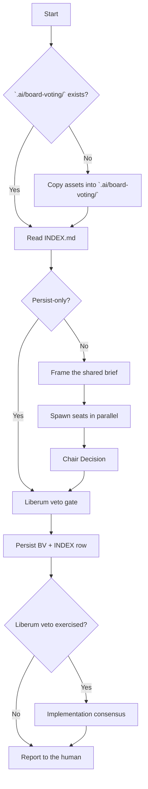

# Board voting

## Purpose

Run a short multi-model board on one concrete proposal. Persist the outcome so the repo has a searchable trail.

Votes are advisory unless the Decision says they constrain practice. Lasting binding rules belong in `.ai/adr/`. Living notes belong in `.ai/docs/`.

**Liberum veto:** after the board votes, the human MAY discard the board Decision. Then Adopt the proposer proposal. The question becomes how to implement, not whether.

## Activation

### Use when

- The human asks for a board vote or a multi-model discussion on a design fork.
- Two or more approaches compete. A durable "we already decided" record is useful.
- Persist a board discussion that already happened in this thread. Do not vote again. Write the file from the transcript.
- The human exercises or declines **liberum veto** on a just-completed or existing BV.

### Do not use when

- The choice is a small coding preference with no durable fork.
- The outcome should be binding architecture now. File an ADR after the vote if needed.
- The work is ticket refine, plan, or review scratch. Use `.ai/task/`.
- The work is a product or tech PRD. Draft in `.ai/idea/` then push to Linear.
- The work is a living note. Use `.ai/docs/`.
- The work is ordinary code review. Use `review-implementation`.

Do not invent a board vote for every small coding choice. Read `.ai/board-voting/INDEX.md` first.

## Context

Consuming-repo layout is `.ai/board-voting/`. Conventions: `assets/AGENTS.md`. File shape: `assets/TEMPLATE.md`. Empty index shape: `assets/INDEX.md`.

If `.ai/board-voting/` is missing, copy those three assets into `.ai/board-voting/` before the first persist.

If `.ai/AGENTS.md` is missing, follow `ai-dir` bootstrap first.

Each seat is an `architect` agent. Pass that seat's `model` explicitly. Seat models in the example default board below are skill-mandated. They apply to board voting only. They override the consuming-repo architect default for those seats.

The consuming repo or the human MAY replace the seats. These seats are an example default for multi-model dissent. They are not required by this kit. They are not required by any named product.

If a slug is not on this turn's Task allow-list, skip that seat or ask. Never swap the family in silence. Never pick Fast unless asked.

Always pass Task `model`. Follow the consuming repo's model-picking rule when it exists.

## Workflow

The numbered steps are the authority.

### 1. Frame the proposal

Write one brief. Use the same text for every seat.

- Proposal (concrete files and patterns)
- Proposer rationale (+ / −)
- Current-state facts (paths, sizes, existing rules and ADRs)
- Allowed verdicts: **Adopt** / **Defer** / **Reject** / **Abstain**
- Required reply shape:
  - Verdict
  - Why (3–6 bullets)
  - Preferred alternative
  - Repo pitfalls if relevant
  - Revisit when
- Cap the brief at about 350 words per seat

Gather facts with Read and Grep as needed. Do not ask the human for facts the repo already states.

### 2. Cast votes

Spawn one Task subagent per seat with:

- `subagent_type: architect`
- that seat's `model` from the example default board, the consuming-repo override, or the human override
- system framing: "You are \<Seat\> on the architecture board (architect seat)…"
- the shared brief
- Instruct the seat to use the board vote reply shape in this session
  - Verdict
  - Why
  - Preferred alternative
  - Repo pitfalls
  - Revisit when

Do not use the default output contract of the architect agent. That contract is a single Decision.

Collect structured opinions. Spawn seats in parallel.

### 3. Chair Decision (board outcome)

You (the orchestrator) synthesize the outcome. You are not a fourth voting seat unless the human asks.

- Tally Adopt / Defer / Reject / Abstain
- **Board decision** is the majority of non-abstain votes. On a tie, prefer **Defer**. Do not ship a contested convention.
- **Decision rationale** is a short synthesis. Do not paste every bullet.
- Set provisional **Binding effect**. Usual values: `none (advisory)` or `constrains practice until revisited`. Use `recommend ADR` when the outcome should bind implementers repo-wide.

Do not treat this as final until the liberum veto gate completes.

### 4. Liberum veto gate (mandatory)

After you present the board summary (tally, per-seat one-liners, provisional Decision), ask the human:

> Do you want to exercise **liberum veto**? If yes, the board Decision is discarded for outcome purposes. **Your proposal is Adopted.** The board reconvenes for **implementation consensus**. That round is how to ship it, not whether.

Rules:

- Ask every time a live vote finishes. Skip the question if the human already answered in this turn ("veto", "liberum veto", "no veto", "stand by the board").
- Do not persist the BV until the human answers, or explicitly says discussion-only / skip persist.
- Liberum veto is available for any board Decision (Adopt / Defer / Reject), not only Reject. Liberum veto always means "proposer proposal stands as Adopt."
- Never delete votes and tally. Liberum veto overrides the **Decision**. It does not erase dissent from the record.
- If the human declines:
  1. Final Decision is the board Decision.
  2. Persist.
  3. Stop. Do not run an implementation-consensus round unless they ask.

### 5. Persist

1. Use the next free `NNNN` from `.ai/board-voting/` (`0001`, `0002`, …). Update an existing BV only when you apply liberum veto or implementation consensus to that id.
2. Copy `.ai/board-voting/TEMPLATE.md` to `NNNN-kebab-title.md`. If TEMPLATE is missing, copy `assets/TEMPLATE.md`. Fill every section.
3. **Liberum veto section:**
   - Declined → `Offered: yes`, `Exercised: no`. Decision is the board Decision.
   - Exercised → `Offered: yes`, `Exercised: yes`. Record **Board decision before veto**. Set **Decision: Adopt**. Note that the proposer proposal stands. The INDEX Decision column uses `Adopt (liberum veto)` (or equivalent).
4. Append or update the row in `.ai/board-voting/INDEX.md`.
5. Set Status to `Decided` on first persist.
6. Do not rewrite vote rationales. Liberum veto and implementation consensus are additive sections. If a wholly new vote replaces an old one, set Status to `Superseded by BV-NNNN`.

### 6. Implementation consensus (only after liberum veto)

When liberum veto is exercised:

1. Tell seats the **whether** question is closed. The proposal is Adopted by liberum veto.
2. Reconvene the same board. Use parallel Task calls. Use `subagent_type: architect` with each seat's model. Give a new brief: produce a **consensus implementation plan**. Include:
   - concrete file layout
   - project architecture constraints
   - what to extract vs keep
   - test expectations
   - what not to do
3. Tell seats that verdicts are positions on shape, not Adopt/Reject of the proposal. Use the implementation-position reply shape from the brief. Do not use the default Decision block of the architect agent.
4. The chair synthesizes one **Consensus** block. Resolve disagreements. Prefer the smallest change that honors the proposal.
5. Write it under `## Implementation consensus` on the same BV. Update the INDEX one-liner if useful.
6. Report the consensus to the human. Implement only if they ask, or if the turn already includes "and build it".

### 7. Report to the human

Give a short board summary:

- provisional or final Decision
- tally
- one line per seat
- liberum veto status
- binding effect
- path to the BV file

After veto, also report the implementation consensus. Offer ADR only when Decision says recommend ADR.

## Decision Rules

- If `.ai/board-voting/` is missing → copy `assets/AGENTS.md`, `assets/TEMPLATE.md`, and `assets/INDEX.md` into `.ai/board-voting/`.
- If INDEX already has the same fork → stop. Point at that BV. Do not vote again without new evidence, an explicit reopen, or liberum veto.
- If the human names seats or models this turn → use those. They must still be real Task slugs.
- If the consuming repo defines other default seats → use those.
- Else → use the example default board below.
- If a requested slug is not in the Task allow-list → skip that seat or ask. Record the skip. Never substitute Fast. Never substitute another family.
- If the human already accepted High-for-Medium (or similar effort) → record the substitution in **Models used**.
- If votes already happened in this thread ("persist this board vote") → do not spawn seats again for the original vote. Still run the liberum veto gate unless the human already answered. Reconstruct TEMPLATE fields from the transcript. Still update INDEX.
- If the human exercises liberum veto on a previously Decided BV → keep Votes and Tally. Fill Liberum veto. Set Decision to Adopt. Update INDEX. Run implementation consensus. Append that section.
- If the human says discussion-only → do not persist.
- Always pass explicit `model` on each Task call.
- Do not use `generalPurpose` for board seats. Use it only if the human explicitly overrides the agent type for that turn.

## Example default board

Each seat is an **`architect` agent** (`Task` `subagent_type: architect`) voting under that seat's framing.

| Seat | Preferred family | Task `subagent_type` | Task `model` slug to use first | Fallback if unavailable |
| --- | --- | --- | --- | --- |
| KIMI K3 | Kimi K3 | `architect` | `kimi-k3-high` | Disclose skip. Do not silently replace with another family |
| Opus | Claude Opus | `architect` | User-named effort if given. Else latest Opus `*-thinking-high` available in Task | Same. Disclose. Do not silently swap the family |
| Sol | GPT Sol | `architect` | User-named effort if given. Else `gpt-5.6-sol-high` | Same. Disclose |

This table is the skill's example default. Multi-model dissent is the point. The consuming repo or the human MAY override seats.

## Constraints

- MUST persist under `.ai/board-voting/` unless the human said discussion-only.
- MUST NOT persist before the human answers the liberum veto question.
- MUST update INDEX in the same change.
- MUST NOT swap the model family in silence.
- MUST NOT give each seat a different brief.
- MUST NOT create a BV for every typo-level preference.
- MUST NOT debate a Decided BV again without new evidence, an explicit reopen, or liberum veto.
- MUST NOT use liberum veto to erase or rewrite board vote rationales.
- MUST NOT ask the board "whether" again after liberum veto. Ask only "how".
- MUST NOT file a BV under `.ai/adr/`.
- MUST NOT treat a BV as a substitute for ADR constraints.
- MUST NOT use `subagent_type: reviewer` for board seats.
- NEVER pick Fast unless asked.

## Quality Checks

Before finishing:

- [ ] INDEX was read before a new vote.
- [ ] `.ai/board-voting/` exists. Assets were copied if it was missing.
- [ ] Every seat received the same brief.
- [ ] Each Task call passed explicit `model`.
- [ ] Missing slugs were skipped or asked. No silent family swap.
- [ ] Liberum veto was offered (or the human already answered).
- [ ] BV file fills every TEMPLATE section.
- [ ] INDEX has a row. Decision MAY read `Adopt (liberum veto)`.
- [ ] Votes and tally are intact after veto.
- [ ] Implementation consensus exists only after veto, or is marked `n/a`.
- [ ] Binding next steps point at `.ai/adr/` or project architecture rules when needed.

## Examples

### Live vote

Input: "put this design fork to the board."

Expected: read INDEX. Frame one brief. Spawn example-default or override seats in parallel. Chair Decision. Ask liberum veto. Persist. Report.

### Persist-only

Input: "persist this board vote" after seats already spoke in the thread.

Expected: do not spawn again. Run liberum veto unless already answered. Reconstruct the TEMPLATE from the transcript. Update INDEX.

### Liberum veto exercised

Input: human says "liberum veto" after a Reject tally.

Expected: Decision becomes Adopt. Votes stay. Reconvene for implementation consensus. INDEX shows `Adopt (liberum veto)`.

### Missing slug

Input: `kimi-k3-high` is not on this turn's Task allow-list.

Expected: skip that seat or ask. Disclose. Do not spawn Opus or Sol in KIMI's place.

### Seat override

Input: human says "board of two: Opus and our repo default architect."

Expected: use those seats. Do not force the example default three.

## Failure Modes

- `.ai/board-voting/` missing → copy assets. Do not invent a parallel shape.
- INDEX already records the fork → point at the BV. Do not re-vote.
- Slug missing from the Task allow-list → skip or ask. Never silent swap.
- Human has not answered liberum veto → do not persist.
- Required path unreadable → stop. Name the path. Do not guess votes.
- Human asks to erase dissent → refuse. Veto overrides Decision only.

## Relationship to ADRs

| Board voting | ADR |
| --- | --- |
| Deliberation + advisory/practice note | Binding architecture constraint |
| Multi-model dissent on the record | Single Choice + Why + Consequences |
| May recommend an ADR | May cite a BV as Context |
| Liberum veto → Adopt + impl consensus | Still promote to ADR if binding |

Promote lasting constraints to an ADR. Then mirror them in project architecture rules when they bind day-to-day code. Non-binding "how this works now" belongs in `.ai/docs/`.

## References

- `assets/AGENTS.md` — copy into `.ai/board-voting/AGENTS.md` if missing. Consuming-repo conventions.
- `assets/TEMPLATE.md` — copy into `.ai/board-voting/TEMPLATE.md` if missing. BV file shape.
- `assets/INDEX.md` — copy into `.ai/board-voting/INDEX.md` if missing. Empty index + how-to.
- `skills/ai-dir/SKILL.md` — root `.ai/` bootstrap, docs, adr catalogs.
- `.ai/adr/` — binding architecture.
- `.ai/docs/` — living notes.
