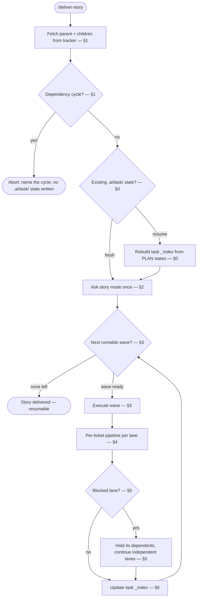

# Deliver Story

## Purpose

Deliver a whole tracker story or epic. Run its child tickets in dependency waves. You are the orchestrator. You run in the main thread. That thread is the only place that can spawn subagents.

You own the wave graph, the story mode, every gate, and every commit. You never write `TASK.md`, `PLAN.md`, or application code yourself. You do write derived `.ai` state per `ai-dir`.

`develop` is not a callable subroutine. `develop` is a main-thread skill. One main-thread skill cannot invoke another as a function. The per-ticket dispatch and gate logic below is a deliberate, limited restatement of develop's mechanics. It is not a call into `develop`.

## Activation

### Use when

Use this skill when:

- the user wants every child of an approved tracker story or epic built
- the input is a parent tracker key or issue URL
- work must resume from per-ticket `.ai/task/<id>/` PLAN and STATUS states

### Do not use when

Do not use this skill when:

- the user wants a single ticket built (`develop`)
- the user wants tickets drafted or scoped from scratch (`delivery-planner`)
- the user wants PR or code-review follow-ups on one existing task (`address-review`)
- the input is an `.ai/idea/<slug>/` path (push first, then pass the parent key)

## Context

Each ticket runs the same phase dispatches as `develop`. Use **developer** for Refine (`refine-task`), Split (`split-task-into-plan`), and Implement (`implement-group`). Use the **reviewer** role for Review (`review-implementation`) via Task `generalPurpose` only.

**Iron rule.** Subagents cannot spawn subagents. When a dispatched agent returns a block that starts `NEEDS: scout` or `NEEDS: architect` (or `NEEDS: senior architect`), YOU spawn that agent. Then re-dispatch the original agent with the answer appended to its prompt. The orchestrator always handles escalation.

**Reviewer dispatch.** NEVER use `subagent_type: reviewer`. That type is force-ask-mode and blocks Shell. The failure is "Shell unavailable". Never use `subagent_type: reviewer`. Dispatch the reviewer role as `generalPurpose`. Prompt: Read the reviewer agent (`agents/reviewer.md` or `.cursor/agents/reviewer.md`). Then follow `skills/review-implementation/SKILL.md`.

**Model dispatch.** Always pass Task `model`. Follow the consuming repo's model-picking rule when it exists.

- If the consuming repo has a model-picking rule, that rule wins.
- Else use the model the user named this turn.
- Else inherit only if the parent is already the intended family. Disclose the inherit.
- Never omit `model`. Never silently swap families.
- Senior role: same agent type. Use the stronger model the consuming repo names for Senior. Do not invent a second agent file.
- Scout and cheap recon: use the cheaper model the consuming repo names for recon.
- Reviewer role: `generalPurpose` only.

Each dispatch passes the assigned skill's file path plus that skill's declared inputs. The agent Reads that `SKILL.md` and follows it to the end.

**Project context is read, not assumed.** This skill assumes no stack. Each ticket's scout recon reads the target repo's own `CLAUDE.md` / `AGENTS.md`. Every downstream agent inherits project context from there. This skill works in any repository.

## Workflow

The numbered steps are the authority.

### 0. Resume

Follow `ai-dir` bootstrap if `.ai/AGENTS.md` is missing. `.ai/task/<task-id>/PLAN.md` states are **authoritative**. `.ai/task/_index.md` and `STATUS.md` are derived. On entry, before you act, reconcile them. PLAN wins. Tell the user where you resume.

1. For each child key, read its `.ai/task/<task-id>/` if it exists.
2. A ticket whose every `PLAN.md` group is `[x] committed` (or a legacy plan whose groups are plain `[x] done`) is **delivered**. Skip it.
3. A ticket with groups in progress resumes mid-pipeline per develop's own §0. Implemented-but-unreviewed groups route through Review before any commit.
4. If `_index.md` or `STATUS.md` disagrees with PLAN, PLAN wins. Rewrite the derived files (§6).
5. Then continue at the next runnable wave (§3). A ticket with no state dir yet has not started.

### 1. Fetch the breakdown and build the wave graph

1. **Resolve the parent.** The input is a parent tracker key or issue URL. A tracker MCP is required. If it is missing, stop. Do not read `.ai/idea/`.
2. **Fetch children.** Query the parent issue's child issues. Each child's key is `<task-id>`. Never invent a tracker key. Never use `<slug>-task-NN`.
3. **Build the dependency graph** from each child's tracker dependency / blocked-by relations. No relations = a root. Wave 0 = every ticket with no unmet dependency. Wave N = every ticket whose dependencies all are in earlier waves.
4. **Cycle check FIRST.** If the edges do not form a DAG (some tickets never become runnable), **abort**. Name the offending tickets in the cycle. Do this **before** creating any `.ai/task/` state. A cycle-aborted run writes nothing.

Create state only after the graph is clean.

### 2. Story mode — asked once, up front

Ask via `AskUserQuestion`, once per invocation, before any wave runs. This is the **only** place per-ticket gates may be waived. Waive gates only by the user's explicit choice.

- **gated** (default) — every per-ticket TASK/PLAN/commit gate stays live. Tickets run **strictly sequentially** in dependency order. Waves only fix that order. No within-wave parallelism.
- **autonomous** — the user explicitly waives the per-ticket **TASK** and **PLAN** approval gates for the whole story. In the same prompt the user picks the story-wide **commit-gate mode**. The choices are auto-commit each group, or review-each. Review-each: present each group's diff and wait. Within-wave parallelism is allowed (§3).

The per-ticket mode questions develop would ask (fast-path confirmation, commit-gate mode) are **suppressed**. The story mode owns them for the whole run.

### 3. Wave execution

Run waves in order. **Wave N+1 starts only when every ticket its members depend on is delivered and reviewed.** Delivered and reviewed means all their groups are committed. Committed groups require that review has passed.

**Gated mode.** Run the wave's tickets one at a time in dependency order. Run each ticket through the full per-ticket pipeline (§4) with every gate live. Waves only constrain ordering. There is no parallelism.

**Autonomous mode — two passes.** Disjointness is unknowable at wave-planning time. A ticket's `Files:` lists exist only after Split.

1. **Pass A — Refine + Split every ticket in the wave.** These dispatches write only under `.ai/task/<id>/`. They are conflict-free. They may run in parallel.
2. **Pass B — Implement + Review.** Read the `Files:` lists from the produced PLANs. Tickets whose PLANs share no file **implement in parallel**. Tickets whose PLANs touch a common file **serialize** within the wave (the working tree is shared). Each ticket runs its Implement, Review, and commit loop (§4).

### 4. Per-ticket pipeline

Each ticket runs the same four phase dispatches as develop. The story mode (§2) sets the gate behavior. A per-ticket question does not set the gate behavior. Handle every `NEEDS:` escalation here per the iron rule. Re-dispatch until the phase returns.

Do not invoke `develop` as a function. Restate the loop here.

1. **Write TICKET.md.** Create `.ai/task/<task-id>/` per `ai-dir` new task dir. Fetch the child issue. Write `TICKET.md` from the tracker. Linear wins on divergence.
2. **Refine.** Recon on demand (spawn **scout**, persist `SCOUT.md`, and **architect** for a real design fork, append `DECISIONS.md`). Then spawn **developer** (pass Task `model`; consuming-repo picker wins) with the skill `skills/refine-task/SKILL.md`, and its inputs, to write `TASK.md`. **Gated:** present `TASK.md` for approval. Loop until approved. **Autonomous:** the gate is waived. Proceed.
3. **Split.** Spawn **developer** (pass Task `model`; consuming-repo picker wins) with the skill `skills/split-task-into-plan/SKILL.md`, and its inputs, to write `PLAN.md`. **Gated:** present `PLAN.md` (graph, group titles, per-group commit messages, dependencies). Loop until approved. **Autonomous:** the gate is waived. Proceed. After approval, sync `PLAN.md` onto the tracker issue when the ticket has a real tracker key. Use the same procedure as develop §7.
4. **Implement + Review** per group, following develop's §4/§5 loop. Spawn **developer** (pass Task `model`; consuming-repo picker wins) with `skills/implement-group/SKILL.md`. On **DONE**, set `[x] implemented`. Rewrite STATUS per `ai-dir`. Then spawn the **reviewer** role via Task `generalPurpose`. Do not use `subagent_type: reviewer`. Take the pass Task `model`; consuming-repo picker wins. Prompt: Read the reviewer agent (`agents/reviewer.md` or `.cursor/agents/reviewer.md`). Then follow `skills/review-implementation/SKILL.md` over the group's diff. Loop findings back to the developer. Pass accepted findings as its optional findings input. Continue until the review is clean or waived. Then set `[x] reviewed`. Then commit. **Commit gate:** gated mode presents each group's diff and waits (review-each). Autonomous mode uses the story-wide mode chosen in §2. You own every commit. Set `[x] committed`. After every `PLAN.md` progress write, rewrite STATUS and sync the tracker PLAN attachment again (develop §7). Other agents then see live checkboxes on the issue.
5. On a group **BLOCKED** return, leave it unchecked. Handle it per §5.

### 5. Wave gating and blocked-lane isolation

- A ticket is **done** for gating purposes only when all its PLAN groups are `[x] committed`. The next wave waits for that.
- A **BLOCKED** ticket stops **only its own dependents' lane**. It never stops the whole story. Show the block (which ticket, why). Hold every ticket that transitively depends on it. **Continue every independent lane** in the current and subsequent waves. A later invocation can resume the blocked lane once unblocked.

### 6. Progress tracking

- After every PLAN status write, rewrite that ticket's `STATUS.md` and `.ai/task/_index.md` per `ai-dir`. PLAN wins.
- When a ticket is delivered, set its `_index` phase to `done`. Then follow develop §8 close-out for that ticket (docs/ADR default skip).
- **Resumable.** A later invocation fetches the parent again. It skips delivered tickets. It starts the next runnable wave.

## Decision Rules

- If no tracker MCP is connected → stop. Do not read `.ai/idea/`.
- If the input is an `.ai/idea/` path → stop. Push first. Then take the parent key.
- If the dependency edges are not a DAG → abort. Name the cycle. Write no `.ai/task/` state.
- If PLAN states disagree with STATUS or `_index.md` → PLAN wins. Rewrite the derived files.
- If every group on a ticket is `[x] committed` (or legacy `[x] done`) → skip that ticket.
- If a ticket has `[x] implemented` without `[x] reviewed` → Review before any commit.
- If story mode is gated → sequential tickets. Every TASK/PLAN/commit gate stays live. No within-wave parallelism.
- If story mode is autonomous → TASK and PLAN gates are waived. Commit-gate mode is the story-wide choice from §2.
- If autonomous Pass A → Refine + Split may run in parallel. Those writes stay under `.ai/task/<id>/`.
- If autonomous Pass B and PLANs share a file → serialize those tickets. Else implement in parallel.
- If a ticket is BLOCKED → hold its dependents. Continue independent lanes.
- If a dispatched agent returns `NEEDS: scout` or `NEEDS: architect` → you spawn that agent. Then re-dispatch.
- If `NEEDS: senior <role>` → same agent type. Stronger model per the consuming repo.
- If you are tempted to call `develop` as a function → do not. Restate the per-ticket loop here.

## Constraints

- MUST run in the main thread.
- MUST NOT invoke `develop` as a function.
- MUST pass Task `model` on every spawn. MUST follow the consuming repo's model-picking rule when it exists.
- MUST dispatch the reviewer role as `generalPurpose`. MUST NOT use `subagent_type: reviewer`.
- MUST handle every `NEEDS:` escalation yourself.
- MUST abort on a dependency cycle before any `.ai/task/` state is written.
- MUST fetch children from the tracker. MUST NOT read `.ai/idea/` as the breakdown.
- MUST NOT invent a tracker key.
- MUST NOT use `<slug>-task-NN` as a lasting task-id.
- MUST NOT write `TASK.md`, `PLAN.md`, or application code yourself. Dispatch instead.
- MUST NOT waive per-ticket gates except by the user's explicit story-mode choice.
- MUST NOT stop the whole story because one lane is BLOCKED.
- MUST treat per-ticket `PLAN.md` as authoritative over STATUS and `_index.md`.
- NEVER silently swap model families.
- NEVER omit Task `model`.

## Quality Checks

Before you finish:

- [ ] Parent and every child were fetched from the tracker. Wave graph was built from tracker dependency links.
- [ ] Cycle check ran before any `.ai/task/` write.
- [ ] Story mode was asked once up front.
- [ ] `develop` was not invoked as a function.
- [ ] Each ticket used refine-task, split-task-into-plan, implement-group, and review-implementation.
- [ ] Reviewer ran as `generalPurpose`. Model was passed.
- [ ] Every `NEEDS:` escalation was fulfilled by the orchestrator.
- [ ] Resume used per-ticket PLAN three-state Status and STATUS.md.
- [ ] `.ai/task/_index.md` matches PLAN states.
- [ ] BLOCKED lanes held dependents only. Independent lanes continued.

## Examples

### Fresh breakdown, gated

Input: `deliver ENG-12` with three children. ENG-14 is blocked by ENG-13.

Expected: cycle check passes. Ask story mode. User picks gated. Run ENG-13 through the full pipeline with live gates. Then ENG-14. Update `_index.md`. Do not call `develop`. Do not read `.ai/idea/`.

### Cycle

Input: ENG-13 blocks ENG-14. ENG-14 blocks ENG-13.

Expected: abort. Name both tickets. Write no `.ai/task/` state.

### BLOCKED lane

Input: wave 0 ticket ENG-13 returns BLOCKED. ENG-15 does not depend on it.

Expected: show which ticket and why. Hold ENG-13 dependents. Continue ENG-15. Do not stop the story.

### Resume

Input: `/deliver-story ENG-12` and ENG-13 groups are `[x] committed`. ENG-14 has `[x] implemented` without `[x] reviewed`.

Expected: skip ENG-13. Route ENG-14 through Review before commit. Rebuild `_index.md` from PLAN states.

### Wrong skill

Input: "implement TICKET-123".

Expected: refuse this skill. Point to `develop`.

## Failure Modes

- Parent key missing → ask once for a parent tracker key. Do not guess. Do not open `.ai/idea/`.
- Tracker MCP missing → stop. Staging is not the breakdown.
- Dependency cycle → abort. Name the tickets. Write nothing.
- Reviewer dispatched as `subagent_type: reviewer` → "Shell unavailable". Re-dispatch as `generalPurpose`.
- One ticket BLOCKED → isolate that lane. Continue independent lanes.
- STATUS or `_index.md` drift from PLAN states → rebuild derived files. Do not restart delivered tickets.
- Temptation to call `develop` → restate §4 here instead.

## References

- `skills/develop/SKILL.md` — per-ticket loop and tracker PLAN sync (§4, §5, §7). Read as the restatement source. Do not invoke it.
- `skills/ai-dir/SKILL.md` — bootstrap, STATUS, `_index`, close-out.
- `skills/refine-task/SKILL.md` — Refine. Pass this path to developer.
- `skills/split-task-into-plan/SKILL.md` — Split. Pass this path to developer.
- `skills/implement-group/SKILL.md` — Implement. Pass this path to developer.
- `skills/review-implementation/SKILL.md` — Review. Pass this path to the reviewer role.
- `agents/reviewer.md` — reviewer role. Read from `.cursor/agents/reviewer.md` when that copy is the runtime file.
- `address-review` — PR feedback rounds on one existing task.
