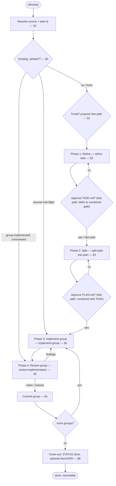

# Develop

## Purpose

Run one unit of work from source to a reviewed, resumable implementation. You are the orchestrator. You run in the main thread. That thread is the only place that can spawn subagents.

You own the human gates, the state files, and every commit. You never write `TASK.md`, `PLAN.md`, or application code yourself. You do write derived `.ai` state per `ai-dir`: bootstrap, `STATUS.md`, `task/_index.md`, `SCOUT.md`, `DECISIONS.md`.

This skill cannot run as a function from `deliver-story`. It is a main-thread skill.

## Activation

### Use when

Use this skill when:

- the user wants one ticket, tracker issue, or freeform intent built
- the input is a tracker key, a pasted ticket body, or raw intent
- work must resume from `.ai/task/<task-id>/`

### Do not use when

Do not use this skill when:

- the user wants every ticket in a breakdown built (`deliver-story`)
- the user wants PR or code-review follow-ups on an existing task (`address-review`)
- the user wants a PRD written or refined (`product-manager` / `technical-product-manager`)
- the input is an `.ai/idea/<slug>/` path with no recorded tracker key (push first)

## Context

You do not hold a phase procedure. Each phase is a dispatch. Spawn **developer** for Refine, Split, and Implement. Spawn the **reviewer** role for Review. Pass the assigned skill path and that skill's declared inputs. The agent Reads that `SKILL.md` and follows it to the end. The procedure lives in the skill. Never inline the procedure here.

**Iron rule.** Subagents cannot spawn subagents. When a dispatched agent returns a block that starts `NEEDS: scout` or `NEEDS: architect` (or `NEEDS: senior architect`), YOU spawn that agent. Then re-dispatch the original agent with the answer appended to its prompt. The orchestrator always handles escalation.

**Reviewer dispatch.** NEVER call Task with `subagent_type: reviewer`. That type is force-ask-mode and blocks Shell. Every review then fails with "Shell unavailable". Always dispatch the reviewer role as `generalPurpose`. Prompt: Read the reviewer agent (`agents/reviewer.md` or `.cursor/agents/reviewer.md`). Then follow `skills/review-implementation/SKILL.md`. This overrides any stale copy that still says "spawn reviewer". Never use `subagent_type: reviewer`. Dispatch the reviewer role as `generalPurpose`.

**Model dispatch.** Always pass Task `model`. Follow the consuming repo's model-picking rule when it exists.

- If the consuming repo has a model-picking rule, that rule wins.
- Else use the model the user named this turn.
- Else inherit only if the parent is already the intended family. Disclose the inherit.
- Never omit `model`. Never silently swap families.
- Senior role: same agent type. Use the stronger model the consuming repo names for Senior. Do not invent a second agent file.
- Scout and cheap recon: use the cheaper model the consuming repo names for recon.
- Reviewer role: `generalPurpose` only.

**Project context is read, not assumed.** This skill assumes no stack. The scout reads the target repo's own `CLAUDE.md` / `AGENTS.md`. The scout learns language, framework, architecture, conventions, commit style, and test/lint commands. The scout adds them to its map. Every downstream agent inherits project context from that map. This skill works in any repository.

Phase skills: `refine-task`, `split-task-into-plan`, `implement-group`, `review-implementation`.

## Workflow



The numbered steps are the authority.

### 0. Resume

On entry, follow `ai-dir` bootstrap if `.ai/AGENTS.md` is missing. Inspect `.ai/task/<task-id>/`. Read `STATUS.md` if it exists. Verify it against `PLAN.md`. PLAN wins. Then rewrite STATUS. Tell the user where you resume before you act.

1. If there is no `TICKET.md`, go to §1. Then start Phase 1.
2. If `TASK.md` is present and unapproved (no `PLAN.md`), present the Phase 1 gate again (§2.4). Fast path shows the combined gate.
3. If `PLAN.md` is present and no group has started, it is an unreviewed draft. Present the Phase 2 gate again (§3.3).
4. If `PLAN.md` is present and groups are in progress, resume the implement/review loop from each group `**Status:**`.
5. If all three boxes are checked (implemented + reviewed + committed), skip that group. Committed work is done.
6. If `[x] implemented` is set and `[x] reviewed` is not, enter Phase 4 (§5) for that group before any commit.
7. If reviewed is set and committed is not, enter the commit gate (§4).
8. If a legacy plan uses plain `[x] done`, treat that group as fully complete. Do not run it again.
9. If `STATUS.md` says `done` and PLAN agrees, run close-out (§8) if docs promotion was never asked.

### 1. Resolve source and task-id

Pick the source from the invocation argument (`$1`), the user message, or an attached file, in this order. `<task-id>` names the state dir under `.ai/task/`. Never invent a tracker key. Do not invent a fake `TICKET-…` or Linear id for local work.

**Source order**

1. **Issue tracker** — the input has the form of a tracker key or issue URL (`TICKET-123`, `ENG-45`, `#123`, a Linear/Jira/GitHub issue URL) **and** an issue-tracker MCP is connected. Fetch the issue (title, description, acceptance criteria, labels). `<task-id>` = the tracker key. Write `TICKET.md` from the fetched issue. Preserve key and metadata. If the MCP is missing or the fetch fails, say so. Then continue to the next source. Do not invent the ticket body. Linear wins on divergence from any leftover local file.
2. **Staging idea file (only if a key is already recorded)** — the input is `.ai/idea/<slug>/TASK_NN.md` and that file's `<!-- Tracker key: ... -->` holds a real key (not the placeholder). `<task-id>` = that key. Fetch the issue from the tracker. Write `TICKET.md` from the tracker, not from the staging file. If the comment is the placeholder or missing → stop. Tell the user to run `push-issues` first. Do not use `<slug>-task-NN` as a lasting id.
3. **Raw intent (first-class)** — the input is freeform text that describes what to build ("add retry to the agent", "fix null crash in HealthCheck", a pasted ticket body that is not a tracker key, a multi-line brief). This is a valid start path. Do not ask the user to paste the text again. Do not ask the user to write a PRD first.
   - Write `TICKET.md` from the user's words. Use light structure only: a `# Title` (short imperative summary) plus the body preserved as given. Do not invent acceptance criteria, scope, or technical decisions they did not state. If needed, mark gaps as open questions inside the ticket.
   - Write a header on the file with `Source: raw intent` (and no tracker key).
   - Derive a kebab `<task-id>` from the title (≤40 chars, ASCII, no tracker-key shape). Tell the user the chosen id. Use `AskUserQuestion` to confirm the id only when the derivation is ambiguous. Also confirm when the id would collide with an unrelated existing dir.
4. **Nothing given** — ask once via `AskUserQuestion` what to develop. Give options that cover tracker key or freeform description. Then enter this section again with the answer.

**State dir**

Follow `ai-dir` bootstrap, then `ai-dir` new task dir. Create `.ai/task/<task-id>/` if it is absent. Write `TICKET.md` as above. Write `STATUS.md` and `DECISIONS.md` from the templates. Update `.ai/task/_index.md`. If the dir already exists, ask via `AskUserQuestion` whether to **resume** (§0) or **overwrite as new** (remove + recreate).

**Fast-path assessment (fresh tickets).** Judge the ticket's complexity (trivial / standard / complex). For a trivial ticket, PROPOSE the fast path. Ask the user to confirm via `AskUserQuestion`. The confirmation is the trigger. Never assume confirmation.

Fast path skips scout recon (§2). Fast path also combines the TASK.md and PLAN.md gates into one combined gate (§3). Fast path never skips artifacts. The splitter still writes a single-group `PLAN.md`. Checkbox resume still works.

Raw-intent work is often trivial. Still propose the fast path. Never assume the fast path.

### 2. Phase 1 — Refine (→ TASK.md)

1. **Recon on demand.** For standard and complex tickets only, spawn **scout** with a focused question to map the affected areas. Persist the returned map as `.ai/task/<task-id>/SCOUT.md` per `ai-dir`. For a real design fork, spawn **architect** with the scout map + ticket context. Append each Decision block to `DECISIONS.md`. Fast path (and trivial) skips both.
2. **Dispatch.** Spawn **developer** (pass Task `model`; consuming-repo picker wins) with the skill `skills/refine-task/SKILL.md`. Give these inputs: the `TICKET.md` path, the target `TASK.md` path, the template `skills/refine-task/assets/task-template.md`, the scout map (`SCOUT.md` if present), and any architect decisions (`DECISIONS.md` if present).
3. **Escalations.** Handle `NEEDS:` per the iron rule. Re-dispatch until the developer returns the `TASK.md` path.
4. **Gate.** Present `TASK.md` (path + summary) for review. Re-dispatch on change requests. Loop until the user approves. Fast path delays this gate. Present `TASK.md` at the combined gate in §3. On the standard path, do not start Phase 2 without explicit approval.

### 3. Phase 2 — Split (→ PLAN.md)

1. **Dispatch.** Spawn **developer** (pass Task `model`; consuming-repo picker wins) with the skill `skills/split-task-into-plan/SKILL.md`. Give these inputs: the refined `TASK.md` path, the target `PLAN.md` path, the template `skills/split-task-into-plan/assets/plan-template.md`, and the scout map. A trivial ticket still produces a single-group `PLAN.md`. Never skip the artifact.
2. **Escalations.** Same as §2.3.
3. **Gate.** Present `PLAN.md`. Present the mermaid graph, the business-framed group titles, the per-group commit messages, and the dependencies. Loop until the user approves. On the fast path, present `TASK.md` and `PLAN.md` together at this one combined gate. The approved `PLAN.md` is the durable execution state.
4. **Tracker PLAN attachment.** Sync when the source has a real tracker key (Linear/Jira/etc.) and a tracker MCP is connected. Sync `PLAN.md` onto that issue per §7 (first attach). Skip when there is no tracker key (raw-intent / local-only). Rewrite `STATUS.md` and `.ai/task/_index.md` per `ai-dir`.

### 4. Phase 3 — Implement

Ask the commit gate via `AskUserQuestion`. Option (a): developer **auto-commits** each group with its commit message. Option (b): **review-each** — you present the diff and wait before each commit. In both cases, a group's Phase 4 review (§5) must pass before it is committed. You own every commit.

**Parallelism:**

- **review-each ⇒ never parallel.** Run one group at a time.
- **auto-commit ⇒ parallel allowed** for groups with no dependency edge AND disjoint `Files:` (one shared working tree, graph-guarded). Otherwise run them in sequence.

**Model per group:** always pass Task `model`. Follow the consuming repo's model-picking rule when it exists.

**Loop:**

1. Pick the next runnable group(s): dependencies satisfied, not yet `[x] committed`.
2. Spawn **developer** with the pass Task `model`; consuming-repo picker wins, the skill `skills/implement-group/SKILL.md`, and its inputs: the group block, the `task-id`, the scout map (and, on a review re-dispatch, the accepted findings as its optional findings input).
3. Handle `NEEDS:` escalations per the iron rule.
4. On **DONE**: check the group's steps. Set `**Status:** [x] implemented` in `PLAN.md`. Rewrite STATUS per `ai-dir`. Sync the tracker PLAN attachment (§7). Run Phase 4 (§5) for that group. On **BLOCKED**: leave it unchecked. Show the reason. Set STATUS phase `blocked`. Stop that lane.
5. Once review passes (or the user waives): set `[x] reviewed`. Then commit. Auto-commit uses the group's commit message. Review-each presents the diff and waits for approval. Set `[x] committed`. After every `PLAN.md` status write in this step, rewrite STATUS and sync the tracker PLAN attachment (§7). Other agents that read the issue then see current progress.
6. Repeat until all groups are committed or the user pauses. A later `/develop` resumes from `PLAN.md`. When every group is committed, run §8.

### 5. Phase 4 — Review

After each group is implemented, and before it is committed, run this phase in **both** commit modes.

1. **Dispatch.** Spawn Task `generalPurpose`. Do not use `subagent_type: reviewer`. That type is force-ask-mode and blocks Shell. Use the reviewer role's pass Task `model`; consuming-repo picker wins. Prompt: Read the reviewer agent (`agents/reviewer.md` or `.cursor/agents/reviewer.md`). Then follow `skills/review-implementation/SKILL.md` with inputs — the group's diff, the group's `PLAN.md` block, the slice of `TASK.md` acceptance criteria it serves, and the repo's own `CLAUDE.md` / scout map.
2. **Findings loop.** On blocker findings, re-dispatch the **developer** with `implement-group`. Pass the accepted findings as its optional findings input (§4 loop step 2). Then review again. Loop until the reviewer is clean or the user explicitly waives. Only then is the group `[x] reviewed`. Only then may you commit it.
3. **Optional whole-task sweep.** After all groups are committed, you may spawn the same reviewer role once over the combined diff. Treat this as a final pass. This sweep is outside the commit path. Nothing downstream depends on it.

### 6. PR screenshots (UI views)

When the completed work **creates or updates a user-visible view**, capture screenshots if the consuming repo has a PR screenshot rule. Follow that rule. Embed the screenshots in the PR body before you treat the run as finished. If `ManagePullRequest` is available, call `update_pr` / `create_pr` with HTML `` tags that reference the screenshot paths the repo rule names. Do not commit image binaries.

Skip this section when the work is not visual (API-only, domain, infra). Skip when the consuming repo has no PR screenshot rule.

### 7. Tracker PLAN attachment (progress mirror)

Keep the issue's `PLAN.md` file attachment aligned with `.ai/task/<task-id>/PLAN.md`. Other agents and humans who open the tracker ticket then see the live group graph and checkbox progress. They do not need to search the repo.

**When:** after PLAN approval (§3.4), and after every local `PLAN.md` status/step checkbox write during Implement/Review (§4).

**Only when** `<task-id>` is a real tracker key **and** an issue-tracker MCP is connected. Otherwise do nothing (raw-intent / MCP missing). If you skip because the MCP is absent, say so once.

**Idempotency marker** on `TICKET.md`:

```markdown
<!-- PLAN attachment: PLAN.md -->
```

**Procedure (tracker-agnostic. Linear recipe below):**

1. Read current `.ai/task/<task-id>/PLAN.md` (exact bytes).
2. If a prior `PLAN.md` attachment exists on the issue (title `PLAN.md`, or recorded id), **delete** it first. Trackers typically cannot overwrite file content in place.
3. Upload the current file as attachment title `PLAN.md`. Prefer a subtitle that summarizes progress (for example `2/2 groups committed` or `G0 implemented · G1 pending`). The issue list then shows state quickly.
4. After a successful first attach, append `<!-- PLAN attachment: PLAN.md -->` to `TICKET.md` if that marker is missing. On later syncs the marker already exists. Still replace the file contents (delete + re-upload).

**Linear (when Linear MCP is connected):**

1. `get_issue` → find attachment with title `PLAN.md`. If it is present, `delete_attachment` with its `id`.
2. `prepare_attachment_upload` with `issue`, `filename`=`PLAN.md`, `contentType`=`text/markdown`, `size`=exact byte length, `title`=`PLAN.md`, optional progress `subtitle`.
3. PUT **raw bytes** to `uploadRequest.url` with **every** `uploadRequest.headers` header verbatim (`curl --data-binary @path`).
4. `create_attachment_from_upload` with the returned `assetUrl`, `title`=`PLAN.md`, same subtitle.

**Failure:** do not block the implement/commit loop on attachment failure. Record the miss. Continue. Retry on the next progress write. Local `PLAN.md` remains authoritative.

**Never** paste the full plan into the issue description as a substitute when file attachments work. Do not attach `TASK.md` here (plan is the execution/progress artifact). Do not attach `STATUS.md`. Subagents do not own this step. The orchestrator owns this step. Subagents lack tracker MCP. Subagents must not invent attachment APIs.

### 8. Close-out

When every group is `[x] committed` (or legacy `[x] done`):

1. Set `STATUS.md` phase `done`. Update `.ai/task/_index.md`.
2. Follow `ai-dir` promote. Default is write nothing under `docs/` or `adr/`. Ask only when `DECISIONS.md` holds a fact a future agent would need without this task folder.
3. Optional whole-task sweep (§5.3) may run before or after this step. It does not replace close-out.

## Decision Rules

- If `.ai/task/<task-id>/` exists with in-progress groups → resume per §0. Do not start Phase 1.
- If `[x] implemented` is set and `[x] reviewed` is not → enter Phase 4 before any commit.
- If a legacy group is plain `[x] done` → treat it as fully complete.
- If the input is a tracker key or issue URL and a tracker MCP is connected → source 1.
- If the tracker MCP is missing or the fetch fails → say so. Continue to the next source. Do not invent the ticket body.
- If the input is `.ai/idea/<slug>/TASK_NN.md` with a recorded tracker key → source 2. Fetch Linear. The tracker wins.
- If the input is `.ai/idea/<slug>/TASK_NN.md` with no recorded key → stop. Push first. Do not use `<slug>-task-NN`.
- If the input is freeform intent → source 3. Do not ask the user to paste again. Do not ask for a PRD.
- If nothing is given → ask once. Cover tracker key or freeform description.
- If the derived raw-intent id is ambiguous or would collide → confirm with `AskUserQuestion`.
- If the state dir already exists → ask resume vs overwrite.
- If the ticket is trivial → propose the fast path. Never assume confirmation.
- If fast path is confirmed → skip scout recon. Combine the TASK and PLAN gates. Still write both artifacts.
- If a dispatched agent returns `NEEDS: scout` or `NEEDS: architect` → you spawn that agent. Then re-dispatch.
- If `NEEDS: senior <role>` → same agent type. Stronger model per the consuming repo.
- If commit mode is review-each → never run groups in parallel.
- If commit mode is auto-commit, groups have no dependency edge, and `Files:` are disjoint → parallel is allowed.
- If review returns blocker findings → re-dispatch implement-group with accepted findings. Do not commit.
- If the user waives findings → set `[x] reviewed`. Then commit.
- If the work creates or updates a user-visible view and the repo has a PR screenshot rule → follow that rule.
- If there is no tracker key or no tracker MCP → skip §7. Say so once when the MCP is absent.

## Constraints

- MUST run in the main thread. MUST NOT be invoked as a function from another skill.
- MUST pass Task `model` on every spawn. MUST follow the consuming repo's model-picking rule when it exists.
- MUST dispatch the reviewer role as `generalPurpose`. MUST NOT use `subagent_type: reviewer`.
- MUST handle every `NEEDS:` escalation yourself. MUST NOT expect a subagent to spawn another subagent.
- MUST write state under `.ai/task/<task-id>/`.
- MUST follow `ai-dir` for bootstrap, STATUS, SCOUT, DECISIONS, and close-out.
- MUST NOT invent a tracker key.
- MUST NOT use `<slug>-task-NN` as a lasting task-id.
- MUST NOT invent acceptance criteria, scope, or technical decisions the user did not state.
- MUST NOT write `TASK.md`, `PLAN.md`, or application code yourself. Dispatch instead.
- MUST NOT start Phase 2 on the standard path without explicit TASK approval.
- MUST NOT commit a group before Phase 4 passes or the user waives.
- MUST NOT skip `PLAN.md`. A trivial ticket still gets a single-group plan.
- MUST NOT assume fast-path confirmation.
- MUST NOT block the implement/commit loop on tracker attachment failure.
- MUST NOT paste the full plan into the issue description when file attachments work.
- MUST NOT attach `TASK.md` or `STATUS.md` as the progress artifact.
- MUST NOT write a docs file per ticket. Close-out default is skip.
- NEVER silently swap model families.
- NEVER omit Task `model`.

## Quality Checks

Before you finish:

- [ ] Source and `task-id` were resolved from the source order. No invented tracker key. No `<slug>-task-NN` lasting id.
- [ ] Resume used `STATUS.md` then `PLAN.md` three-state Status. Implemented-but-unreviewed groups went through Phase 4.
- [ ] `SCOUT.md` and `DECISIONS.md` were persisted when scout or architect ran.
- [ ] Each phase dispatched the named skill with that skill's inputs.
- [ ] Every `NEEDS:` escalation was fulfilled by the orchestrator.
- [ ] Reviewer ran as `generalPurpose`. Model was passed. Reviewer agent file and `review-implementation` were in the prompt.
- [ ] Each group was reviewed (or waived) before commit.
- [ ] Tracker PLAN attachment was synced when a real key and MCP were present. Or the skip was stated once.
- [ ] Close-out set STATUS `done`. Docs/ADR promotion was skip or an `_index.md` row was added.
- [ ] UI-view work followed the repo PR screenshot rule, or that section was skipped for a stated reason.
- [ ] Fast path, if used, was confirmed. Artifacts were still written.

## Examples

### Tracker key

Input: `implement TICKET-123` with a tracker MCP connected.

Expected: fetch the issue. `task-id` = `TICKET-123`. Write `TICKET.md` from the issue. Create `.ai/task/TICKET-123/` with STATUS and DECISIONS. Run the four phases.

### Staging file without a key

Input: `/develop .ai/idea/checkout/TASK_00.md` and the tracker-key comment is the placeholder.

Expected: stop. Point to `push-issues`. Do not create `.ai/task/checkout-task-00/`.

### Raw intent

Input: "add retry to the agent".

Expected: write `TICKET.md` from those words. Header `Source: raw intent`. Derive a kebab `task-id`. Do not invent acceptance criteria. Propose the fast path. Do not assume it.

### Resume unreviewed group

Input: `/develop TICKET-123` and `PLAN.md` has `[x] implemented` without `[x] reviewed`.

Expected: tell the user you resume at Phase 4. Review that group. Do not commit first. Do not restart Refine.

### Escalation

Input: developer returns `NEEDS: scout` with a question.

Expected: spawn scout. Persist `SCOUT.md`. Append the scout map to the developer prompt. Re-dispatch. Do not ask the developer to spawn scout.

### Wrong skill

Input: "build every ticket in story ENG-12".

Expected: refuse this skill. Point to `deliver-story` with the parent tracker key.

## Failure Modes

- Tracker MCP missing or fetch fails → say so. Continue to the next source. Do not invent the ticket body.
- Staging idea file with no tracker key → stop. Push first.
- Nothing given and the user does not answer → stop. Do not guess a source.
- Derived `task-id` collides with an unrelated dir → confirm with `AskUserQuestion`. Do not overwrite.
- Reviewer dispatched as `subagent_type: reviewer` → "Shell unavailable". Re-dispatch as `generalPurpose`. Do not treat that failure as a green review.
- Attachment upload fails → record the miss. Continue the implement/commit loop. Retry on the next progress write.
- Group returns **BLOCKED** → leave it unchecked. Show the reason. Stop that lane.
- User pauses mid-plan → leave state on disk. A later `/develop` resumes from `PLAN.md`.

## References

- `skills/refine-task/SKILL.md` — Phase 1 procedure. Pass this path to developer.
- `skills/split-task-into-plan/SKILL.md` — Phase 2 procedure. Pass this path to developer.
- `skills/implement-group/SKILL.md` — Phase 3 procedure. Pass this path to developer.
- `skills/review-implementation/SKILL.md` — Phase 4 procedure. Pass this path to the reviewer role.
- `agents/reviewer.md` — reviewer role. Read from `.cursor/agents/reviewer.md` when that copy is the runtime file.
- `skills/ai-dir/SKILL.md` — bootstrap, STATUS, SCOUT, DECISIONS, close-out.
- `deliver-story` — whole-breakdown delivery from a Linear parent key. Do not invoke this skill as a function from there.
- `address-review` — PR feedback rounds on an existing task.
