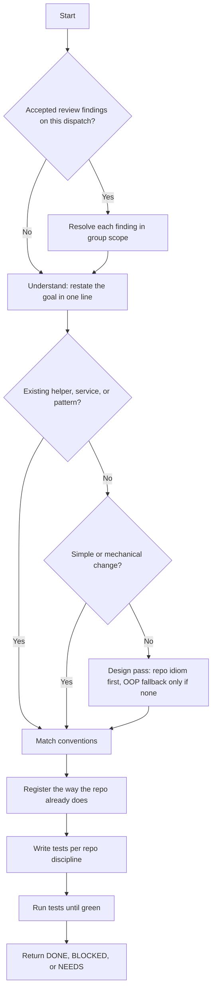

# Implement Group

## Purpose

Implement exactly one `PLAN.md` group. Write the code. Write its tests. Make the tests green. Return a status.

## Activation

### Use when

Use this skill when:

- one `PLAN.md` group is approved and ready to implement
- a post-review group in `review/R<n>/POST_REVIEW_PLAN.md` is ready to implement
- the caller re-dispatches a group with accepted review findings to address

One invocation implements one group.

### Do not use when

Do not use this skill when:

- the task is to review already-written code (that is `review-implementation`)
- the task is to produce the plan or group breakdown (that is `split-task-into-plan` or `plan-post-review`)
- the caller asks for more than one group in the same invocation
- the caller asks you to commit or push

## Context

Usual files live under `.ai/task/<task-id>/`. Develop groups come from `PLAN.md`. Post-review groups come from `review/R<n>/POST_REVIEW_PLAN.md`.

Work only in the target repo's stack and conventions. Read them from its `CLAUDE.md` / `AGENTS.md` and the scout map. Assume no stack. Assume no framework. Assume no path layout.

This skill runs inside the implementing agent. Do not spawn a Task. Do not select a model. The caller always passes a model. Never use `subagent_type: reviewer`. The consuming repo policy wins. Do not hardcode a model family.

Whoever runs this cannot assume it can spawn further agents. When blocked, end the turn with an escalation. Whatever dispatched this skill must fulfill that escalation. Then expect a re-dispatch with the answer appended.

## Inputs

- One **group block** from `PLAN.md` or a round's `review/R<n>/POST_REVIEW_PLAN.md`. The block has title, steps, `Files:`, and commit message. Post-review groups may also carry `Addresses:`. Include the `task-id`.
- The **scout map** — stack, conventions, patterns, test surface. Read the repo's own `CLAUDE.md` / `AGENTS.md` for anything the map does not cover.
- Optionally, **review findings to address**. These are accepted findings from a prior review pass. They are scoped to this group. They arrive on a re-dispatch after the review phase. When they are present, resolve every one of them in the group's scope first.
- You may read `.ai/task/<task-id>/TASK.md` for the acceptance criteria the group serves. For post-review groups, the acceptance slice is the actionable asks of the addressed feedback items. Take those asks from that round's `REVIEW_TRIAGE.md` or the group's `Addresses:`.

## Scope

- Do the group's steps. Touch only the group's `Files:` and their tests. If you need any other file, escalate. Do not edit that file.
- Never commit, push, or touch git. The owner of the review/commit gate does that work.
- Never redesign across groups. A cross-group or architecture fork is `NEEDS: architect`.
- Do not edit `PLAN.md` status boxes. The orchestrator owns progress checkboxes.

## The thinking graph

Before you follow the graph, check for review findings on this dispatch. If they are present, resolve each accepted finding in the group's scope first. Treat them as part of the goal. Do not treat them as an afterthought.

Follow the rungs below in order. Stop at the first rung that solves the goal.



1. **Understand.** Read the group block. Read the acceptance criteria in `TASK.md`. State the goal again in one line.
2. **Already solved?** Grep the repo for an existing helper, service, or pattern that does this. Reuse is better than rebuild.
3. **Simple / mechanical?** (config, wiring, a thin one-file change) If yes:
   - Make the smallest change that works.
   - Skip the design pass. Skip pattern ceremony.
   - Go to step 5 (match conventions).
4. **Non-trivial → design pass, repo conventions first.** Apply the design idiom the consuming repo's `CLAUDE.md` / `AGENTS.md` or the scout map states. Use its stated architecture, its layering rules, and its named patterns. Use the plain OOP defaults below only where the repo states none. Use those defaults only where an OOP paradigm applies. Skip this fallback in a non-OOP repo (functional, procedural, script-style):
   - **SRP** — each unit has one reason to change. Split a unit that is growing several reasons.
   - **Composition over inheritance** — use an injected collaborator or a small abstraction before a base class.
   - **Interfaces for injected services only** — give services and application classes an interface they are typed and injected against. Do NOT give an interface to value objects, entities, DTOs, forms, or controllers.
   - **Design patterns** — reuse a pattern the repo already uses if it fits (repo-first, same as above). Otherwise use a standard pattern. Never force a pattern where plain code is clearer (rung 3 wins).
5. **Match conventions.** Match naming, layering, namespaces, and error handling exactly as the scout map and repo `CLAUDE.md` describe. Follow the repo. Do not follow personal habit.
6. **Register** what needs registration. Register services, routes, providers, or the wiring the repo uses. Register them the way the repo already does it.
   - Grep how sibling units are wired (autowiring, explicit config, tags, a manifest).
   - Match that mechanism.
   - If you cannot tell how, return `NEEDS: scout`.
7. **Tests.** Read the repo's stated testing discipline (test-first/TDD, or another stated convention). Follow that discipline. If none is stated, default to test-after.

   Write tests for logic-bearing units only. Skip thin glue with no branching logic (anemic data holders, pure passthroughs, generated boilerplate). Test behavior through the unit's public surface. Do not test internals.

8. **Verify — tests to green.** Run the repo's own test command (from its `CLAUDE.md` / `AGENTS.md`, task runner, or manifest). Then:
   - Read the output.
   - Fix red tests.
   - Run the tests again.
   - Repeat until green.

   Never return DONE on red or unrun tests. Tests are the gate here. CS-fix and static analysis are not the gate.

9. **Return** the status block below.

## Escalation contract

When blocked, end the turn with an escalation. Do not spawn an agent to resolve it:

```
NEEDS: scout
<recon question — e.g. how are services registered here / where does X live>
```

— or —

```
NEEDS: architect
<design question that spans groups or picks an architecture>
```

## Output contract (return exactly one)

```
DONE
Group: <id + title>
Files: <paths written / changed>
Tests: <command run> — <pass summary>
```

— or a `NEEDS: scout` / `NEEDS: architect` escalation —
— or —

```
BLOCKED
Group: <id + title>
Reason: <what stopped you, and what you tried>
```

## Decision Rules

- If accepted review findings are present → resolve each one in group scope first. Then follow the graph.
- If an existing helper already solves the goal → reuse it. Skip rebuild.
- If the change is mechanical → skip the design pass. Go to match conventions.
- If the repo states an idiom → use that idiom. Do not apply the OOP fallback.
- If the repo states no idiom and the paradigm is OOP → use the OOP defaults above.
- If the repo is not OOP → skip the OOP fallback.
- If a needed file is outside the group's `Files:` → escalate. Do not edit that file.
- If registration mechanism cannot be determined → return `NEEDS: scout`.
- If the work needs a cross-group or architecture fork → return `NEEDS: architect`.
- If tests are red or unrun → do not return DONE.
- If you cannot finish and it is not a scout or architect gap → return `BLOCKED` with what you tried.

## Constraints

- MUST touch only the group's `Files:` and their tests.
- MUST follow the thinking graph in order.
- MUST run the repo's own test command before DONE.
- MUST return exactly one of DONE, BLOCKED, or a NEEDS block, in the shapes above.
- MUST resolve accepted review findings in group scope when they are present.
- MUST NOT commit, push, or touch git.
- MUST NOT edit `PLAN.md` status boxes.
- MUST NOT spawn a Task subagent.
- MUST NOT select or hardcode a model.
- MUST NOT return DONE with failing or unrun tests.
- MUST NOT redesign across groups.
- MUST NOT apply OOP defaults when the repo states an idiom, or when the paradigm is not OOP.
- When the OOP fallback applies, MUST NOT give an interface to entities, value objects, DTOs, forms, or controllers.
- NEVER force a design pattern where plain code is simpler.

## Quality Checks

Before you return:

- [ ] The group block, `TASK.md` AC (or addressed asks), and scout map were read.
- [ ] Accepted review findings in scope were resolved first, if present.
- [ ] Only the group's `Files:` and their tests were edited.
- [ ] Conventions match `CLAUDE.md` / `AGENTS.md` and the scout map.
- [ ] The repo's test command was run. Tests are green.
- [ ] The return block is exactly one of DONE, BLOCKED, or NEEDS.
- [ ] Git was not touched. `PLAN.md` status boxes were not edited.

## Examples

### Mechanical change

Input: a one-file config wiring listed in `Files:`.

Expected: smallest change that works. Skip the design pass. Match conventions. Run tests. Return DONE.

### Missing registration

Input: a new service must be registered. Sibling wiring cannot be determined.

Expected: return `NEEDS: scout`. Do not invent a registration mechanism. Do not return DONE.

### Out-of-scope file

Input: a step needs a file that is not in the group's `Files:`.

Expected: escalate. Do not edit that file.

### OOP fallback skipped

Input: `AGENTS.md` states a functional module style. The repo states no classes.

Expected: follow that idiom. Do not apply SRP/interface defaults.

### Red tests

Input: the test command fails after the change.

Expected: fix. Re-run. Repeat until green. If you cannot, return BLOCKED. Never return DONE.

## Failure Modes

- Group block missing → stop. Name the required input. Do not guess a group.
- Scout map silent on stack → read `CLAUDE.md` / `AGENTS.md`. If still unknown, `NEEDS: scout`.
- Tests unrun because Shell is unavailable → return BLOCKED. Do not claim green.
- Cross-group redesign tempting → `NEEDS: architect`. Do not redesign.
- Caller asks to commit → refuse. The orchestrator owns git.

## References

- `review-implementation` — reviews the group's diff after this skill returns DONE. Do not run it here.
- `split-task-into-plan` / `plan-post-review` — write the group plan. Do not run them here.
