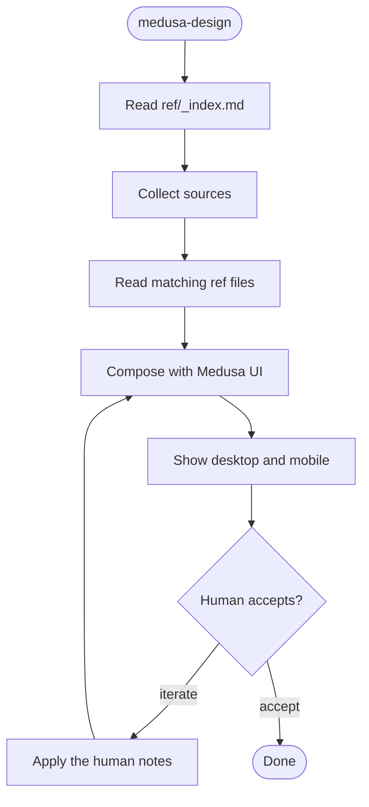

# Medusa design

Design the requested view or element with Medusa UI. Ship desktop and mobile. Compose with kit primitives. Iterate with the human until they accept.

## Flow

## Collect sources

Read every source the human gave. Rank them in this order. Later sources fill gaps. They do not override a higher source unless the human says so.

1. **Locked views** — [ref/_index.md](ref/_index.md) then [ref/views.md](ref/views.md). For a simple screen, follow those previews. Do not invent a new layout unless the human asks.
2. **Component refs** — from the index, open only the matching `ref/<slug>.md`. Those files dump Medusa UI usage, kit props, official examples, and usage notes.
3. **Medusa design system** — public barrels `@medusajs/ui` and `@medusajs/icons`. Cite [ref/views.md](ref/views.md) kit screenshots.
4. **Visual input** — Figma URL, Figma MCP, screenshot, or sketch. Load `figma-design-to-code` before `get_design_context`.
5. **Hints** — copy, hierarchy, density, and states the human named.

Do not mix another UI kit with Medusa.

## Locked simple screens

Simple screens follow these initial designs unless the human asks otherwise.

| Screen              | Default composition                                    | Screenshot                                                   |
| ------------------- | ------------------------------------------------------ | ------------------------------------------------------------ |
| List / index / read | Card `Container`, Add filter chips, `Table`            | [list-desktop.png](ref/screenshots/list-desktop.png)         |
| Create              | `FocusModal` + `ProgressTabs`                          | [create-desktop.png](ref/screenshots/create-desktop.png)     |
| Detail / update     | Section `Container` cards. Edit in `Drawer`            | [detail-desktop.png](ref/screenshots/detail-desktop.png)     |
| Shell               | Sidebar + main top bar. Org and account `DropdownMenu` | [org-menu-desktop.png](ref/screenshots/org-menu-desktop.png) |

Screenshots: [ref/screenshots/](ref/screenshots/). Detail: [ref/views.md](ref/views.md).

Do not use `DataTable.FilterBar` for the locked list. Use `Table` plus Add filter as in [views.md](ref/views.md).

## Kit rules

Keep kit primitives. Prefer a size or variant prop over a `className` override.

Reuse `Button`, `Input`, `Label`, `Hint`, `Heading`, `Text`, `Checkbox`, `Avatar`, `Divider`, `DropdownMenu`, `IconButton`, `Container`, `Table`, `FocusModal`, `Drawer`, `Select`, and `StatusBadge` when they fit.

Build custom chrome only when the kit has no primitive for that layout.

`CodeBlock` line numbers need the Tailwind v4 rule. See [ref/code-block.md](ref/code-block.md).

## Compose

Compose the view with `@medusajs/ui` and `@medusajs/icons`. Follow the locked screens and the matching refs.

Cover 1440×900 and 390×844. Prefer one responsive composition. Split only when the layouts cannot share a tree.

Show both breakpoints to the human. Then stop.

## Iterate

When the human sends notes, change only the design. Show both breakpoints again. Stop again.

Accept words include: accept, approved, lock this. Until one of those arrives, stay on the design.

## Desktop and mobile

Every design must cover both breakpoints. Default sizes are 1440×900 and 390×844. Use a Figma frame size when the human gave one.

If a breakpoint is missing from the input, say so. Ask for it. Do not invent a second layout.

## Done

The work is done when the human accepted the design on desktop and mobile. Kit primitives that already matched stay unchanged.
