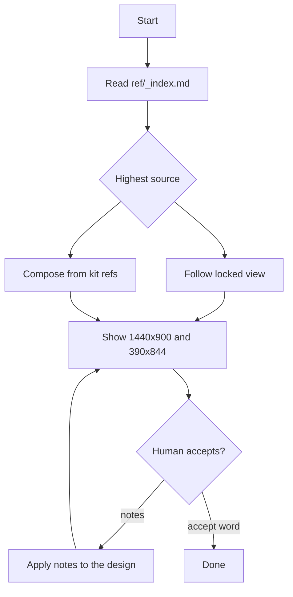

# Medusa design

## Purpose

Compose the requested view with Medusa UI. Show desktop and mobile. Iterate with the human until they accept. The deliverable is the view composition, not a backend change.

## Activation

### Use when

- The human asks to design a Medusa admin view or screen.
- The work is a locked CRUD or shell layout from this kit.
- A Figma URL, screenshot, or sketch must become Medusa UI primitives.

### Do not use when

- The human already accepted the design and asked only to implement it.
- The work is Medusa backend, modules, or API.
- The work uses another UI kit (shadcn, Catalyst, or similar).
- The work is non-UI Medusa work.

## Context

Knowledge lives in `ref/` (this skill's `references/` layer). Read `ref/_index.md` first. Then open only the matching `ref/<slug>.md`.

Default breakpoints are 1440×900 and 390×844. Use a Figma frame size when the human gave one.

Accept words include: accept, approved, lock this.

## Workflow

1. Read `ref/_index.md`.
2. Collect sources in the rank below. Open only the matching `ref/<slug>.md` files.
3. If the screen is a locked simple view, follow that locked composition. Do not invent a new layout unless the human asks.
4. Compose the view in TSX with `@medusajs/ui` and `@medusajs/icons`.
5. Show both breakpoints to the human (1440×900 and 390×844, or the Figma sizes they gave). Then stop.
6. When the human sends notes, change only the design. Show both breakpoints again. Stop again.
7. The work is done when the human used an accept word for desktop and mobile.

The numbered steps are the authority. The diagram is a map of the loop.

## Decision Rules

- If sources conflict → a higher source wins, unless the human overrides it.
- If the screen is list, create, detail, or shell, and the human did not ask for a custom layout → use the locked composition in `ref/_index.md` and `ref/views.md`.
- If the human asks for a custom layout → follow the human. Still use kit primitives.
- If the screen is a locked list → use `Table` plus Add filter. Do not use `DataTable.FilterBar`.
- If a kit prop or variant exists → use the prop. Do not override with `className`.
- If one tree can serve both breakpoints → keep one responsive composition.
- If the layouts cannot share a tree → split. Still show both breakpoints.
- If a breakpoint is missing from the input → say so. Ask for it. Do not invent a second layout.
- If Figma or MCP is unavailable → compose from locked views and kit refs. Report the gap. Do not pretend you loaded Figma.
- If no `ref/<slug>.md` matches → ask which primitive to use. Do not invent a kit API.
- If the human asks for shadcn, Catalyst, or another kit → refuse. Stay on Medusa UI.

## Constraints

- MUST compose with `@medusajs/ui` and `@medusajs/icons`.
- MUST show 1440×900 and 390×844, or the Figma sizes the human gave.
- MUST follow locked simple screens unless the human asks otherwise.
- MUST open `ref/_index.md` first, then only matching `ref/<slug>.md` files.
- MUST NOT mix another UI kit with Medusa.
- MUST NOT call the API.
- MUST NOT mount `AuthenticatedShell` unless the human asked for that shell.
- MUST NOT invent a missing breakpoint.
- MUST NOT use `DataTable.FilterBar` for the locked list.
- NEVER read every `ref/*.md` file.
- SHOULD prefer a size or variant prop over a `className` override.
- SHOULD build a custom frame only when the kit has no primitive for that layout.

## Quality Checks

Before you finish:

- [ ] Both breakpoints were shown.
- [ ] Only matching `ref/` files were opened, after `_index.md`.
- [ ] Locked composition was used unless the human asked otherwise.
- [ ] Kit primitives were preferred over a custom frame.
- [ ] No other UI kit was mixed in.
- [ ] The API was not called.
- [ ] `AuthenticatedShell` was not mounted unless asked.
- [ ] An accept word was received for desktop and mobile.

## Examples

### Simple list

Input: "Design the projects list."

Expected: locked list. Card `Container`, Add filter chips, `Table`. Not `DataTable`. Show 1440×900 and 390×844. Stop and wait.

### Figma conflicts with a locked view

Input: a Figma file that uses a different list chrome than the locked list.

Expected: keep the locked list unless the human overrides the source rank. Report the conflict in one line.

### Other kit requested

Input: "Use shadcn for this screen."

Expected: refuse. Compose with Medusa UI only.

### Non-CRUD screen

Input: "Design a dashboard that this kit does not lock."

Expected: ask before you invent a layout. Then compose from kit primitives. Still show both breakpoints.

## Failure Modes

- Figma or MCP is unavailable → compose from locked views and kit refs. Report that Figma was not loaded.
- No matching `ref/<slug>.md` → ask which primitive to use. Do not invent props.
- Sources conflict and the human gave no override → follow the source rank. State which source you followed.
- Human asks for a screen that is not a locked simple screen → ask before you invent a layout.
- Required breakpoint is still missing after you asked → stop. Do not invent it.
- Human asks for another UI kit → refuse.

## References

- `ref/` is the knowledge layer for this skill (`references/` in the playbook standard).
- `ref/_index.md` — read first. Router to primitives and locked views.
- `ref/views.md` — locked shell, list, create, and detail compositions. Always-on preview rules.
- `ref/<slug>.md` — open only when that primitive is in the composition.
- `ref/code-block.md` — read when the view uses `CodeBlock` line numbers (Tailwind v4 rule).
