# Locked Atlas Medusa views

These previews are the default composition for simple CRUD and chrome. Follow them unless the human asks for a different design.

Do not mount `AuthenticatedShell`. Do not call the API. Do not set frozen product `data-testid`s. Do not mix Catalyst.

Locked captures live in [screenshots/](screenshots/). There is no live `/design-preview` route.

## Shell

Two columns: sidebar then main. No header over the sidebar.

- Sidebar: brand (`CloudSolid` in a rounded square + "Atlas Cloud"), org switcher, primary nav, account at the bottom.
- Primary nav: Home and Members only.
- Do not group primary nav under Control or Organization.
- Do not put Projects, Nodes, Deployments, or Teams in primary nav.
- Do not add `shell-teams-link`.
- Collapse: icon rail.
- Main top bar: collapse / hamburger, breadcrumbs, centered Search `⌘K`, Settings, bell.
- Org menu: team switcher. Teams Platform / Docs / Ops, then Organization settings (inert in preview).
- Account menu: name, `@login`, Account, Sign out (inert in preview).
- The mobile hamburger sheet traps focus.
- Escape dismisses that sheet.
- That sheet locks body scroll while it is open.

See [dropdown-menu.md](dropdown-menu.md), [avatar.md](avatar.md), [icon-button.md](icon-button.md).

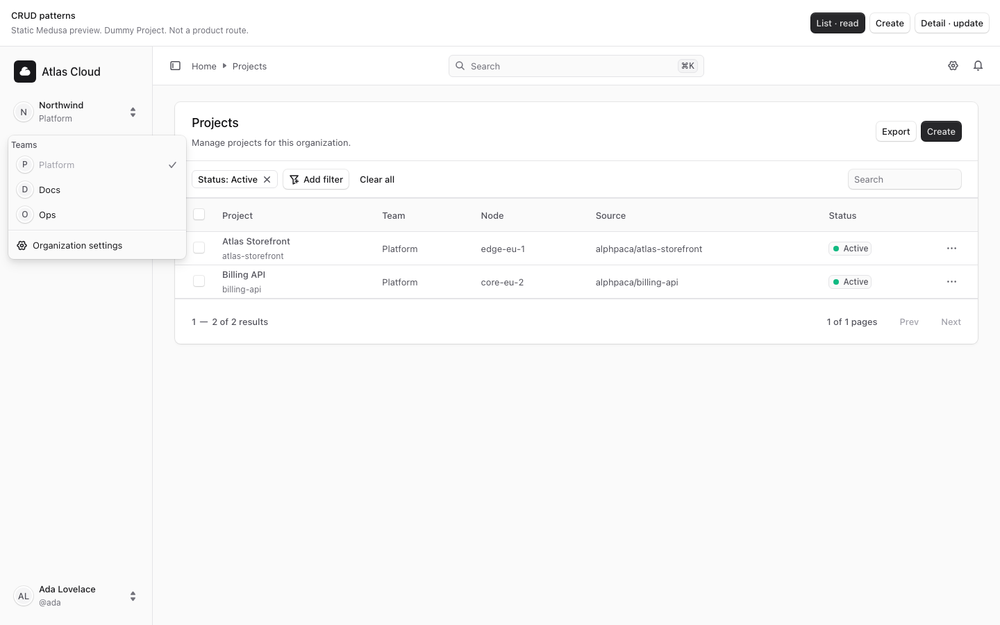
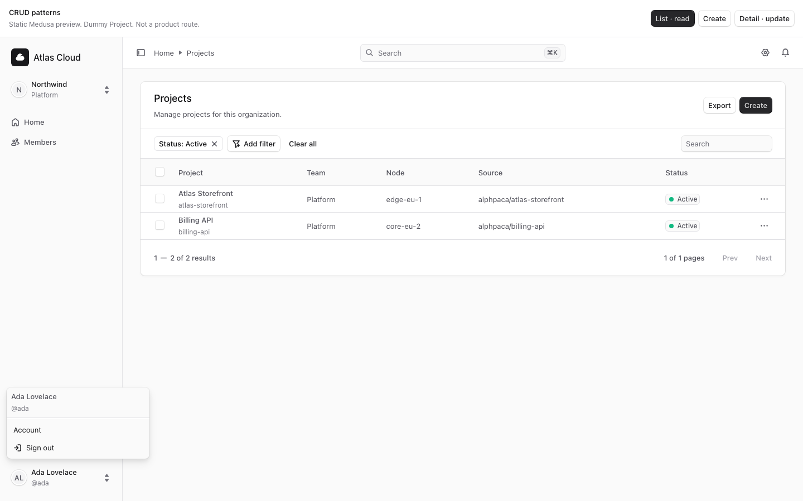

## List · read

Card on `bg-ui-bg-subtle`. Use `Container className="divide-y p-0"`.

1. Header: `Heading` + muted subtitle. Right: Export secondary, Create primary, both `size="small"`.
2. Toolbar: chips, **Add filter** (`FunnelPlus` + `DropdownMenu` with submenus), Clear all, Search.
3. `Table` with checkbox column, project name + handle, team, node, source, `StatusBadge`, row `...`.
4. `Table.Pagination`.

Do not jam title, filters, search, and Create into one row. Do not use `DataTable.FilterBar` for this list.

- Do not make the whole row the only navigation target.
- Give the select-all control an accessible name.
- Give each row checkbox an accessible name.
- Give the row `...` menu trigger an `aria-label`.
- If Edit is in that menu, open the detail `Drawer`.
- Do not open the show page from that Edit action.

See [container.md](container.md), [table.md](table.md), [button.md](button.md), [status-badge.md](status-badge.md).

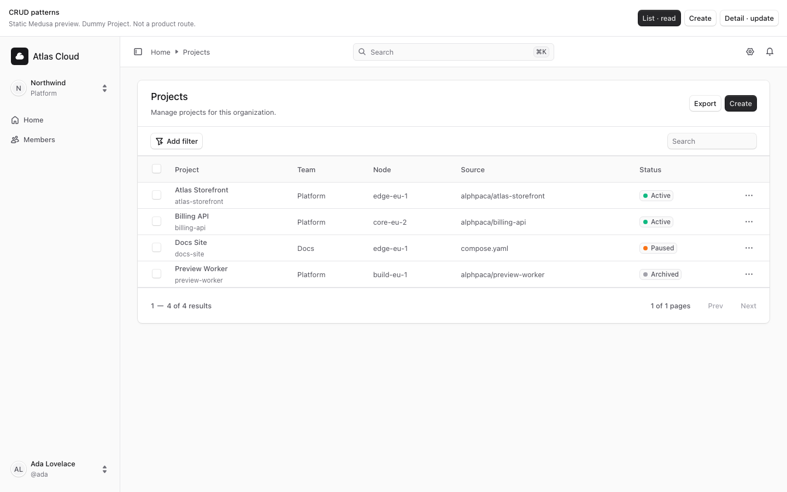
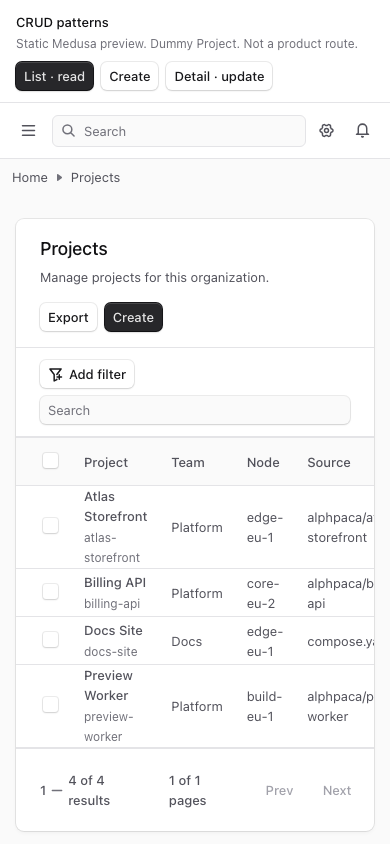

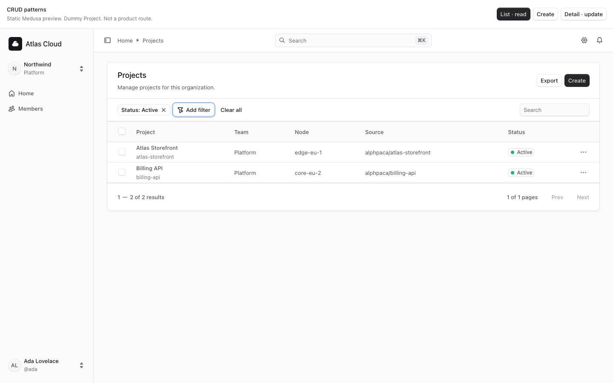

## Create

`FocusModal` over the list. `ProgressTabs` for Details then Source. Fields: `Label` + `Input` / `Textarea` / `Select` + `Hint`.

- Hide `ProgressTabs` on small screens.
- Center the header title when those tabs are hidden.
- On small screens, show a Back control in the footer on the Source step.

See [focus-modal.md](focus-modal.md), [progress-tabs.md](progress-tabs.md), [input.md](input.md), [label.md](label.md), [hint.md](hint.md).

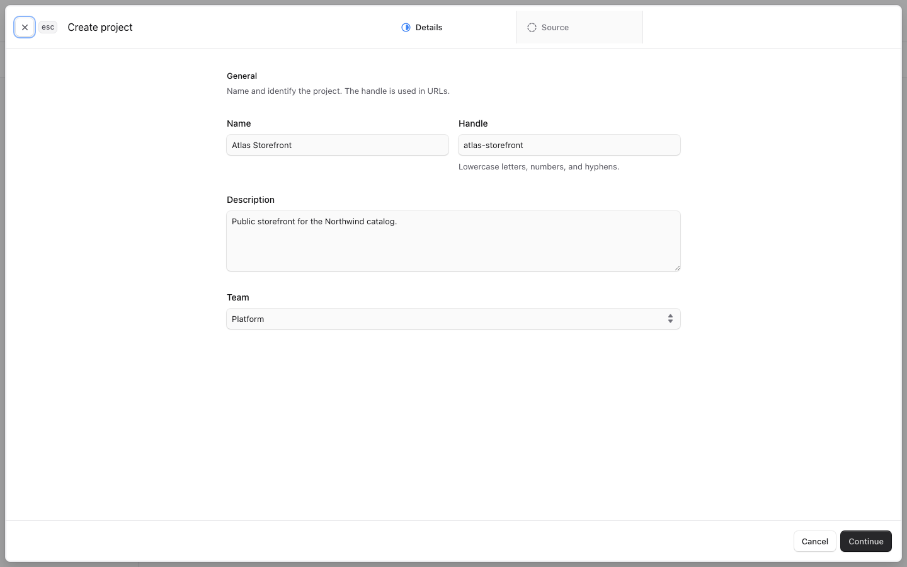
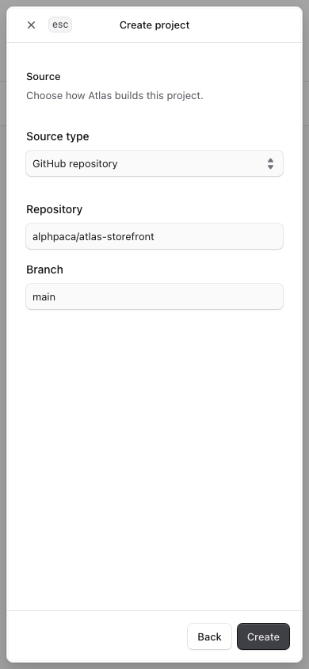

## Detail · update

Stacked `Container` cards (`divide-y p-0`). Section title + `...` menu. Facts in a two-column grid on desktop. Edit opens a `Drawer` from the show page. Do not turn the whole detail into a FocusModal.

- The Source card icon follows `sourceKind`.
- Do not use a GitHub mark on Compose rows.

See [container.md](container.md), [drawer.md](drawer.md), [heading.md](heading.md), [text.md](text.md).

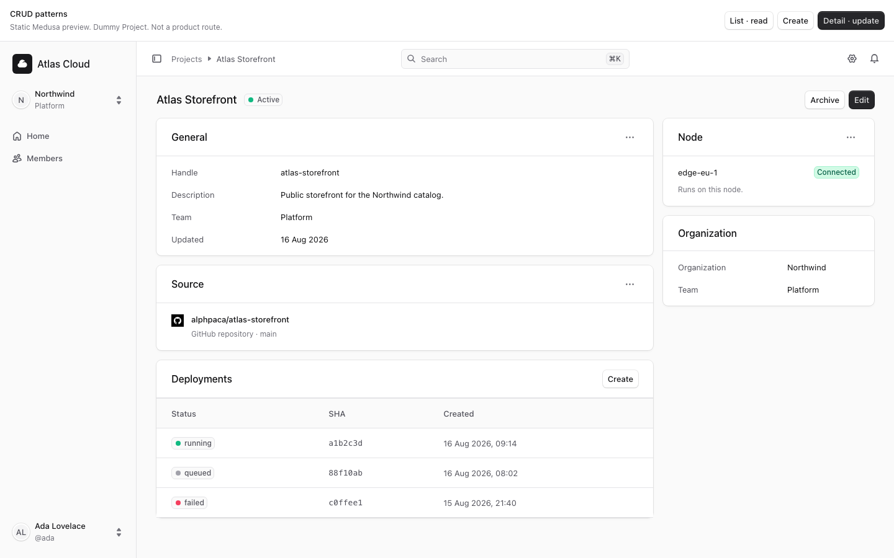
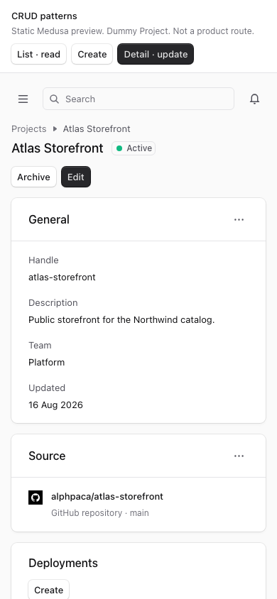

## Kit gallery

The kit gallery capture shows primitives in sections: Actions, Inputs, Feedback, Overlays, Data display, Navigation, Icons.

Use those screenshots to check a variant. Then compose the locked views above for a real screen.

`CodeBlock` line numbers need the Tailwind v4 fix in `apps/web/src/app/globals.css` (`pre.code-body.grid`). See [code-block.md](code-block.md).

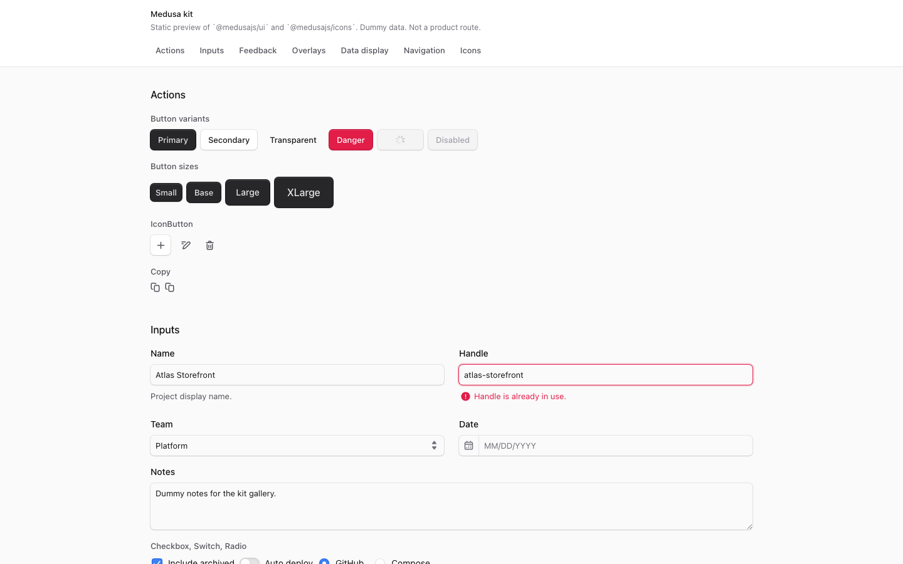
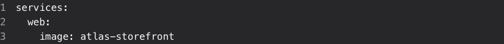
