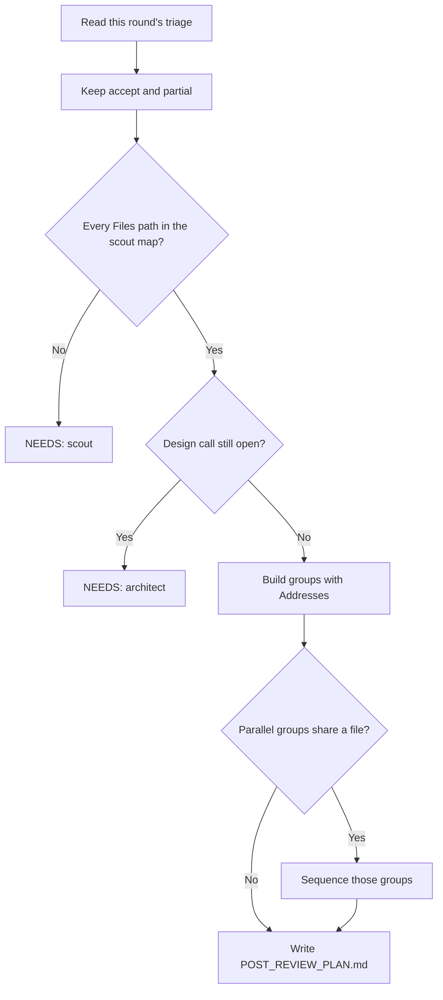

# Plan Post Review

## Purpose

Convert an approved **round** `REVIEW_TRIAGE.md` into that round's `POST_REVIEW_PLAN.md`.

Write ordered, resumable groups for accept/partial feedback **in this round only**.

## Activation

### Use when

Use this skill when:

- a review round's `REVIEW_TRIAGE.md` is approved and needs groups
- a caller asks to write `POST_REVIEW_PLAN.md` or plan post-review fixes

### Do not use when

Do not use this skill when:

- the task is to triage feedback (that is `triage-review-feedback`)
- the task is to implement groups (that is `implement-group`)
- the task is to append, merge, or copy groups from prior rounds
- the task is to rewrite the original develop `PLAN.md`
- the triage is not approved

## Context

Usual files live under `.ai/task/<task-id>/review/R<n>/`. Write `POST_REVIEW_PLAN.md` in that same round directory.

Assume no stack. Read the consuming repo's `CLAUDE.md` and `AGENTS.md`. Read the scout map (`SCOUT.md` when present).

This skill runs inside the planning agent. Do not spawn a Task. Do not select a model.

Read commit style from the consuming repo's `CLAUDE.md` or `AGENTS.md`. Do not hardcode a convention here.

Group shape must stay compatible with `implement-group` / `review-implementation` (`PLAN.md` fields plus `Addresses:`).

## Input

- The approved `REVIEW_TRIAGE.md` path (under `review/R<n>/`).
- Round id `R<n>`.
- A scout map (for real file paths).
- The target `POST_REVIEW_PLAN.md` path (**same round dir**).
- `assets/post-review-plan-template.md`. Follow its structure exactly.

## Workflow

1. Resolve the approved triage path, the round id, and the target `POST_REVIEW_PLAN.md` path.
2. Read `assets/post-review-plan-template.md`. Follow its structure exactly.
3. Read this round's `REVIEW_TRIAGE.md` in full.
4. Collect accept and partial items only. List declined items under `## Declined`.
5. Read the scout map for real file paths. Read `CLAUDE.md` / `AGENTS.md` for commit style.
6. Group the actionable asks. Title each group by the capability or fix asked for.
7. Set `Addresses:` so every accept/partial id appears in exactly one group.
8. Set `Files:`, `Depends on`, and `Parallelizable with`. Check file-disjointness.
9. Write checkable steps, three-state `Status`, and one commit message per group in the repo's style.
10. Draw a mermaid `flowchart TD` graph.
11. Write one `POST_REVIEW_PLAN.md` at the target path. Write nothing else.

## Round scope (anti-bloat)

- Plan **only** items from **this** triage file.
- Do **not** read or copy groups from `review/R*/POST_REVIEW_PLAN.md` for other rounds.
- Do **not** append, merge, or copy committed work from earlier rounds.
- Feedback ids (`F1`, …) are per-round. `Addresses:` refers only to this triage.

## Rules for good groups

- **Only accept + partial.** Do not make a group for declines under `## Declined`.
- **Traceability.** Every group lists `Addresses: F1, F3, …`. Every accept/partial id appears in exactly one group.
- **Business meaning, not technical.** Title by the capability/fix asked for.
- **One commit message per group.** Use the consuming repo's commit style from `CLAUDE.md` / `AGENTS.md`.
- **Explicit `Depends on`.** Derive **`Parallelizable with`** from it.
- **File-disjointness.** Parallelizable groups MUST have disjoint `Files:`.
- **Checkable steps** and three-state **`Status`**: `[ ] implemented / [ ] reviewed / [ ] committed`.
- A **mermaid `flowchart TD`** graph.
- Make group shape compatible with `implement-group` / `review-implementation` (`PLAN.md` fields + `Addresses:`).



## Decision Rules

- If triage is not approved → stop. Do not write `POST_REVIEW_PLAN.md`.
- If a real file path is missing → return `NEEDS: scout`. Do not guess a path.
- If a design call is needed and the triage does not settle it → return `NEEDS: architect`.
- If an item is declined → list it under `## Declined`. Do not make a group for it.
- If an accept/partial id is missing from `Addresses:` → add it to exactly one group.
- If two groups would touch the same file → they are not parallel. Sequence them.
- If another round's `POST_REVIEW_PLAN.md` is present → ignore it. Do not copy groups.
- If the original `PLAN.md` would need a rewrite → leave it. This file is the round plan only.

## Escalation contract

If you need a real file path or a design call the triage does not settle, stop. Return an escalation. Do not guess:

```
NEEDS: scout
<the recon question>
```

— or —

```
NEEDS: architect
<the design question + context>
```

## Constraints

- MUST write only the target `POST_REVIEW_PLAN.md`.
- MUST plan only this round's accept and partial items.
- MUST put every accept/partial id in exactly one group's `Addresses:`.
- MUST list declined items under `## Declined` with no group.
- MUST list disjoint `Files:` on any two parallelizable groups.
- MUST use three-state `Status`: implemented / reviewed / committed.
- MUST include a mermaid `flowchart TD` dependency graph.
- MUST write commit messages in the consuming repo's own style.
- MUST return a `NEEDS: scout` or `NEEDS: architect` block in the shape above when blocked.
- MUST NOT create groups for declined items.
- MUST NOT import or append groups from another round.
- MUST NOT mark two groups parallel when their `Files:` overlap.
- MUST NOT rewrite or replace the original `PLAN.md`.
- MUST NOT spawn a Task subagent.
- MUST NOT select or hardcode a model.
- NEVER commit, push, or touch git. The orchestrator owns that.

## Output format

Write one `POST_REVIEW_PLAN.md` at the target path. Match `assets/post-review-plan-template.md`.

If blocked, return only the escalation block. Do not write a guessed plan.

## Quality Checks

Before you finish:

- [ ] This round's approved `REVIEW_TRIAGE.md` and the scout map were read.
- [ ] Every accept/partial id appears in exactly one `Addresses:` list.
- [ ] Declined items are listed under `## Declined` and have no group.
- [ ] Parallelizable groups have disjoint `Files:`.
- [ ] Every path in `Files:` comes from the scout map.
- [ ] The mermaid graph matches `Depends on`.
- [ ] Commit messages match the consuming repo's style.
- [ ] Status uses the three-state boxes.
- [ ] No other round's groups were copied.
- [ ] The original `PLAN.md` was not rewritten.
- [ ] No file other than the target `POST_REVIEW_PLAN.md` was written.
- [ ] Git was not touched.

## Examples

### Declined item

Input: F2 is declined in triage.

Expected: list F2 under `## Declined`. Do not create a group for F2.

### Missing Addresses id

Input: F1 and F3 are accept. Only F1 appears in a group.

Expected: put F3 in exactly one group. Do not leave an accept id unaddressed.

### Other round present

Input: `review/R1/POST_REVIEW_PLAN.md` has committed groups. This round is R2.

Expected: ignore R1. Write R2 groups only.

### Overlapping files

Input: two R2 groups are marked parallel and share a file.

Expected: sequence them. Do not mark them parallel.

### Unapproved triage

Input: the caller asks to plan from a draft `REVIEW_TRIAGE.md`.

Expected: stop. Do not write `POST_REVIEW_PLAN.md` until triage is approved.

## Failure Modes

- Triage missing or unapproved → stop. Do not write the plan.
- Scout map missing a needed path → `NEEDS: scout`. Do not guess.
- Open design fork → `NEEDS: architect`. Do not pick a design.
- Caller asks to merge prior rounds → refuse. This file is this round only.
- Caller asks to rewrite `PLAN.md` → refuse. Leave the develop plan in place.

## References

- `assets/post-review-plan-template.md` — `POST_REVIEW_PLAN.md` structure. Read once per run. Follow it exactly.
- `triage-review-feedback` — writes `REVIEW_TRIAGE.md`. Do not run it here.
- `implement-group` — implements one post-review group after this plan is approved. Do not run it here.
- `split-task-into-plan` — writes the original develop `PLAN.md`. Do not run it here.
