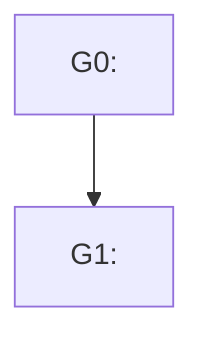

# <task-id> / <R<n>> — post-review plan

> Round: **R<n>** (this file = this round only; prior rounds live under `review/R*/` and stay out of this plan).
> Source: [REVIEW_TRIAGE.md](REVIEW_TRIAGE.md). Check boxes as work completes; resume skips fully checked groups.
> Original develop plan (context only): [../../PLAN.md](../../PLAN.md)

## Declined

<!-- this round only -->

- **F2** — <one-line decline rationale from triage>

## Dependency graph

## Groups

### G0 — <business-framed title>

- **Addresses:** F1, F3
- **Commit:** <message, in the project's commit style>
- **Depends on:** none
- **Parallelizable with:** none
- **Files:** `<paths>`
- **Status:** [ ] implemented / [ ] reviewed / [ ] committed
- Steps:
  - [ ] <step>
  - [ ] <step>

### G1 — <business-framed title>

- **Addresses:** F4
- **Commit:** <message, in the project's commit style>
- **Depends on:** G0
- **Parallelizable with:** none
- **Files:** `<paths>`
- **Status:** [ ] implemented / [ ] reviewed / [ ] committed
- Steps:
  - [ ] <step>
