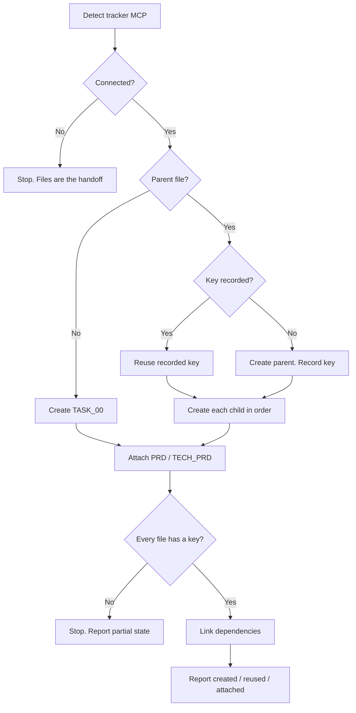

# Push Issues

## Purpose

Write real tracker issues from approved files in `.ai/idea/<slug>/`. One file, one issue. The connected tracker does not matter. This skill only pushes. It does not draft, refine, or clean up.

**The file is the source of truth.** Write every key a tracker returns into its markdown file before the next issue is created. That ordering is the whole idempotency mechanism. A re-run only ever creates what is still missing. It never creates what is already recorded.

Push the English STE text as-is. Do not translate titles or bodies into the human's chat language. See `skills/asd-ste100` and `rules/asd-ste100.md`.

## Activation

### Use when

Use this skill when:

- tickets under `.ai/idea/<slug>/` are drafted and approved
- a human asks to push these to the tracker, create the issues, or send them to Jira, Linear, or another connected tracker

### Do not use when

Do not use this skill when:

- the task is to draft or refine ticket content. Use `split-prd-into-issues` / `write-issue`.
- the task is to clean up the idea folder
- the task is to sync or update issues after creation
- the task is to authenticate a tracker MCP
- the files are not yet approved

## Context

Approved files under `.ai/idea/<slug>/`:

- **Single ticket** — just `TASK_00.md`, `Parent: none`, `Depends on: none`.
- **Story / Epic** — a parent (`EPIC.md` / `STORY.md`) plus ordered `TASK_NN.md` children.
- **Source PRD (when present)** — `PRD.md` and/or `TECH_PRD.md` in the same folder. These are not tracker issues themselves. Attach them to the parent (or sole) issue so later readers of child tickets still have the full product and tech context.

Only run this once the files are approved. Producing or revising them is out of scope here.

## Workflow



The numbered steps are the authority.

### 1. Detect the tracker

Check the available tools for a connected tracker MCP. It must be able to create issues, link them, and query for existing ones. Do not assume which product it is. The steps below do not need a specific product name. Jira and Linear are examples of any tracker MCP.

- **None connected** → STOP. Report that the approved drafts in `.ai/idea/<slug>/` ARE the handoff. A later agent, or a live push once an MCP is connected, will create the issues from these files. Do nothing else.
- **One connected** → continue at steps 2 to 6 using its create, link, query, and attachment operations.

### 2. Create the parent (if any)

Single-ticket shape has no parent file. Continue at step 3. Then attach PRDs to `TASK_00`'s issue in step 4.

Before you create anything, check the parent file's trailing `<!-- Tracker key: ... -->` comment. If it already contains a key, that issue exists. Reuse the recorded key. Do not create it again. If the record looks uncertain, query the tracker before you create a duplicate. Uncertain means partially written, or a prior run may have been interrupted right after creating it.

Otherwise, create the parent issue from the file's content. Immediately record the returned key in the parent file's `<!-- Tracker key: ... -->` comment before you create any child. This is the resume checkpoint for the whole run.

### 3. Create each child, linked to the parent

Process `TASK_NN.md` files in dependency order (`TASK_00`, `TASK_01`, ...). For each:

- If its own `<!-- Tracker key: ... -->` comment already contains a key, that issue exists. Skip it. If uncertain, query the tracker. Do not guess.
- Otherwise create it (as a child of the parent, when one exists. Single-ticket shape has no parent to link).
- Before you create the next issue, record the returned key in both places:
  1. The task file's own `<!-- Tracker key: ... -->` comment.
  2. The parent's `## Tasks` list line for that task (append the key, for example `— <KEY>`).

Never create an issue whose key is already recorded anywhere. Never invent a key. Never record a key the tracker call did not actually return.

### 4. Attach PRD / TECH_PRD to the parent (or sole) issue

**Mandatory whenever** `.ai/idea/<slug>/PRD.md` and/or `.ai/idea/<slug>/TECH_PRD.md` exists on disk.

**Target issue:**

| Shape | Attach to |
| --- | --- |
| Epic / Story | The parent issue (`EPIC.md` / `STORY.md` tracker key) |
| Single ticket | The sole `TASK_00.md` issue |

Attach **each** present file (`PRD.md`, `TECH_PRD.md`). Business and tech PRDs are both valid to attach. Do not pick only one if both exist.

#### Idempotency

On the target markdown file (parent or `TASK_00.md`), find:

```markdown
<!-- PRD attachment: PRD.md -->
<!-- PRD attachment: TECH_PRD.md -->
```

- If a given filename is already recorded → skip that file (already attached).
- If uncertain → query the tracker's attachments on that issue for a matching filename or title before uploading again.
- After a successful attach, **immediately** append `<!-- PRD attachment: <filename> -->` to that markdown file before the next upload.

#### Tracker attachment procedure

Use the connected tracker's **file attachment** APIs when available. Do not paste the full PRD into the issue description as a substitute when attachments work.

**Example when a Linear MCP is connected** (any tracker with prepare-then-upload is the same idea):

1. Discover schemas via the MCP tool catalog (`prepare_attachment_upload`, `create_attachment_from_upload`). Prefer that path over a deprecated base64 `create_attachment` (tiny-file fallback only).
2. For each file to attach, one at a time (do not batch prepares — signed URLs expire):
   - `prepare_attachment_upload` with `issue` = target key, `filename` (for example `TECH_PRD.md`), `contentType` = `text/markdown`, `size` = exact byte length, optional `title` = `TECH_PRD.md` or `PRD.md`.
   - PUT **raw bytes** to `uploadRequest.url` with **every** `uploadRequest.headers` header verbatim (curl `--data-binary @path`). Do not base64-transform the body.
   - `create_attachment_from_upload` with the returned `assetUrl` (and matching title).
3. Record `<!-- PRD attachment: <filename> -->` on the target markdown file.

**No attachment API on the connected tracker:**

- Do **not** silently skip. Append a short "Source PRD" section on the parent or sole issue that names the repo path(s) (`.ai/idea/<slug>/TECH_PRD.md` etc.). Record `<!-- PRD attachment: <filename> (description-link only) -->`. Report in the handoff that true file attach was unavailable.

#### Fast-path / no PRD file

If neither `PRD.md` nor `TECH_PRD.md` exists (small idea with tickets only), step 4 is a no-op. Say so in the report.

### 5. Link dependencies

Only start this once every issue in the folder has a recorded key. For each `TASK_NN.md` whose `Depends on:` field is not `none`, resolve each referenced `TASK_NN` to its recorded key. Use the TASK→key mapping built in steps 2 to 3. Then create the dependency link in the tracker.

Record each completed link immediately, before you create the next link. Example: append `(linked)` next to the resolved reference in the `Depends on:` field. A resumed run can then tell which links already exist without re-querying everything.

### 6. On any failure

Stop immediately. Do not undo or remove anything already recorded. Every key, link, and PRD-attachment marker written so far stays exactly as recorded. Report:

- what was created, linked, and attached
- what failed and why
- what is left, so this skill can resume later

A later run re-executes steps 1 to 5 unchanged. It skips everything already recorded. It only creates, links, or attaches what is missing. Never recreate an issue, link, or attachment that is already recorded. When a record is uncertain, query the tracker before you create anything.

## Decision Rules

- If no tracker MCP is connected → stop. The files are the handoff. Do nothing else.
- If a `<!-- Tracker key: ... -->` already holds a key → reuse it. Do not create again.
- If the key record is uncertain → query the tracker before you create.
- If the tracker did not return a key → do not record one. Stop and report.
- If `PRD.md` or `TECH_PRD.md` exists → attach each file to the parent or sole issue.
- If an attachment marker already names that file → skip that upload.
- If the tracker has no attachment API → write a description link. Record the description-link-only marker. Do not skip silently.
- If any create, attach, or link fails → stop. Keep all records. Report partial state.
- If the human's chat is not English → still push the English STE text as-is.

## Constraints

- MUST treat the markdown file as the source of truth.
- MUST record each returned key before the next create.
- MUST attach every on-disk `PRD.md` and `TECH_PRD.md` to the parent or sole issue.
- MUST record `<!-- PRD attachment: … -->` before the next upload.
- MUST push English STE as-is. MUST NOT translate into the human's chat language.
- MUST NOT draft or revise ticket content.
- MUST NOT invent a tracker key.
- MUST NOT recreate an issue, link, or attachment that is already recorded.
- MUST NOT assume a specific tracker product except as an example of any tracker MCP.
- NEVER undo records after a failure.

## Out of scope

- Removing `.ai/idea/<slug>/` — offered by the calling agent only after every issue, link, and PRD attachment succeeds.
- Two-way sync or updating issues after creation (including replacing a newer PRD revision — that is a deliberate re-run after you remove the `<!-- PRD attachment: … -->` marker).
- Authenticating or connecting the tracker MCP.
- Drafting or revising `PRD.md` / `TECH_PRD.md`.

## Quality Checks

Before you finish:

- [ ] Tracker detected generically — no step names a specific tracker product except inside the optional Linear recipe example.
- [ ] Parent before children — parent created (when one exists) before any child.
- [ ] Key recorded before next create — each returned key written to its file (and the parent's task list, for children) before the next issue is created.
- [ ] PRD attached when present — every on-disk `PRD.md` / `TECH_PRD.md` is attached to the parent (or sole) issue, or explicitly recorded as description-link-only when attachments are unavailable.
- [ ] Attachment marker before next upload — each `<!-- PRD attachment: … -->` written before the next file is prepared.
- [ ] Links after all issues exist — dependency links only attempted once every issue file has a recorded key.
- [ ] Resumable — on failure, stopped cleanly, nothing recorded lost, partial state reported.
- [ ] No double-create — an issue, link, or PRD attachment already recorded is never recreated. Uncertain records are queried first.
- [ ] Titles and bodies were pushed as English STE. They were not translated into the human's chat language.

## Examples

### No tracker MCP

Input: approved `.ai/idea/guest-checkout/` and no issue-tracker MCP.

Expected: stop. Report that the files are the handoff. Do not invent issues.

### Resume after a partial run

Input: `EPIC.md` already has `<!-- Tracker key: ENG-12 -->`. `TASK_00.md` has a key. `TASK_01.md` does not.

Expected: reuse ENG-12 and the TASK_00 key. Create only TASK_01. Record its key before any further create.

### PRD present

Input: the folder has `PRD.md` and `TECH_PRD.md`.

Expected: attach both to the parent (or sole) issue. Record both attachment markers. Do not paste the files into the description when attachments work.

## Failure Modes

- No tracker MCP → stop. Files are the handoff.
- Create succeeds but the key is not returned → do not record a fake key. Stop. Report.
- Attach fails → stop. Keep issue keys already recorded. Report that attach is left.
- Link fails → stop. Keep issue keys and attachment markers. Report remaining links.
- Human asks to update an existing issue → refuse. This skill creates. It does not sync.

## References

- `split-prd-into-issues` / `write-issue` — draft the files before this skill runs.
- `skills/asd-ste100` and `rules/asd-ste100.md` — English STE on durable artifacts. Push as-is.
