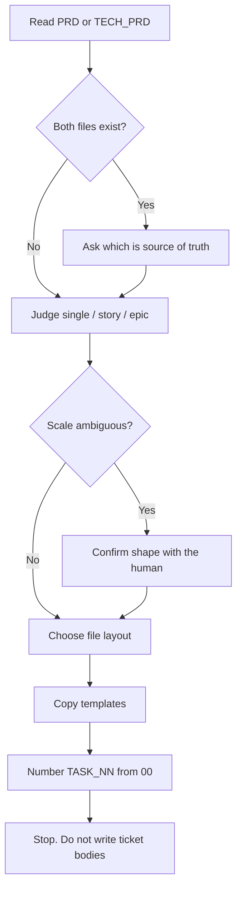

# Split PRD Into Issues

## Purpose

Write a file-per-issue skeleton from an approved `PRD.md` or `TECH_PRD.md`, or from a refined small idea. The skeleton is a parent file plus ordered `TASK_NN.md` stubs.

This skill owns shape, skeleton, and slicing only. It does not write ticket bodies (title, description, Gherkin acceptance criteria). That content belongs to `write-issue`.

## Activation

### Use when

Use this skill when:

- an idea or PRD is settled and needs to become tickets
- a human asks to break this down, split the PRD or TECH_PRD, or write the task files

### Do not use when

Do not use this skill when:

- the idea is still a raw brainstorm
- the task is to write ticket bodies. Use `write-issue`.
- the task is to write the PRD. Use `write-prd` or `write-tech-prd`.
- the task is to judge readiness. Use `review-issue-readiness`.
- the task is to create tracker issues. Use `push-issues`.

## Context

Input is `PRD.md` (business) or `TECH_PRD.md` (technical) for larger work, or a refined idea for smaller work. The idea must already be scoped and settled.

Prefer whichever file exists under the staging path `.ai/idea/<slug>/`. If both exist, ask which is the source of truth before slicing.

All staging files live in `.ai/idea/<slug>/`. Each ticket file is exactly one future Linear issue.

`write-issue` reuses `assets/task-template.md` from this skill for the body shape.

Skeleton files are staging drafts. They are not a durable bucket. Write English STE in any text you do fill (parent summary, task list titles). Do not translate into the human's chat language. See `skills/asd-ste100` and `rules/asd-ste100.md`.

Before the first write, follow `ai-dir` bootstrap. Ensure `.ai/idea/` is gitignored.

## Workflow



The numbered steps are the authority.

1. Read the approved `PRD.md` or `TECH_PRD.md`, or the refined idea. If both PRD files exist, ask which is the source of truth.
2. Judge the shape before you write anything. See Decision Rules.
3. If the scale is ambiguous, confirm the judged shape with the human before you write files.
4. Copy `assets/parent-template.md` to `EPIC.md` or `STORY.md` when the shape needs a parent. Skip the parent for a single ticket.
5. Copy `assets/task-template.md` to each `TASK_NN.md`. Number from `TASK_00`, two digits, in dependency order.
6. Complete the parent shared context and the ordered child list. Do not repeat ticket bodies.
7. Stop. Leave title, description, and Gherkin acceptance-criteria content for `write-issue`.

## Judge the shape

Decide the scale before you write anything:

- **Single ticket** — one coherent unit of work, one issue.
- **Story** — one deliverable that splits into a few sub-tasks.
- **Epic** — a large body of work spanning several stories or tasks.

## File layout

**Single ticket:**

```text
.ai/idea/<slug>/
  TASK_00.md
```

**Story or Epic:**

```text
.ai/idea/<slug>/
  EPIC.md            # or STORY.md — the parent issue
  TASK_00.md         # child issue
  TASK_01.md
  ...
  references/        # optional shared material
  examples/          # optional
```

## Numbering / parent rule

`TASK_NN.md` is always the leaf file. Its `Type` header field carries the actual issue type (Task, Story, Bug, Spike). The filename only ever means "child N". Number from `TASK_00`, two digits, in dependency order.

A parent file (`EPIC.md` / `STORY.md`) exists only for the story or epic shape. A single ticket has no parent (`Parent: none`).

## Slicing / synthesis rule

Synthesize the PRD, TECH_PRD, or refined idea into tickets. Do not only transcribe it. Resolve contradictions. Make the reasoning visible. Size each ticket as a coherent, independently reviewable unit of work.

## Decision Rules

- If both `PRD.md` and `TECH_PRD.md` exist → ask which is the source of truth. Do not guess.
- If scale is ambiguous → confirm the shape with the human before you write files.
- If the shape is a single ticket → write only `TASK_00.md` with `Parent: none` and `Depends on: none`. Do not write a parent file.
- If the shape is a story → parent file is `STORY.md`.
- If the shape is an epic → parent file is `EPIC.md`.
- If templates are needed → copy `assets/parent-template.md` and `assets/task-template.md` verbatim. Do not hand-author the skeleton.
- If you are tempted to fill Gherkin or a full description → stop. That is `write-issue`.

## Constraints

- MUST judge shape before writing files.
- MUST number from `TASK_00`, two digits, in dependency order.
- MUST copy the templates. MUST NOT retype them.
- MUST NOT write ticket bodies (title, description, Gherkin AC).
- MUST NOT create tracker issues.
- MUST ask which file is source of truth when both PRD files exist.
- MUST write English STE for any text you do fill. See `skills/asd-ste100` and `rules/asd-ste100.md`.
- MUST NOT translate filled text into the human's chat language.
- NEVER invent a slice the source does not support.

## Quality Checks

Before you declare the breakdown done:

- [ ] Shape judged — single, story, or epic decided, and confirmed with the human if the scale was ambiguous.
- [ ] Numbered correctly — files numbered from `TASK_00`, two digits, in dependency order.
- [ ] Parent only when needed — a parent file exists only for story or epic. Single-ticket shape has `Parent: none`.
- [ ] Templates copied, not retyped — `assets/parent-template.md` and `assets/task-template.md` copied verbatim.
- [ ] No ticket bodies written — title, description, and Gherkin AC content left for `write-issue`.
- [ ] Any filled parent summary or task-list title is English STE.

## Examples

### Single ticket

Input: a small settled idea "show order total on the account page".

Expected: `.ai/idea/<slug>/TASK_00.md` only. `Parent: none`. `Depends on: none`. No `STORY.md`. Body left for `write-issue`.

### Story

Input: an approved PRD for guest checkout with a few slices.

Expected: `STORY.md` plus `TASK_00.md`, `TASK_01.md`, and so on, in dependency order. Parent lists children. No Gherkin in the stubs.

### Both PRDs present

Input: `.ai/idea/guest-checkout/` contains `PRD.md` and `TECH_PRD.md`.

Expected: ask which file is the source of truth. Do not slice until the human answers.

### Filling bodies

Input: the human says "split this and write the tickets".

Expected: write the skeleton only. Point to `write-issue` for bodies.

## Failure Modes

- The idea is a raw brainstorm → stop. The source must be settled.
- Both PRD files exist and the human has not chosen → ask. Do not pick a side.
- Scale is ambiguous → confirm shape before writing files.
- A contradiction in the PRD cannot be resolved from the text → make the reasoning visible on the parent. Do not hide it.
- You started writing Gherkin → delete it from the stub. Leave that to `write-issue`.

## References

- `assets/task-template.md` — leaf ticket skeleton. Copy verbatim to each `TASK_NN.md`.
- `assets/parent-template.md` — parent skeleton. Copy verbatim to `EPIC.md` or `STORY.md`.
- `write-issue` — ticket bodies after the skeleton exists.
- `write-prd` / `write-tech-prd` — source documents when the idea is not yet a PRD.
- `push-issues` — tracker create after tickets are approved. Not part of this procedure.
- `skills/asd-ste100` and `rules/asd-ste100.md` — English STE on staging drafts
- `skills/ai-dir/SKILL.md` — bootstrap and gitignore `.ai/idea/`
