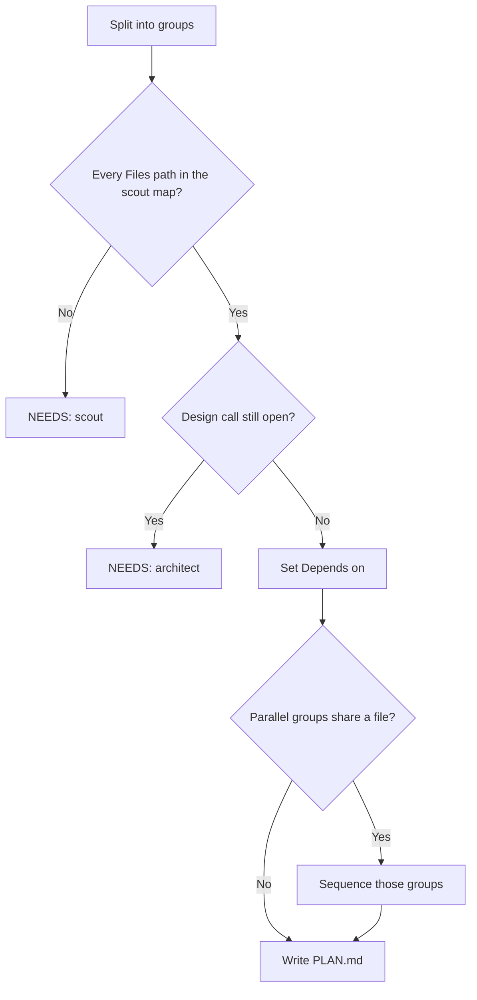

# Split Task Into Plan

## Purpose

Convert an approved `TASK.md` into a `PLAN.md`. The plan is an ordered, resumable set of groups.

Some groups are parallelizable. They can run one at a time or in file-disjoint lanes.

## Activation

### Use when

Use this skill when:

- a `TASK.md` is approved and needs to become an executable plan
- a caller asks to split the task, write `PLAN.md`, or build the group plan

### Do not use when

Do not use this skill when:

- the `TASK.md` is not approved
- the task is to write `TASK.md` itself (that is `refine-task`)
- the task is to implement any group (that is `implement-group`)
- the task is to plan post-review fixes (that is `plan-post-review`)

## Context

Usual files live under `.ai/task/<task-id>/`. Write `PLAN.md` there unless the caller names another target.

Assume no stack. Read the consuming repo's `CLAUDE.md` and `AGENTS.md`. Read the scout map. Take real file paths from the scout map.

This skill runs inside the planning agent. Do not spawn a Task. Do not select a model.

Read commit style from the consuming repo's `CLAUDE.md` or `AGENTS.md` (gitmoji, Conventional Commits, or whatever that repo already uses). Do not hardcode a convention here.

## Workflow

1. Resolve the approved `TASK.md` path, the scout map, and the target `PLAN.md` path.
2. Read `assets/plan-template.md`. Follow its structure exactly.
3. Read the approved `TASK.md` in full.
4. Read the scout map for real file paths.
5. Read the consuming repo's `CLAUDE.md` and `AGENTS.md` for commit style and any grouping convention.
6. Split the work into business-meaningful groups. Title each group by the capability it delivers.
7. List `Files:` per group from the scout map. If a path is missing, stop. Return `NEEDS: scout`.
8. Set explicit `Depends on`. Derive `Parallelizable with` from those edges.
9. Check file-disjointness. If two parallel groups share a file, sequence them instead.
10. Write checkable steps. Write a three-state `Status`. Write one commit message per group in the repo's style.
11. Draw a mermaid `flowchart TD` graph. An edge is a dependency. No edge means the groups may run in parallel.
12. Write one `PLAN.md` at the target path. Write nothing else.

## Decision Rules

- If `TASK.md` is not approved → stop. Do not write `PLAN.md`.
- If a real file path is missing from the scout map → return `NEEDS: scout`. Do not guess a path.
- If a design call is needed and `TASK.md` does not settle it → return `NEEDS: architect`. Do not pick a design.
- If two groups would touch the same file → they are not parallel. Sequence them.
- If two groups have no dependency edge and disjoint `Files:` → they may be parallel.
- If a group title names a type, entity, or file → rewrite it as the capability it delivers.
- If the repo's commit style cannot be read → use the style already present in that repo's history. Do not invent a new convention.
- If a plan uses a legacy `[x] done` status → treat that checked box as fully done on resume. Do not force a migration.

## Rules for good groups

- **Business meaning, not technical.** Title each group by the capability it delivers. Use "Let admin assign a user to an organization". Never use "Create Organization entity".
- **One commit message per group.** Write it in the consuming repo's own commit style.
- **Explicit `Depends on`.** Derive **`Parallelizable with`** from it. Groups with no dependency edge between them are parallelizable candidates.
- **File-disjointness.** Any two groups marked parallelizable MUST list disjoint `Files:`. Parallel execution shares one working tree. If two groups would touch the same file, they are NOT parallel. Sequence them instead.
- **Checkable steps** (`- [ ]`). Use a three-state **`Status`** at group level: `[ ] implemented / [ ] reviewed / [ ] committed` (see the template). A plan written before this convention existed, with a plain `[x] done` status, still resumes as complete. Treat a checked legacy `done` box as fully done. Do not force a migration.
- A **mermaid `flowchart TD`** graph. An edge = dependency. No edge between two nodes = they may run in parallel.



## Escalation contract

If you need a real file path or a design call the `TASK.md` does not settle, stop. Return an escalation. Do not guess:

```
NEEDS: scout
<the recon question>
```

— or —

```
NEEDS: architect
<the design question + context>
```

## Constraints

- MUST write only the target `PLAN.md`.
- MUST match `assets/plan-template.md`.
- MUST title groups by business capability.
- MUST list disjoint `Files:` on any two parallelizable groups.
- MUST use three-state `Status`: implemented / reviewed / committed.
- MUST include a mermaid `flowchart TD` dependency graph.
- MUST write commit messages in the consuming repo's own style.
- MUST return a `NEEDS: scout` or `NEEDS: architect` block in the shape above when blocked.
- MUST NOT mark two groups parallel when their `Files:` overlap.
- MUST NOT write technical-only group titles.
- MUST NOT implement any group.
- MUST NOT spawn a Task subagent.
- MUST NOT select or hardcode a model.
- NEVER commit, push, or touch git. The orchestrator owns that.

## Output format

Write one `PLAN.md` at the target path. Match `assets/plan-template.md`.

If blocked, return only the escalation block. Do not write a guessed plan.

## Quality Checks

Before you finish:

- [ ] The approved `TASK.md` and the scout map were read.
- [ ] Every group has a business-framed title, `Files:`, `Depends on`, `Parallelizable with`, steps, Status, and a commit message.
- [ ] Parallelizable groups have disjoint `Files:`.
- [ ] Every path in `Files:` comes from the scout map.
- [ ] The mermaid graph matches `Depends on`.
- [ ] Commit messages match the consuming repo's style.
- [ ] Status uses the three-state boxes, or a legacy `done` box is left as-is on resume.
- [ ] No file other than the target `PLAN.md` was written.
- [ ] Git was not touched.

## Examples

### Overlapping files

Input: G0 and G2 are marked parallel. Both list the same module file.

Expected: remove the parallel mark. Sequence them. Do not write overlapping `Files:` as parallel.

### Technical title

Input: a group titled "Create Organization entity".

Expected: retitle by the capability, for example "Let admin assign a user to an organization".

### Missing path

Input: a step needs a file the scout map does not list.

Expected: stop. Return `NEEDS: scout`. Do not invent the path.

### Unapproved TASK.md

Input: the caller asks to split a draft `TASK.md`.

Expected: stop. Do not write `PLAN.md` until `TASK.md` is approved.

## Failure Modes

- `TASK.md` missing or unapproved → stop. Do not write `PLAN.md`.
- Scout map missing a needed path → `NEEDS: scout`. Do not guess.
- Open design fork → `NEEDS: architect`. Do not pick a design.
- Parallel groups share a file → sequence them. Do not mark them parallel.
- Commit style unknown → copy the repo's existing style. Do not invent one.

## References

- `assets/plan-template.md` — `PLAN.md` structure. Read once per run. Follow it exactly.
- `refine-task` — writes `TASK.md`. Do not run it here.
- `implement-group` — implements one group after the plan is approved. Do not run it here.
- `plan-post-review` — plans review fixes in `review/R<n>/`. Do not run it here.
