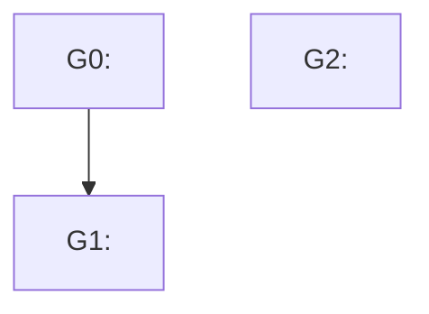

# <task-id> — implementation plan

> Source: [TASK.md](TASK.md). This file IS the state — check boxes as work completes; resume skips groups whose boxes are all checked.

## Dependency graph

## Groups

### G0 — <business-framed title>

<!-- business meaning, e.g. "Let admin assign a user to an organization" — NOT "Create Organization entity" -->

- **Commit:** <message, in the project's commit style>
- **Depends on:** none
- **Parallelizable with:** G2

<!-- Files must be disjoint from every group listed in "Parallelizable with" -->

- **Files:** `<paths>`
- **Status:** [ ] implemented / [ ] reviewed / [ ] committed
- Steps:
  - [ ] <step>
  - [ ] <step>

### G1 — <business-framed title>

- **Commit:** <message, in the project's commit style>
- **Depends on:** G0
- **Parallelizable with:** none
- **Files:** `<paths>`
- **Status:** [ ] implemented / [ ] reviewed / [ ] committed
- Steps:
  - [ ] <step>
