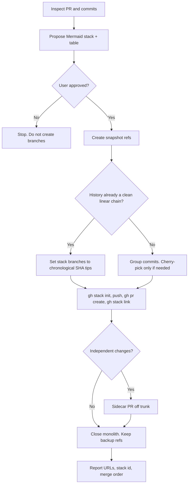

# Use GitHub stacked PRs

## Purpose

Create a [stacked PR](https://docs.github.com/en/pull-requests/get-started/about-stacked-prs) chain from one large PR, or from one branch with many commits. Each layer targets the branch below it.

This skill complements `split-to-prs`. Use that skill's propose-then-approve flow. Use **this** skill when layers have **real dependencies**. Those layers should be a GitHub stack, not independent PRs off trunk.

## Activation

### Use when

- A PR is too large to review.
- The user asks for stacked PRs, gh stack, stack layers, or a dependent review chain.
- Commits on one work-branch form a linear series that should land as stacked PRs.

### Do not use when

- Layers have no dependency. Use `split-to-prs` and open independent PRs off trunk.
- The stack would cross forks. Same-repo branches only.
- The user asked only for a local rebase with no GitHub stack.

## Context

Trunk is usually `main` unless the consuming repo uses another default branch.

Needs GitHub CLI `gh` ≥ 2.90 and Git ≥ 2.20.

Keep the original work-branch as a backup. Do not delete it unless asked.

`gh stack submit --auto` invents titles. Do not use it when titles must include a tracker key.

## Workflow



The numbered steps are the authority.

### 1. Inspect

```bash
gh pr view --json number,title,url,baseRefName,headRefName,changedFiles,additions,deletions
git log --oneline <trunk>..HEAD
# per-commit paths
for c in $(git rev-list --reverse <trunk>..HEAD); do
  echo "--- $(git log -1 --oneline $c) ---"
  git diff-tree --no-commit-id --name-only -r $c
done
```

Prefer natural slices:

- implementation-plan groups
- one concern per commit
- `packages/*` before `apps/*`
- domain before adapters

Include tiny follow-ups (creds tweaks, test moves) in the layer they belong to.

If a change is **independent of the feature** (for example Cursor skills, docs-only), open a separate PR off trunk. Do **not** include it in the stack.

### 2. Propose (then wait)

Show a Mermaid stack. Show a table with these columns: layer, title, commits/SHA tip, ~file count, base.

```text
main
 └─ PR1 foundation
     └─ PR2 depends on PR1
         └─ PR3 depends on PR2
```

Include the tracker key in the title when one exists (for example `[TICKET-32] Know who a user is`). This keeps Linear/Jira linked.

Ask for approval. Offer to split an oversized top layer further if needed.

Do not create branches, push, open PRs, link a stack, or close the monolith until the user approves.

### 3. Execute (after approval)

Create a snapshot before you change history:

```bash
git update-ref "refs/backup/pre-split-$(date +%s)" HEAD
```

If the tree is dirty, also run `git stash create` and store a backup ref.

#### Prefer chronological commit tips

If history is already a clean linear chain, set each stack branch to the commit that finishes that layer. **Do not reorder** with cherry-picks unless necessary. Reordering often causes conflicts. Then use chronological grouping. Include small commits in the nearest layer tip.

```bash
git branch stack/<id>-layer1 <sha-g0>
git branch stack/<id>-layer2 <sha-g1>   # ancestor of layer3, etc.
# ...
```

#### Init, push, open with custom titles

```bash
gh stack init stack/<id>-layer1 stack/<id>-layer2 stack/<id>-layer3
gh stack push

# Bottom → top: each PR's base is the branch below (trunk for the bottom)
gh pr create --head stack/<id>-layer1 --base main \
  --title "[TICKET] …" --body "…"
gh pr create --head stack/<id>-layer2 --base stack/<id>-layer1 \
  --title "[TICKET] …" --body "…"
# …

gh stack link <pr1> <pr2> <pr3> --open
```

Each PR body should state which stack layer it is. It should also state that reviewers only need that layer's diff.

#### Independent PR

```bash
git branch stack/<id>-sidecar $(git rev-parse main)
git checkout stack/<id>-sidecar
git cherry-pick <sidecar-sha>   # only if it applies cleanly on main
git push -u origin HEAD
gh pr create --base main --title "[TICKET] …" --body "Independent of the feature stack."
```

#### Close the monolith

```bash
gh pr close <monolith> --comment "Closing in favor of stacked PRs: <urls>…"
```

Keep the old work-branch and `refs/backup/pre-split-*`.

### 4. Report

1. List each PR title, URL, and file count.
2. Note the stack id (`gh stack view`).
3. Note any sidecar PR.
4. Remind the user: **merge bottom-up** (or merge the top to land the whole stack).

GitHub or `gh stack rebase` handles cascading rebase after lower merges.

## Decision Rules

- If the user has not approved the split plan → stop after Propose. Do not touch branches.
- If history is already a clean linear chain → set stack branches to chronological SHA tips. Do not cherry-pick reorder.
- If a change is independent of the feature → sidecar PR off trunk. Do not put it in the stack.
- If titles must include a tracker key → `gh pr create` with explicit titles, then `gh stack link`. Do not use `gh stack submit --auto`.
- If a mid-stack PR looks huge → confirm `base` is the previous stack branch, not trunk.
- If `gh` or `gh-stack` is missing → install per Prerequisites. Do not invent a stack with raw git only.
- If the work is on a fork of another repo → refuse. Same-repo branches only.

## Constraints

- MUST NOT create branches, push, open PRs, link a stack, or close the monolith until the user approves the split plan.
- MUST NOT discard user work. MUST NOT run `reset --hard`, `clean -fdx`, branch deletion, or force-push without explicit approval.
- MUST create a snapshot before you change history: `git update-ref "refs/backup/pre-split-$(date +%s)" HEAD`. If the tree is dirty, also run `git stash create` and store a backup ref.
- MUST keep the original work-branch (`<work-branch>`) as a backup. MUST NOT delete it unless asked.
- MUST stage only named files or hunks when recommitting. MUST NOT use `git add .` or `git add -A`.
- MUST use same-repo branches only. MUST NOT use cross-fork stacks.
- MUST install the extension with `gh extension install github/gh-stack`. Upgrade it if it is already present.
- NEVER skip the snapshot ref.

## Quality Checks

Before finishing:

- [ ] User approved the split plan before branches, push, PRs, stack link, or close of the monolith.
- [ ] Snapshot ref `refs/backup/pre-split-*` exists.
- [ ] Original work-branch is still present.
- [ ] No `git add .` or `git add -A`.
- [ ] Each PR base is the branch below (trunk for the bottom).
- [ ] Tracker key is in titles when one exists.
- [ ] Independent changes are sidecar PRs off trunk.
- [ ] Monolith is closed only after the stack exists. Backup refs remain.
- [ ] Report lists URLs, stack id, and merge order.

## Examples

### Linear history

Input: four commits already stacked as foundation → domain → adapter → UI.

Expected: four stack branches at those SHA tips. No cherry-pick reorder. Titles include the tracker key if one exists.

### Independent docs commit

Input: the work-branch also contains a docs-only commit that does not depend on the feature.

Expected: sidecar PR off trunk. Do not include it in the stack.

### No approval yet

Input: user asked to stack the PR. You finished Inspect and Propose.

Expected: wait. Do not create `stack/` branches.

## Failure Modes

- `gh` older than 2.90 or Git older than 2.20 → stop. Name the version gap.
- `gh-stack` missing → install. Do not fake a stack.
- Dirty tree → `git stash create` plus backup ref before history changes.
- Cherry-pick reorder conflicts → stop. Use chronological SHA tips instead.
- Cross-fork request → refuse.
- User withholds approval → leave the work-branch unchanged.

## Pitfalls

| Pitfall | What to do |
| --- | --- |
| Cherry-pick reorder conflicts | Use chronological SHA tips. Include tiny commits in the layer tip |
| `submit --auto` titles | `gh pr create` with explicit titles, then `gh stack link` |
| Mid-stack PR looks huge | Confirm `base` is the previous stack branch, not trunk |
| Unrelated commits in the branch | Sidecar PR off trunk |
| CI / CODEOWNERS | The stack applies trunk rules to every layer. This is expected |

## References

- [About stacked PRs](https://docs.github.com/en/pull-requests/get-started/about-stacked-prs)
- [Quickstart](https://docs.github.com/en/pull-requests/get-started/stacked-prs-quickstart)
- [CLI reference](https://docs.github.com/en/pull-requests/reference/stacked-prs-cli-commands)
