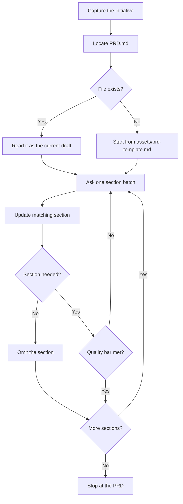

# Write PRD

## Purpose

Write a shared business spec for what the team is building and why. The team agrees on the problem, the goals, and the boundaries before anyone splits the work into tickets.

This procedure creates a new `PRD.md`. It also refines an existing `PRD.md`. Refining is not a separate mode. Enter with the existing file as the current draft.

## Activation

### Use when

Use this skill when:

- an initiative is too large or too unclear to write as tickets
- the initiative needs a shared business spec first
- `.ai/idea/<slug>/PRD.md` already exists and needs an update
- a human asks to write, draft, create, or refine a PRD or product spec

### Do not use when

Do not use this skill when:

- the initiative is engineering-led (refactor, tech debt, platform, performance, DX). Use `write-tech-prd`.
- the change is already one small ticket
- the task is implementing or coding
- the task is a README, ADR, or runbook
- the task is to split the PRD into tickets. Use `split-prd-into-issues`.
- the task is to grill the PRD. Use `grill-me`.

## Context

Required input:

- What is being built and why, in the requester's own words
- The idea slug in kebab-case. The slug sets `.ai/idea/<slug>/`.
- If `.ai/idea/<slug>/PRD.md` exists, that file is required input too. Read it in full as the current draft before you ask anything.

A PRD is a durable artifact. Write it in English STE. Do not translate it into the human's chat language. See `skills/asd-ste100` and `rules/asd-ste100.md`. Match the human's language in live chat only.

Stay in business outcomes. Do not prescribe module boundaries, data models, or migration plans.

## Workflow

The numbered steps are the authority.

1. Capture the initiative. Get what is being built and why in plain terms. Do not add structure yet.
2. Locate `.ai/idea/<slug>/PRD.md`. If it exists, read it as the current draft. If it does not exist, use `assets/prd-template.md`.
3. Ask questions for one section at a time. Follow the section guide. Ask only what this initiative needs answered. Cover the real problem and its evidence. Cover who it is for. Cover what success looks like. Cover what is explicitly out. Cover the non-functional bar. Cover dependencies. Cover risks. Ask in small batches. Skip any question the codebase or the existing draft already answers.
4. After each batch of answers, update the matching section of `PRD.md` immediately. Synthesize the answers into prose or bullets. Do not transcribe the raw Q&A.
5. Drop any template section that this initiative does not need. A PRD is a tool. It is not a form to complete.
6. Repeat steps 3 to 5, section by section, until every kept section meets the quality checks.

## Section guide

Keep a section only if this initiative needs it.

- **Summary** — one paragraph: what this is and why it matters.
- **Problem** — the pain, who feels it, and the evidence it is real.
- **Goals** — the outcomes that define success, measurable where possible.
- **Non-goals** — what this deliberately does not do. Use this section to stop scope creep early.
- **Users & personas** — who uses it and the context they are in.
- **Key use cases** — the main flows as user stories (`As a <role>, I want <capability>, so that <benefit>`). These seed the tickets' acceptance criteria later.
- **Functional requirements** — what the system must do.
- **Non-functional requirements** — performance, security, accessibility, scale, compliance. This is the bar the solution must meet for every feature.
- **Success metrics** — how you will know it worked after it ships.
- **Scope & milestones** — what is in the first cut vs deferred. Add phasing if it is staged.
- **Dependencies & assumptions** — what this needs (teams, systems, decisions) and what you treat as given.
- **Risks & open questions** — what could derail it and what is still unanswered.

## Output format

- A single Markdown file at `.ai/idea/<slug>/PRD.md`.
- For a new PRD, follow `assets/prd-template.md` section order and heading names.
- For an existing draft, keep its current section order. Edit it in place.
- Omit sections that this initiative does not need. Do not leave them as empty stubs.
- Write prose and bullets, synthesized from the Q&A. Do not write a raw transcript of questions and answers.

## Decision Rules

- If the work is engineering-led → stop. Point to `write-tech-prd`.
- If `.ai/idea/<slug>/PRD.md` exists → it is the current draft. Update it in place. Do not start a second file.
- If the slug is missing → ask for a kebab-case slug before you write files.
- If a question is already answered in the draft or the codebase → skip it.
- If a section is not needed here → omit it. Do not leave a stub.
- If the change is already one small ticket → stop. Do not write a PRD.
- If the human asks to grill or ticket in the same turn → finish the PRD first. Do not run those skills here.

## Constraints

- MUST write English STE. See `skills/asd-ste100` and `rules/asd-ste100.md`.
- MUST NOT translate the PRD into the human's chat language.
- MUST update an existing `PRD.md` in place.
- MUST synthesize answers. MUST NOT transcribe raw Q&A.
- MUST stay in business outcomes.
- MUST NOT prescribe the technical solution.
- MUST NOT invent evidence, metrics, or personas. Ask.
- MUST NOT run `grill-me` or `split-prd-into-issues` as part of this procedure.
- NEVER leave empty template placeholders in a kept section.

## Quality Checks

Before you finish:

- [ ] Every kept section has synthesized, specific content. No leftover template placeholders. No raw Q&A transcript.
- [ ] Problem names the pain, who feels it, and the evidence it is real.
- [ ] Goals are measurable where possible. Non-goals name what is deliberately excluded.
- [ ] Key use cases are phrased as `As a <role>, I want <capability>, so that <benefit>`.
- [ ] Dropped sections were dropped because this initiative does not need them.
- [ ] The file lives at `.ai/idea/<slug>/PRD.md` and reflects the latest answers.
- [ ] The PRD is English STE. It is not translated into the human's chat language.

## Examples

### New initiative

Input: "We need a spec for guest checkout" and slug `guest-checkout`.

Expected: create `.ai/idea/guest-checkout/PRD.md` from the template. Ask about problem, users, and goals in small batches. Write each section after each answer batch.

### Existing draft

Input: a path to an existing `PRD.md`.

Expected: read it in full first. Update it in place. Do not start a second file.

### Engineering-led work

Input: "spec this refactor of the order pipeline".

Expected: stop. Point to `write-tech-prd`.

## Failure Modes

- Slug is missing → ask for a kebab-case slug. Do not invent one.
- The initiative is engineering-led → stop. Point to `write-tech-prd`.
- The human cannot name the problem or the evidence → keep the Problem section open. Do not invent evidence.
- The existing file conflicts with new answers → update the file to the new answers. Do not keep both versions.
- The human asks to ticket or grill in the same turn → finish the PRD. Stop. Those steps are outside this procedure.

## References

- `assets/prd-template.md` — section order and heading names for a new PRD. Read when the file does not exist yet.
- `write-tech-prd` — engineering-led initiatives.
- `split-prd-into-issues` — file skeleton after the PRD is approved. Not part of this procedure.
- `grill-me` — adversarial review of the locked PRD. Not part of this procedure.
- `skills/asd-ste100` and `rules/asd-ste100.md` — English STE on durable artifacts.
