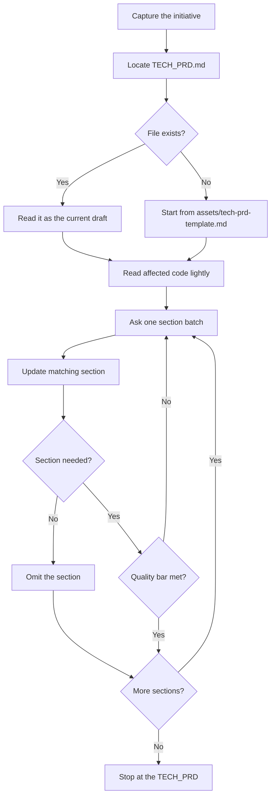

# Write Tech PRD

## Purpose

Write a shared technical spec for what the team is changing in the system and why. Engineering agrees once on the technical problem, the target state, and the hard constraints. Engineering does not reopen those decisions on each ticket.

This procedure creates a new `TECH_PRD.md`. It also refines an existing one. Refining is not a separate mode. Enter with the existing file as the current draft.

## Activation

### Use when

Use this skill when:

- an engineering-led initiative is too large or too unclear to write as tickets
- typical inputs are refactorings, tech debt, platform or internal improvements, performance work, or developer-experience changes
- `.ai/idea/<slug>/TECH_PRD.md` already exists and needs an update
- a human asks to write, draft, or refine a tech PRD

### Do not use when

Do not use this skill when:

- the initiative is a pure business or user product spec. Use `write-prd`.
- the task is implementing or coding
- the task is a single design decision during a build. Record that decision in an ADR or architecture note.
- the task is to split the TECH_PRD into tickets. Use `split-prd-into-issues`.
- the task is to grill the TECH_PRD. Use `grill-me`.

## Context

Required input:

- What is being changed and why, in the requester's own words
- The idea slug in kebab-case. The slug sets the staging path `.ai/idea/<slug>/`.
- If `.ai/idea/<slug>/TECH_PRD.md` exists, that file is required input too. Read it in full as the current draft before you ask anything.

When grounding matters, read the repo's root `AGENTS.md` / `CLAUDE.md` and the affected modules before you lock requirements. Do not invent paths or patterns. Do not assume a stack.

A staging `TECH_PRD.md` is not a durable bucket. Linear is the source of truth after `push-issues`. Write the draft in English STE. Do not translate it into the human's chat language. See `skills/asd-ste100` and `rules/asd-ste100.md`. Match the human's language in live chat only.

Before the first write, follow `ai-dir` bootstrap. Ensure `.ai/idea/` is gitignored.

## Workflow

The numbered steps are the authority.

1. Capture the initiative. Get what is changing and why in plain terms. Do not add structure yet.
2. Locate `.ai/idea/<slug>/TECH_PRD.md`. If it exists, read it as the current draft. If it does not exist, use `assets/tech-prd-template.md`.
3. Ground lightly. If affected areas are named or implied, read the real code and `AGENTS.md` / `CLAUDE.md`. Read enough to ask sharp questions and write accurate paths. Do not read the whole repository.
4. Ask questions for one section at a time. Follow the section guide. Ask only what this initiative needs answered. Ask in small batches. Skip any question the codebase or the existing draft already answers.
5. After each batch of answers, update the matching section of `TECH_PRD.md` immediately. Synthesize. Do not transcribe the raw Q&A.
6. Drop any template section that this initiative does not need.
7. Repeat steps 4 to 6 until every kept section meets the quality checks.

## Section guide

Keep a section only if this initiative needs it.

- **Summary** — one paragraph: what this technical change is and why it matters now.
- **Technical problem** — the current pain, who feels it (engineers, operators, downstream features), and the evidence it is real (incidents, slow delivery, flaky tests, measured cost).
- **Current state** — how the system works today in the affected area. Name real packages, modules, or paths when known.
- **Goals** — the technical outcomes that define success, measurable where possible.
- **Non-goals** — what this deliberately does not change. Stop scope creep early.
- **Affected areas** — packages, modules, contracts, data stores, deployables touched or intentionally left alone.
- **Target state** — what "done" looks like structurally and behaviorally after the change.
- **Technical requirements** — concrete musts: seams to introduce or remove, APIs or contracts to keep or break, invariants, observability, compatibility.
- **Constraints & invariants** — hard limits (compat windows, zero-downtime, data safety, public API freeze, performance floor).
- **Migration & rollout** — how the change moves from current state to target (order of work, dual-write, feature flags, backfill, rollback).
- **Success metrics** — how you will know it worked after it ships (latency, error rate, deleted surface, build time, incident rate, test confidence).
- **Dependencies & assumptions** — other teams, systems, or decisions this needs, and what you treat as given.
- **Risks & open questions** — what could derail it. List design forks still unresolved. Those forks are later architecture decisions during the build.

## Output format

- A single Markdown file at `.ai/idea/<slug>/TECH_PRD.md`.
- For a new tech PRD, follow `assets/tech-prd-template.md` section order and heading names.
- For an existing draft, keep its current section order. Edit it in place.
- Omit sections that this initiative does not need. Do not leave empty stubs.
- Write prose and bullets, synthesized from the Q&A. Do not write a raw transcript.

## Decision Rules

- If the work is a pure business or user product initiative → stop. Point to `write-prd`.
- If `.ai/idea/<slug>/TECH_PRD.md` exists → it is the current draft. Update it in place.
- If the slug is missing → ask for a kebab-case slug before you write files.
- If affected areas are named → read the real paths before you lock requirements.
- If the repo does not show a path, API, or pattern → do not invent it.
- If a design fork is unresolved → list it as an open question. Do not silently decide it.
- If the task is one mid-build design decision → stop. Do not write a TECH_PRD.
- If the human asks to grill or ticket in the same turn → finish the TECH_PRD first. Do not run those skills here.

## Constraints

- MUST write English STE. See `skills/asd-ste100` and `rules/asd-ste100.md`.
- MUST NOT translate the TECH_PRD into the human's chat language.
- MUST update an existing `TECH_PRD.md` in place.
- MUST synthesize answers. MUST NOT transcribe raw Q&A.
- MUST NOT invent module paths, APIs, or patterns the repo does not have.
- MUST list unresolved design forks as open questions.
- MUST NOT run `grill-me` or `split-prd-into-issues` as part of this procedure.
- NEVER leave empty template placeholders in a kept section.

## Quality Checks

Before you finish:

- [ ] Every kept section has synthesized, specific content. No leftover template placeholders. No raw Q&A transcript.
- [ ] Technical problem names the pain, who feels it, and the evidence it is real.
- [ ] Goals are measurable where possible. Non-goals name what is deliberately excluded.
- [ ] Technical requirements are concrete enough to ticket. Open design forks are listed as open questions.
- [ ] Affected areas and current or target state use real repo language when the codebase supports it.
- [ ] Dropped sections were dropped because this initiative does not need them.
- [ ] The file lives at `.ai/idea/<slug>/TECH_PRD.md` and reflects the latest answers.
- [ ] The TECH_PRD is English STE. It is not translated into the human's chat language.

## Examples

### New refactor

Input: "spec this refactor of the order pipeline" and slug `order-pipeline-split`.

Expected: create `.ai/idea/order-pipeline-split/TECH_PRD.md`. Read the real order modules. Ask about current pain, target state, and constraints. Write each section after each answer batch.

### Existing draft

Input: a path to an existing `TECH_PRD.md`.

Expected: read it in full first. Update it in place. Do not start a second file.

### Product initiative

Input: "we need a spec for guest checkout".

Expected: stop. Point to `write-prd`.

### Invented paths

Input: the human names a module the repo does not have.

Expected: do not write that path. Ask. Use real packages from the repo.

## Failure Modes

- Slug is missing → ask for a kebab-case slug. Do not invent one.
- The initiative is a product PRD → stop. Point to `write-prd`.
- Affected code cannot be found → ask which area to ground. Do not invent paths.
- A design fork is unresolved → record it as an open question. Do not pick a side.
- The human asks to ticket or grill in the same turn → finish the TECH_PRD. Stop.

## References

- `assets/tech-prd-template.md` — section order and heading names for a new TECH_PRD. Read when the file does not exist yet.
- `write-prd` — business or user product initiatives.
- `split-prd-into-issues` — file skeleton after the TECH_PRD is approved. Not part of this procedure.
- `grill-me` — adversarial review of the locked TECH_PRD. Not part of this procedure.
- `skills/asd-ste100` and `rules/asd-ste100.md` — English STE on the staging draft (it becomes the Linear attachment)
- `skills/ai-dir/SKILL.md` — bootstrap and gitignore `.ai/idea/`
