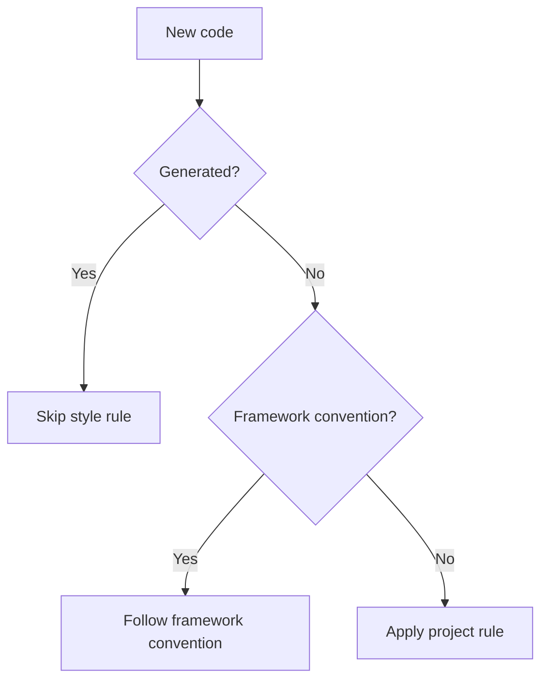

--
name: writing-ultimate-rule
description: Create clear, precise, and enforceable AI agent rules. Use when creating a new rule, improving an existing rule, or converting coding standards, behavioral constraints, conventions, or policies into reusable agent rules.
--

# Rule Writer

Create rules that give AI agents clear, consistent, and enforceable behavioral constraints.

A good rule is a **policy**, not a procedure and not documentation.

A rule tells an agent:

* what behavior is required
* what behavior is prohibited
* where the rule applies
* how strong the requirement is
* when exceptions apply
* how the rule should be interpreted

Use this distinction:

> **Rule = policy**
> **Skill = procedure**
> **Reference = knowledge**
> **Script = execution**

---

# Purpose

When creating or improving a rule, optimize for:

1. **Clarity** — the agent can understand the rule without unnecessary interpretation.
2. **Enforceability** — compliance can be evaluated.
3. **Scope** — it is clear where the rule applies.
4. **Consistency** — terminology and requirement strength are consistent.
5. **Minimality** — the rule contains only information needed to define the policy.
6. **Composability** — the rule works alongside other rules without unnecessary conflicts.
7. **Explicit exceptions** — exceptional cases are defined instead of left to guesswork.

A rule should change agent behavior.

If removing a sentence would not change agent behavior, consider removing it or moving it to `references/`.

---

# Rule Structure

Use this structure as the default:

```markdown
# Rule Name

## Scope

...

## Principle

...

## Rules

- MUST ...
- MUST NOT ...
- SHOULD ...
- SHOULD NOT ...
- MAY ...

## Exceptions

...

## Examples

### Prefer

...

### Avoid

...

## References

- ...
```

Not every section is mandatory.

Use only sections that provide useful policy information.

---

# 1. Scope

Define where the rule applies.

Answer:

> What does this rule govern?

Examples:

```markdown
## Scope

Applies to all PHP source code in this repository.
```

```markdown
## Scope

Applies to public APIs exposed by the application.
```

```markdown
## Scope

Applies only to tests under `tests/Integration/`.
```

Avoid vague scope:

```markdown
Applies to the project.
```

If the rule applies globally, state that explicitly:

```markdown
## Scope

Applies to all source code unless a more specific rule overrides it.
```

---

# 2. Principle

State the core policy in one or two concise sentences.

The principle explains **what the rule optimizes for**.

Prefer:

> Prefer simple, explicit code over clever abstractions.

Avoid:

> Good code should be clean, maintainable, elegant, scalable, readable, and follow best practices.

The principle should provide context, not become a second documentation section.

---

# 3. Rules

This is the authoritative part of the rule.

Use explicit normative language.

## Requirement Levels

Use:

* `MUST` — mandatory requirement
* `MUST NOT` — prohibited behavior
* `SHOULD` — recommended behavior
* `SHOULD NOT` — discouraged behavior
* `MAY` — optional behavior

Do not mix requirement levels casually.

For example:

```markdown
## Rules

- MUST use strict types in every PHP file.
- MUST NOT introduce global state.
- SHOULD prefer composition over inheritance.
- SHOULD NOT add comments that only restate the code.
- MAY use an exception when a framework convention requires it.
```

Each rule should describe **one policy**.

Prefer:

```markdown
- MUST use strict types.
- MUST use the project's established namespace convention.
```

over:

```markdown
- MUST use strict types and the project's namespace convention while keeping the code clean.
```

One rule should normally express one requirement.

---

# 4. Rule Priority

When a rule can conflict with other instructions, make its precedence explicit.

Use this section when the rule is likely to interact with other rules.

```markdown
## Priority

This rule takes precedence over:
- generic coding conventions
- stylistic preferences

This rule does not override:
- explicit user instructions
- security requirements
- higher-priority system instructions
```

Use the smallest useful hierarchy.

A useful default is:

```text
CRITICAL
  ↓
MUST / MUST NOT
  ↓
SHOULD / SHOULD NOT
  ↓
MAY
```

Do not invent priority levels unless they are meaningful for the target environment.

---

# 5. Exceptions

Define when the rule does not apply.

Do not rely on vague phrases such as:

> Use common sense.

Prefer explicit exceptions:

```markdown
## Exceptions

- Generated code MAY use different naming conventions.
- Follow framework conventions when they conflict with this rule.
- Legacy code MAY remain unchanged unless the current task modifies it.
```

If there are no meaningful exceptions, omit the section.

Do not create artificial exceptions only to fill the template.

---

# 6. Examples

Use examples to clarify interpretation.

Examples should demonstrate behavior, not repeat the rule.

Useful examples include:

* preferred behavior
* prohibited behavior
* edge cases
* exceptions
* ambiguous cases

Example:

````markdown
## Examples

### Prefer

```php
final class OrderCalculator
{
    public function calculate(Order $order): Money
    {
        // ...
    }
}
````

### Avoid

```php
class OrderCalculator extends AbstractCalculator
{
    // ...
}
```

### Exception

A framework-generated class MAY use inheritance when required by the framework.

````

A few representative examples are better than many trivial examples.

---

# 7. References

Move detailed knowledge out of the rule.

Use references for:

- external standards
- framework documentation
- large examples
- domain explanations
- migration guides
- detailed rationale

Example:

```markdown
## References

- `references/php-style.md` — project PHP conventions
- `references/api-design.md` — API design guidelines
````

The rule itself should remain understandable without loading every reference.

---

# Language

Use the **ASD-STE100 skill** when it is available in the current environment.

The ASD-STE100 skill is responsible for the language quality of the rule. Follow its guidance when writing or reviewing:

* normative statements
* constraints
* exceptions
* scope definitions
* examples
* conflict resolution

Do not duplicate ASD-STE100 guidance in this skill.

If the ASD-STE100 skill is available:

1. Use its rules when drafting the rule.
2. Apply them when reviewing the final rule.
3. Prefer its terminology and writing conventions over generic technical-writing advice.
4. Do not weaken a rule merely to satisfy stylistic preferences.

If the ASD-STE100 skill is not available, use clear technical English:

* use short sentences
* use one requirement per sentence
* use consistent terminology
* prefer active voice
* avoid idioms and metaphors
* avoid ambiguous pronouns
* avoid unnecessary synonyms
* state conditions explicitly
* replace vague language with observable requirements

---

# Rule Design Rules

## Prefer Normative Language

Rules must tell the agent what to do.

Prefer:

```markdown
MUST use dependency injection.
```

over:

```markdown
Dependency injection is generally considered a good practice.
```

Prefer:

```markdown
MUST NOT add a dependency when an existing dependency provides the required functionality.
```

over:

```markdown
Be careful when adding dependencies.
```

---

## Prefer Observable Requirements

A rule should be possible to evaluate.

Weak:

```markdown
Code SHOULD be clean.
```

Strong:

```markdown
Methods SHOULD have one primary responsibility.
```

Weak:

```markdown
Tests SHOULD be meaningful.
```

Strong:

```markdown
Every new behavior MUST have at least one automated test unless the behavior cannot be tested automatically.
```

Avoid requirements that depend entirely on subjective judgment.

---

# Avoid Procedural Rules

A Rule defines **what must be true**, not a detailed process for achieving it.

Bad:

```markdown
1. Open the file.
2. Find the method.
3. Rename the variable.
4. Run the tests.
5. Commit the changes.
```

This is a **Skill**, not a Rule.

Prefer:

```markdown
- MUST use descriptive variable names.
- MUST run the relevant test suite before reporting completion.
```

If a rule requires a complex procedure, create a Skill and reference the Rule from it.

---

# Avoid Documentation Disguised as Rules

Do not turn explanations into policies.

Bad:

```markdown
## Doctrine

Doctrine is an ORM for PHP. It provides...
```

If the information does not define agent behavior, move it to `references/`.

---

# Avoid Subjective Rules

Avoid:

```markdown
- MUST write beautiful code.
- SHOULD make the code elegant.
- MUST keep things simple.
```

Replace subjective terms with observable criteria.

For example:

```markdown
- MUST NOT introduce an abstraction unless at least one concrete use case requires it.
- SHOULD prefer existing project patterns over introducing a new pattern.
```

---

# Avoid Redundant Rules

Do not express the same policy multiple times.

Bad:

```markdown
- MUST use strict types.
- All PHP files must declare strict types.
- Strict typing is required.
```

Use one authoritative rule:

```markdown
- MUST declare strict types in every PHP file.
```

---

# Avoid Hidden Exceptions

Do not write:

```markdown
- MUST never use inheritance.
```

if the framework requires inheritance in some cases.

Prefer:

```markdown
- MUST NOT introduce inheritance unless required by the framework or an existing architectural constraint.
```

Exceptions should be explicit.

---

# Avoid Conflicting Rules

Check every rule against the others.

Bad:

```markdown
- MUST always use immutable objects.
- MAY mutate DTOs during request processing.
```

Resolve the conflict:

```markdown
- SHOULD use immutable domain objects.
- Request DTOs MAY be mutable when required by the framework.
```

When two rules have different scopes, state the scopes explicitly.

---

# Use Existing Conventions

When creating a rule for an existing repository:

1. Inspect existing rules.
2. Inspect repository conventions.
3. Identify established patterns.
4. Avoid creating rules that duplicate existing policy.
5. Prefer extending an existing rule when appropriate.

Existing project conventions take precedence over generic recommendations unless the new rule intentionally changes them.

---

# Rule Composition

Rules should be independently understandable.

Avoid unnecessary coupling:

```text
Rule A requires Rule B, which requires Rule C...
```

Prefer small, composable policies.

When a dependency is necessary, state it explicitly:

```markdown
This rule assumes that the `php-code-style` rule is also applied.
```

Do not duplicate the contents of another rule.

---

# When to Create a Skill Instead

Create a **Rule** when the desired output is a persistent constraint:

> "Always use X."

Create a **Skill** when the desired output is a procedure:

> "When asked to do X, follow these steps."

Create a **Reference** when the desired output is knowledge:

> "Here is how X works."

Create a **Script** when the desired output is deterministic execution:

> "Run this operation."

If a rule starts accumulating:

* long workflows
* decision trees
* tool instructions
* multi-step procedures
* extensive examples

consider splitting it into a Rule + Skill + References.

---

# Mermaid

Use **Mermaid.js** when a rule contains complex relationships that are easier to understand visually.

Good candidates include:

* rule precedence
* exception hierarchies
* policy decision trees
* state transitions
* relationships between rules

For example:



Do not use Mermaid for simple rules.

A diagram should reduce cognitive load.

## Mermaid Rules

When creating a Mermaid diagram:

* Keep node labels concise.
* Make decision branches explicit.
* Label conditional edges.
* Use consistent terminology with the written rule.
* Keep the diagram focused on policy.
* Do not duplicate large amounts of prose inside nodes.
* Prefer one diagram per logical decision path.
* Do not create a diagram when a short list is clearer.
* Ensure the diagram matches the written rules.

The written rules remain authoritative.

The diagram is a visual representation of those rules.

---

# Rule Naming

Choose names that describe the policy.

Good:

```text
php-code-style
api-backward-compatibility
database-migration-safety
security-sensitive-code
testing-requirements
```

Avoid:

```text
important-rules
coding
stuff
general-guidelines
best-practices
```

The name should help an agent and a human identify the rule's purpose quickly.

---

# Rule Size

Keep rules small enough to load and apply efficiently.

As a guideline:

* prefer a focused rule over a broad policy document
* split unrelated policies into separate rules
* move large explanations into `references/`
* move complex procedures into Skills

Do not optimize for an arbitrary line count.

Optimize for **one coherent policy per rule**.

---

# Final Review

Before considering a rule complete, review it against these questions.

## Scope

* [ ] Is it clear where the rule applies?
* [ ] Is the scope specific enough?
* [ ] Are global rules explicitly marked as global?

## Policy

* [ ] Is the core principle clear?
* [ ] Does every rule actually change agent behavior?
* [ ] Is every requirement expressed with appropriate normative language?
* [ ] Are `MUST`, `SHOULD`, and `MAY` used consistently?

## Exceptions

* [ ] Are important exceptions explicit?
* [ ] Are hidden assumptions removed?
* [ ] Can the rule be applied without guessing?

## Composition

* [ ] Does the rule conflict with existing rules?
* [ ] Does it duplicate another rule?
* [ ] Is it unnecessarily coupled to another rule?
* [ ] Should part of it be a Skill instead?

## Language

* [ ] Was the ASD-STE100 skill used if it is available?
* [ ] Are sentences short and explicit?
* [ ] Is terminology consistent?
* [ ] Are ambiguous phrases removed?
* [ ] Are idioms and unnecessary metaphors removed?
* [ ] Are vague terms replaced with observable requirements?

## Examples

* [ ] Do examples clarify interpretation?
* [ ] Are important edge cases covered?
* [ ] Are exceptions demonstrated where useful?

## Visualization

* [ ] Would a Mermaid diagram make complex policy logic easier to understand?
* [ ] If a diagram exists, does it match the written rules?
* [ ] Are simple rules free from unnecessary diagrams?

## Final Test

Ask:

> **Could an agent apply this rule consistently without having to guess what the author meant?**

If not, rewrite the rule before adding more explanation.

---

# Core Principle

> **A good rule tells the agent what must be true. It does not tell the agent everything it needs to know about the subject.**

Keep policy in Rules.

Keep procedures in Skills.

Keep knowledge in References.

Keep deterministic execution in Scripts.
