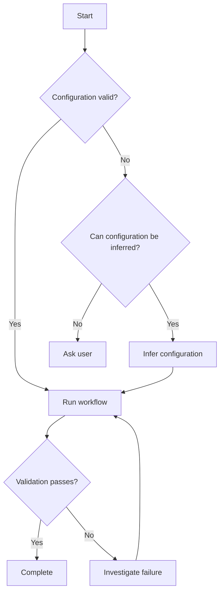

--
name: skill-writer
description: Create well-structured, reliable AI agent skills. Use when creating a new SKILL.md, designing a skill, improving an existing skill, or turning a workflow or procedure into a reusable agent skill.
--

# Skill Writer

Create skills that give an AI agent clear, reliable, reusable behavior.

A good skill is not documentation. It is an **operational playbook for an agent**. It tells the agent when to activate, what to do, how to make decisions, what constraints to follow, and how to verify the result.

## Purpose

When creating or improving a skill, optimize for:

1. **Correct activation** — the skill is used when it should be and avoided when it should not.
2. **Clear behavior** — the agent knows what actions to take.
3. **Deterministic decisions** — ambiguous situations have explicit rules.
4. **Minimal context** — only information needed for execution lives in `SKILL.md`.
5. **Progressive disclosure** — detailed knowledge is moved into `references/`.
6. **Verifiability** — the agent can determine whether it completed the task correctly.
7. **Composability** — the skill works alongside other skills without unnecessary overlap.

---

## Skill Structure

Use this structure as the default:

```text
skill-name/
├── SKILL.md
├── references/       # Optional: detailed knowledge
├── scripts/          # Optional: deterministic automation
└── assets/           # Optional: templates/files used by the skill
```

The `SKILL.md` should normally follow this structure:

```markdown
---
name: ...
description: ...
---

# Skill Name

## Purpose

...

## Activation

### Use when

...

### Do not use when

...

## Context

...

## Workflow

1. ...
2. ...
3. ...

## Decision Rules

- If X → Y
- If A → B
- Otherwise → C

## Constraints

- MUST ...
- MUST NOT ...
- NEVER ...

## Quality Checks

- [ ] ...
- [ ] ...

## Examples

...

## Failure Modes

...

## References

- ...
```

Not every section is mandatory. Include sections when they provide useful behavior.

---

# 1. Purpose

Explain the skill's job in one or two concise paragraphs.

Answer:

> What problem does this skill solve?

Do not put detailed domain knowledge here.

Prefer:

> Helps an agent safely migrate a Symfony application from Doctrine annotations to PHP attributes.

Avoid:

> Doctrine is an object-relational mapper...

The latter belongs in `references/`.

---

# 2. Activation

This is one of the most important parts of the skill.

Define both positive and negative activation criteria.

## Use when

Describe concrete situations where the skill applies.

```markdown
### Use when

Use this skill when:
- migrating Doctrine annotations to PHP attributes
- converting existing entity mappings
- auditing a project for annotation usage
```

## Do not use when

Explicitly define nearby situations where the skill should NOT activate.

```markdown
### Do not use when

Do not use this skill when:
- creating a new Doctrine entity from scratch
- changing database schema design
- migrating from Doctrine ORM to another ORM
```

Prefer **specific behavioral signals** over vague descriptions.

Bad:

> Use when working with Doctrine.

Good:

> Use when an existing codebase needs its Doctrine annotations converted to PHP attributes.

---

# 3. Context

Include only knowledge the agent needs to execute the workflow.

Keep this section short.

If the information is:

* large
* rarely needed
* reference material
* API documentation
* domain background
* a catalog of examples

move it to `references/`.

The agent should not need to read 500 lines of domain documentation just to discover how to start the workflow.

---

# 4. Workflow

This is the core of the skill.

Describe the procedure as explicit steps.

Prefer:

```markdown
## Workflow

1. Inspect the existing implementation.
2. Identify all affected entities.
3. Convert mappings one entity at a time.
4. Run the project's test suite.
5. Search for remaining annotations.
6. Report any unresolved cases.
```

Over:

```markdown
## Workflow

Migrate the project carefully and make sure everything works.
```

The agent should be able to execute the workflow **without having to invent the process itself**.

When useful, distinguish:

* preparation
* execution
* verification
* reporting

For complex workflows, use Mermaid to make decision paths and branching behavior explicit.

---

# 5. Decision Rules

Explicitly encode decisions that the agent would otherwise have to guess.

Use simple rules:

```markdown
## Decision Rules

- If the existing mapping is ambiguous → inspect related migrations before changing it.
- If multiple valid approaches exist → prefer the one already used elsewhere in the project.
- If the required information cannot be determined → ask the user instead of guessing.
- If the change affects public API → stop and ask for confirmation.
```

Prefer decision tables or `if → then` rules when there are many branches.

Do not hide important decisions inside prose.

## Mermaid Decision Paths

Use Mermaid when a decision path has enough branches that a visual representation improves understanding.

For example:



Use Mermaid for:

* complex decision trees
* workflows with multiple branches
* state machines
* conditional execution paths
* multi-stage processes
* interactions between agents, tools, or systems

Do not use Mermaid for a simple linear workflow that is already clear as a numbered list.

### Diagram Rules

When using Mermaid:

* Keep node labels concise.
* Make decision branches explicit.
* Label conditional edges.
* Keep the diagram focused on behavior.
* Do not duplicate large amounts of prose inside the diagram.
* Prefer one diagram per logical workflow or decision.
* Avoid diagrams that are harder to understand than the equivalent text.

The diagram is a **visual representation of the workflow**, not the authoritative specification. The written instructions remain authoritative.

---

# 6. Constraints

Separate **hard rules** from general workflow.

Use strong language deliberately:

```markdown
## Constraints

- MUST preserve existing behavior.
- MUST NOT modify unrelated files.
- MUST NOT invent configuration values.
- NEVER silently ignore failing tests.
```

Use:

* `MUST` — hard requirement
* `MUST NOT` — prohibited behavior
* `SHOULD` — preferred behavior
* `MAY` — optional behavior

Avoid contradictory rules.

Bad:

```markdown
- MUST always ask before changing files.
- SHOULD make changes automatically.
```

If rules conflict, rewrite them so precedence is explicit.

---

# 7. Quality Checks

Every non-trivial skill should define how the agent knows it succeeded.

Good:

```markdown
## Quality Checks

Before finishing:

- [ ] All affected files were inspected.
- [ ] Tests pass.
- [ ] No deprecated API remains.
- [ ] No unrelated files were modified.
- [ ] The final result matches the requested behavior.
```

Prefer **observable checks**.

Bad:

```markdown
- [ ] Make sure the migration is good.
```

Good:

```markdown
- [ ] `grep` finds no remaining Doctrine annotations.
- [ ] The test suite passes.
```

If deterministic verification can be automated, prefer a script in `scripts/` over asking the agent to reason about the result.

---

# 8. Examples

Use examples to clarify behavior, not to repeat the instructions.

Useful examples include:

* typical input → expected behavior
* ambiguous input → correct decision
* invalid input → correct refusal
* common edge case → expected handling

Example:

```markdown
## Examples

### Existing annotation

Input:

`/** @ORM\Column(type="string") */`

Expected:

Convert it to the project's established PHP attribute syntax.

### Ambiguous mapping

Input:

An entity uses a custom Doctrine type with no equivalent visible in the project.

Expected:

Inspect the project's type definitions before making the change.

Do not guess.
```

A few high-quality examples are better than many trivial ones.

---

# 9. Failure Modes

Describe situations where the normal workflow can break.

```markdown
## Failure Modes

- Missing configuration → ask the user; do not invent values.
- Tests fail after the change → investigate the failure before reporting success.
- Documentation conflicts with implementation → inspect the implementation and report the discrepancy.
- Required tool is unavailable → explain the limitation rather than pretending the operation succeeded.
```

This section is particularly valuable for agent skills because agents otherwise tend to optimize for completing the happy path.

---

# 10. References

Move detailed information out of `SKILL.md` when it is not required for every invocation.

```markdown
## References

- `references/api.md` — API details
- `references/patterns.md` — project-specific patterns
- `references/examples.md` — extended examples
```

Only instruct the agent to read a reference when it is relevant.

Prefer:

```markdown
Read `references/api.md` when you need to interact with the API.
```

over:

```markdown
Read all files in `references/` before starting.
```

---

# Progressive Disclosure

Keep `SKILL.md` focused on behavior.

Use this hierarchy:

```text
SKILL.md
  ↓
"What should I do?"
  ↓
references/
  ↓
"What do I need to know?"
  ↓
scripts/
  ↓
"What can be executed deterministically?"
```

Do not duplicate the same information across these layers.

A useful rule is:

> **Put instructions in `SKILL.md`, knowledge in `references/`, and deterministic operations in `scripts/`.**

---

# Skill Design Rules

## Use ASD-STE100 when available

If an ASD-STE100 / Simplified Technical English skill is available in the current environment, use it when writing or reviewing the skill.

Apply ASD-STE100 principles primarily to:

* instructions
* workflow steps
* decision rules
* constraints
* quality checks
* failure handling

The goal is to make instructions:

* explicit
* consistent
* easy to parse
* difficult to misinterpret
* free from unnecessary idioms and ambiguous language

Do not force ASD-STE100 terminology into:

* code
* API names
* product names
* domain-specific terminology
* quoted user content

If the ASD-STE100 skill is unavailable, apply the same principles informally:

* prefer short sentences
* use one instruction per sentence
* use consistent terminology
* prefer active voice
* avoid idioms and metaphors
* avoid ambiguous pronouns
* avoid unnecessary synonyms for the same concept
* state conditions explicitly

Prefer:

```markdown
If the test fails, inspect the failure before continuing.
```

over:

```markdown
If something goes wrong, take a look at what happened and figure out what to do next.
```

## Prefer Instructions Over Explanations

Prefer:

```markdown
Run the test suite before reporting success.
```

over:

```markdown
Testing is important because it helps ensure correctness.
```

The first sentence changes agent behavior. The second mainly provides background.

## Prefer Concrete Actions

Prefer:

```markdown
Inspect `composer.json` and identify the PHP version.
```

over:

```markdown
Understand the project's environment.
```

Instructions should tell the agent what observable action to take.

## Prefer Explicit Uncertainty Handling

Always define what the agent should do when information is missing or ambiguous.

Default behavior should be:

> **Do not guess when guessing can cause incorrect changes.**

Prefer explicit rules such as:

```markdown
If the required information cannot be determined from the repository, ask the user.
```

over:

```markdown
Use your best judgment.
```

## Prefer Repository Conventions

When working inside an existing project:

> Existing project conventions take precedence over generic recommendations.

The skill should first inspect the existing implementation, configuration, and conventions before introducing new patterns.

## Avoid Unnecessary Verbosity

Every paragraph in `SKILL.md` consumes agent context.

If a sentence does not change agent behavior, consider removing it or moving it to `references/`.

---

# Anti-patterns

## The Giant Prompt

A 1000-line `SKILL.md` containing every piece of domain documentation.

Move detailed knowledge into `references/`.

## Documentation Disguised as a Skill

Avoid large sections that explain concepts without changing agent behavior.

If the information is only useful as background knowledge, move it to `references/`.

## Vague Workflows

Avoid:

```markdown
1. Analyze the problem.
2. Implement the solution.
3. Make sure it works.
```

Replace these with observable actions and checks.

## Implicit Decisions

Do not make the agent infer important policy from examples.

State the rule explicitly.

## No Failure Behavior

A skill that only describes the happy path is incomplete.

Define what the agent should do when:

* input is missing
* tools fail
* assumptions are invalid
* tests fail
* requirements conflict
* the repository differs from documentation

## Unverifiable Success

Avoid:

> If everything looks good, report success.

Define what "good" means using observable checks.

## Unnecessary Diagrams

Do not add Mermaid diagrams only because Mermaid is available.

A diagram should reduce cognitive load.

If a numbered list is clearer, use the numbered list.

## Diagram-Only Logic

Do not put critical behavior exclusively in a diagram.

The written instructions must remain sufficient to execute the workflow.

---

# Final Review

Before considering a skill complete, review it against these questions:

### Activation

* [ ] Is the `description` specific enough to trigger the skill correctly?
* [ ] Is it clear when the skill should activate?
* [ ] Is it clear when the skill should NOT activate?
* [ ] Could the skill accidentally activate for common neighboring tasks?

### Behavior

* [ ] Can an agent execute the workflow without inventing major steps?
* [ ] Are important decisions expressed explicitly?
* [ ] Are hard constraints clearly separated from preferences?
* [ ] Is uncertainty handled explicitly?
* [ ] Are failure modes covered?

### Structure

* [ ] Is `SKILL.md` focused on behavior rather than domain documentation?
* [ ] Is unnecessary knowledge moved to `references/`?
* [ ] Are deterministic operations delegated to `scripts/` where appropriate?
* [ ] Is progressive disclosure used?

### Language

* [ ] If an ASD-STE100 skill was available, was its guidance applied where appropriate?
* [ ] Are instructions short and explicit?
* [ ] Is terminology consistent?
* [ ] Is active voice preferred?
* [ ] Are ambiguous phrases and unnecessary idioms removed?

### Visualization

* [ ] Are complex decision paths represented with Mermaid where this improves clarity?
* [ ] Are Mermaid diagrams consistent with the written workflow?
* [ ] Are simple workflows free from unnecessary diagrams?
* [ ] Is critical behavior also expressed in text?

### Examples

* [ ] Do examples demonstrate behavior rather than repeat documentation?
* [ ] Are important edge cases represented?
* [ ] Is there at least one example for non-obvious decision logic?

### Final Test

Ask:

> **If an agent followed this skill literally, would it reliably produce the intended result?**

If not, improve the skill before adding more prose.
